> **INDEX**

<table>
<colgroup>
<col style="width: 7%" />
<col style="width: 70%" />
<col style="width: 8%" />
<col style="width: 13%" />
</colgroup>
<thead>
<tr class="header">
<th><strong>Sr. No.</strong></th>
<th><strong>Title</strong></th>
<th><strong>Page No.</strong></th>
<th><strong>Sign</strong></th>
</tr>
</thead>
<tbody>
<tr class="odd">
<td><strong>1</strong></td>
<td><strong>1. a. Files: <em>Lab01-01.exe</em> and
<em>Lab01-01.dll</em>.</strong></td>
<td></td>
<td></td>
</tr>
<tr class="even">
<td></td>
<td>i. Upload the files to <em>http://www.VirusTotal.com/</em> and view
the reports. Does either file match any existing antivirus
signatures?</td>
<td></td>
<td></td>
</tr>
<tr class="odd">
<td></td>
<td>ii. When were these files compiled?</td>
<td></td>
<td></td>
</tr>
<tr class="even">
<td></td>
<td>iii. Are there any indications that either of these files is packed
or obfuscated? If so, what are these indicators?</td>
<td></td>
<td></td>
</tr>
<tr class="odd">
<td></td>
<td>iv. Do any imports hint at what this malware does? If so, which
imports are they?</td>
<td></td>
<td></td>
</tr>
<tr class="even">
<td></td>
<td>v. Are there any other files or host-based indicators that you could
look for on infected systems?</td>
<td></td>
<td></td>
</tr>
<tr class="odd">
<td></td>
<td>vi. What network-based indicators could be used to find this malware
on infected machines?</td>
<td></td>
<td></td>
</tr>
<tr class="even">
<td></td>
<td>vii. What would you guess is the purpose of these files?</td>
<td></td>
<td></td>
</tr>
<tr class="odd">
<td></td>
<td><strong>b. Analyze the file <em>Lab01-02.exe</em>.</strong></td>
<td></td>
<td></td>
</tr>
<tr class="even">
<td></td>
<td>i. Upload the <em>Lab01-02.exe</em> file to
<em>http://www.VirusTotal.com/</em>. Does it match any existing
antivirus definitions?</td>
<td></td>
<td></td>
</tr>
<tr class="odd">
<td></td>
<td>ii. Are there any indications that this file is packed or
obfuscated? If so, what are these indicators? If the file is packed,
unpack it if possible.</td>
<td></td>
<td></td>
</tr>
<tr class="even">
<td></td>
<td>iii. Do any imports hint at this program’s functionality? If so,
which imports are they and what do they tell you?</td>
<td></td>
<td></td>
</tr>
<tr class="odd">
<td></td>
<td>iv. What host- or network-based indicators could be used to identify
this malware on infected machines?</td>
<td></td>
<td></td>
</tr>
<tr class="even">
<td></td>
<td><strong>c. Analyze the file Lab01-03.exe.</strong></td>
<td></td>
<td></td>
</tr>
<tr class="odd">
<td></td>
<td>i. Upload the <em>Lab01-03.exe</em> file to
<em>http://www.VirusTotal.com/</em>. Does it match any existing
antivirus definitions?</td>
<td></td>
<td></td>
</tr>
<tr class="even">
<td></td>
<td>ii. Are there any indications that this file is packed or
obfuscated? If so, what are these indicators? If the file is packed,
unpack it if possible.</td>
<td></td>
<td></td>
</tr>
<tr class="odd">
<td></td>
<td>iii. Do any imports hint at this program’s functionality? If so,
which imports are they and what do they tell you?</td>
<td></td>
<td></td>
</tr>
<tr class="even">
<td></td>
<td>iv. What host- or network-based indicators could be used to identify
this malware on infected machines?</td>
<td></td>
<td></td>
</tr>
<tr class="odd">
<td></td>
<td><strong>d. Analyze the file Lab01-04.exe.</strong></td>
<td></td>
<td></td>
</tr>
<tr class="even">
<td></td>
<td>i. Upload the <em>Lab01-04.exe</em> file to
<em>http://www.VirusTotal.com/</em>. Does it match any existing
antivirus definitions?</td>
<td></td>
<td></td>
</tr>
<tr class="odd">
<td></td>
<td>ii. Are there any indications that this file is packed or
obfuscated? If so, what are these indicators? If the file is packed,
unpack it if possible.</td>
<td></td>
<td></td>
</tr>
<tr class="even">
<td></td>
<td>iii. When was this program compiled?</td>
<td></td>
<td></td>
</tr>
<tr class="odd">
<td></td>
<td>iv. Do any imports hint at this program’s functionality? If so,
which imports are they and what do they tell you?</td>
<td></td>
<td></td>
</tr>
<tr class="even">
<td></td>
<td>v. What host- or network-based indicators could be used to identify
this malware on infected machines?</td>
<td></td>
<td></td>
</tr>
<tr class="odd">
<td></td>
<td>vi. This file has one resource in the resource section. Use Resource
Hacker to examine that resource, and then use it to extract the
resource. What can you learn from the resource?</td>
<td></td>
<td></td>
</tr>
<tr class="even">
<td></td>
<td><strong>e. Analyze the malware found in the file Lab03-01.exe using
basic dynamic analysis tools.</strong></td>
<td></td>
<td></td>
</tr>
<tr class="odd">
<td></td>
<td>i. What are this malware’s imports and strings?</td>
<td></td>
<td></td>
</tr>
<tr class="even">
<td></td>
<td>ii. What are the malware’s host-based indicators?</td>
<td></td>
<td></td>
</tr>
<tr class="odd">
<td></td>
<td>iii. Are there any useful network-based signatures for this malware?
If so, what are they?</td>
<td></td>
<td></td>
</tr>
<tr class="even">
<td></td>
<td><strong>f. Analyze the malware found in the file Lab03-02.dll using
basic dynamic analysis tools.</strong></td>
<td></td>
<td></td>
</tr>
<tr class="odd">
<td></td>
<td>i. How can you get this malware to install itself?</td>
<td></td>
<td></td>
</tr>
<tr class="even">
<td></td>
<td>ii. How would you get this malware to run after installation?</td>
<td></td>
<td></td>
</tr>
<tr class="odd">
<td></td>
<td>iii. How can you find the process under which this malware is
running?</td>
<td></td>
<td></td>
</tr>
<tr class="even">
<td></td>
<td>iv. Which filters could you set in order to use procmon to glean
information?</td>
<td></td>
<td></td>
</tr>
<tr class="odd">
<td></td>
<td>v. What are the malware’s host-based indicators?</td>
<td></td>
<td></td>
</tr>
<tr class="even">
<td></td>
<td>vi. Are there any useful network-based signatures for this
malware?</td>
<td></td>
<td></td>
</tr>
<tr class="odd">
<td></td>
<td><strong>g. Execute the malware found in the file Lab03-03.exe while
monitoring it using basic dynamic analysis tools in a safe
environment</strong></td>
<td></td>
<td></td>
</tr>
<tr class="even">
<td></td>
<td>i. What do you notice when monitoring this malware with Process
Explorer?</td>
<td></td>
<td></td>
</tr>
<tr class="odd">
<td></td>
<td>ii. Can you identify any live memory modifications?</td>
<td></td>
<td></td>
</tr>
<tr class="even">
<td></td>
<td>iii. What are the malware’s host-based indicators?</td>
<td></td>
<td></td>
</tr>
<tr class="odd">
<td></td>
<td>iv. What is the purpose of this program?</td>
<td></td>
<td></td>
</tr>
<tr class="even">
<td></td>
<td><strong>h. Analyze the malware found in the file Lab03-04.exe using
basic dynamic analysis tools.</strong></td>
<td></td>
<td></td>
</tr>
<tr class="odd">
<td></td>
<td>i. What happens when you run this file?</td>
<td></td>
<td></td>
</tr>
<tr class="even">
<td></td>
<td>ii. What is causing the roadblock in dynamic analysis?</td>
<td></td>
<td></td>
</tr>
<tr class="odd">
<td></td>
<td>iii. Are there other ways to run this program?</td>
<td></td>
<td></td>
</tr>
<tr class="even">
<td>2.</td>
<td><strong>a. Analyze the malware found in the file Lab05-01.dll using
only IDA Pro. The goal of this lab is to give you hands-on experience
with IDA Pro. If you’ve already worked with IDA Pro, you may choose to
ignore these questions and focus on reverse engineering the
malware.</strong></td>
<td></td>
<td></td>
</tr>
<tr class="odd">
<td></td>
<td>i. What is the address of DllMain?</td>
<td></td>
<td></td>
</tr>
<tr class="even">
<td></td>
<td>ii. Use the Imports window to browse to gethostbyname. Where is the
import located?</td>
<td></td>
<td></td>
</tr>
<tr class="odd">
<td></td>
<td>iii. How many functions call gethostbyname?</td>
<td></td>
<td></td>
</tr>
<tr class="even">
<td></td>
<td>iv. Focusing on the call to gethostbynamelocated at 0x10001757, can
you fig ure out which DNS request will be made?</td>
<td></td>
<td></td>
</tr>
<tr class="odd">
<td></td>
<td>v. How many local variables has IDA Pro recognized for the
subroutine at 0x10001656?</td>
<td></td>
<td></td>
</tr>
<tr class="even">
<td></td>
<td>vi. How many parameters has IDA Pro recognized for the subroutine at
0x10001656?</td>
<td></td>
<td></td>
</tr>
<tr class="odd">
<td></td>
<td>vii. Use the Strings window to locate the string \cmd.exe /cin the
disassembly. Where is it located?</td>
<td></td>
<td></td>
</tr>
<tr class="even">
<td></td>
<td>viii. What is happening in the area of code that references
\cmd.exe/c?</td>
<td></td>
<td></td>
</tr>
<tr class="odd">
<td></td>
<td>ix. In the same area, at 0x100101C8, it looks like word_1008E5C4 is
a global variable that helps decide which path to take. How does the
malware set dword_1008E5C4? (Hint: Use dword_1008E5C4’s
cross-references.)</td>
<td></td>
<td></td>
</tr>
<tr class="even">
<td></td>
<td>x. A few hundred lines into the subroutine at 0x1000FF58, a series
of com parisons use memcmpto compare strings. What happens if the string
compar ison to robotworkis successful (when memcmpreturns 0)?</td>
<td></td>
<td></td>
</tr>
<tr class="odd">
<td></td>
<td>xi. What does the export PSLISTdo?</td>
<td></td>
<td></td>
</tr>
<tr class="even">
<td></td>
<td>xii. Use the graph mode to graph the cross-references from
sub_10004E79. Which API functions could be called by entering this
function? Based on the API functions alone, what could you rename this
function?</td>
<td></td>
<td></td>
</tr>
<tr class="odd">
<td></td>
<td>xiii. How many Windows API functions does DllMaincall directly? How
many at a depth of 2?</td>
<td></td>
<td></td>
</tr>
<tr class="even">
<td></td>
<td>xiv. At 0x10001358, there is a call to Sleep (an API function that
takes one parameter containing the number of milliseconds to sleep).
Looking backward through the code, how long will the program sleep if
this code executes?</td>
<td></td>
<td></td>
</tr>
<tr class="odd">
<td></td>
<td>xv. At 0x10001701 is a call to socket. What are the three
parameters?</td>
<td></td>
<td></td>
</tr>
<tr class="even">
<td></td>
<td>xvi. Using the MSDN page for socketand the named symbolic constants
func tionality in IDA Pro, can you make the parameters more meaningful?
What are the parameters after you apply changes?</td>
<td></td>
<td></td>
</tr>
<tr class="odd">
<td></td>
<td>xvii. Search for usage of the in instruction (opcode 0xED). This
instruction is used with a magic string VMXh to perform VMware
detection. Is that in use in this malware? Using the cross-references to
the function that executes the in instruction, is there further evidence
of VMware detection?</td>
<td></td>
<td></td>
</tr>
<tr class="even">
<td></td>
<td>xviii. Jump your cursor to 0x1001D988. What do you find?</td>
<td></td>
<td></td>
</tr>
<tr class="odd">
<td></td>
<td>xix. If you have the IDA Python plug-in installed (included with the
com- mercial version of IDA Pro), run <em>Lab05-01.py</em>, an IDA Pro
Python script provided with the malware for this book. (Make sure the
cursor is at 0x1001D988.) What happens after you run the script?</td>
<td></td>
<td></td>
</tr>
<tr class="even">
<td></td>
<td>xx. With the cursor in the same location, how do you turn this data
into a single ASCII string?</td>
<td></td>
<td></td>
</tr>
<tr class="odd">
<td></td>
<td>xxi. Open the script with a text editor. How does it work?</td>
<td></td>
<td></td>
</tr>
<tr class="even">
<td></td>
<td><strong>b. analyze the malware found in the file
Lab06-01.exe.</strong></td>
<td></td>
<td></td>
</tr>
<tr class="odd">
<td></td>
<td>i. What is the major code construct found in the only subroutine
called by main?</td>
<td></td>
<td></td>
</tr>
<tr class="even">
<td></td>
<td>ii. What is the subroutine located at 0x40105F?</td>
<td></td>
<td></td>
</tr>
<tr class="odd">
<td></td>
<td>iii. What is the purpose of this program?</td>
<td></td>
<td></td>
</tr>
<tr class="even">
<td></td>
<td><strong>c. Analyze the malware found in the file
Lab06-02.exe.</strong></td>
<td></td>
<td></td>
</tr>
<tr class="odd">
<td></td>
<td>i. What operation does the first subroutine called by
mainperform?</td>
<td></td>
<td></td>
</tr>
<tr class="even">
<td></td>
<td>ii. What is the subroutine located at 0x40117F?</td>
<td></td>
<td></td>
</tr>
<tr class="odd">
<td></td>
<td>iii. What does the second subroutine called by maindo?</td>
<td></td>
<td></td>
</tr>
<tr class="even">
<td></td>
<td>iv. What type of code construct is used in this subroutine?</td>
<td></td>
<td></td>
</tr>
<tr class="odd">
<td></td>
<td>v. Are there any network-based indicators for this program?</td>
<td></td>
<td></td>
</tr>
<tr class="even">
<td></td>
<td>vi. What is the purpose of this malware?</td>
<td></td>
<td></td>
</tr>
<tr class="odd">
<td></td>
<td><strong>d. analyze the malware found in the file
Lab06-03.exe.</strong></td>
<td></td>
<td></td>
</tr>
<tr class="even">
<td></td>
<td>i. Compare the calls in main to Lab 6-2’s main method. What is the
new function called from main?</td>
<td></td>
<td></td>
</tr>
<tr class="odd">
<td></td>
<td>ii. What parameters does this new function take?</td>
<td></td>
<td></td>
</tr>
<tr class="even">
<td></td>
<td>iii. What major code construct does this function contain?</td>
<td></td>
<td></td>
</tr>
<tr class="odd">
<td></td>
<td>iv. What can this function do?</td>
<td></td>
<td></td>
</tr>
<tr class="even">
<td></td>
<td>v. Are there any host-based indicators for this malware?</td>
<td></td>
<td></td>
</tr>
<tr class="odd">
<td></td>
<td>vi. What is the purpose of this malware?</td>
<td></td>
<td></td>
</tr>
<tr class="even">
<td></td>
<td><strong>e. analyze the malware found in the file
Lab06-04.exe.</strong></td>
<td></td>
<td></td>
</tr>
<tr class="odd">
<td></td>
<td>i. What is the difference between the calls made from the main
method in Labs 6-3 and 6-4?</td>
<td></td>
<td></td>
</tr>
<tr class="even">
<td></td>
<td>ii. What new code construct has been added to main?</td>
<td></td>
<td></td>
</tr>
<tr class="odd">
<td></td>
<td>iii. What is the difference between this lab’s parse HTML function
and those of the previous labs?</td>
<td></td>
<td></td>
</tr>
<tr class="even">
<td></td>
<td>iv. How long will this program run? (Assume that it is connected to
the Internet.)</td>
<td></td>
<td></td>
</tr>
<tr class="odd">
<td></td>
<td>v. Are there any new network-based indicators for this malware?</td>
<td></td>
<td></td>
</tr>
<tr class="even">
<td></td>
<td>vi. What is the purpose of this malware?</td>
<td></td>
<td></td>
</tr>
<tr class="odd">
<td><strong>3.</strong></td>
<td><strong>a. Analyze the malware found in the file
Lab07-01.exe.</strong></td>
<td></td>
<td></td>
</tr>
<tr class="even">
<td></td>
<td>i. How does this program ensure that it continues running (achieves
per sistence) when the computer is restarted?</td>
<td></td>
<td></td>
</tr>
<tr class="odd">
<td></td>
<td>ii. Why does this program use a mutex?</td>
<td></td>
<td></td>
</tr>
<tr class="even">
<td></td>
<td>iii. What is a good host-based signature to use for detecting this
program?</td>
<td></td>
<td></td>
</tr>
<tr class="odd">
<td></td>
<td>iv. What is a good network-based signature for detecting this
malware?</td>
<td></td>
<td></td>
</tr>
<tr class="even">
<td></td>
<td>v. What is the purpose of this program?</td>
<td></td>
<td></td>
</tr>
<tr class="odd">
<td></td>
<td>vi. When will this program finish executing?</td>
<td></td>
<td></td>
</tr>
<tr class="even">
<td></td>
<td><strong>b. Analyze the malware found in the file
Lab07-02.exe.</strong></td>
<td></td>
<td></td>
</tr>
<tr class="odd">
<td></td>
<td>i. How does this program achieve persistence?</td>
<td></td>
<td></td>
</tr>
<tr class="even">
<td></td>
<td>ii. What is the purpose of this program?</td>
<td></td>
<td></td>
</tr>
<tr class="odd">
<td></td>
<td>iii. When will this program finish executing?</td>
<td></td>
<td></td>
</tr>
<tr class="even">
<td></td>
<td><strong>c. For this lab, we obtained the malicious executable,
Lab07-03.exe, and DLL, Lab07- 03.dll, prior to executing. This is
important to note because the mal- ware might change once it runs. Both
files were found in the same directory on the victim machine. If you run
the program, you should ensure that both files are in the same directory
on the analysis machine. A visible IP string beginning with 127 (a
loopback address) connects to the local machine. (In the real version of
this malware, this address connects to a remote machine, but we’ve set
it to connect to localhost to protect you.)</strong></td>
<td></td>
<td></td>
</tr>
<tr class="odd">
<td></td>
<td>i. How does this program achieve persistence to ensure that it
continues running when the computer is restarted?</td>
<td></td>
<td></td>
</tr>
<tr class="even">
<td></td>
<td>ii. What are two good host-based signatures for this malware?</td>
<td></td>
<td></td>
</tr>
<tr class="odd">
<td></td>
<td>iii. What is the purpose of this program?</td>
<td></td>
<td></td>
</tr>
<tr class="even">
<td></td>
<td>iv. How could you remove this malware once it is installed?</td>
<td></td>
<td></td>
</tr>
<tr class="odd">
<td></td>
<td><strong>d. Analyze the malware found in the file Lab09-01.exe using
OllyDbg and IDA Pro to answer the following questions. This malware was
initially analyzed in the Chapter 3 labs using basic static and dynamic
analysis techniques.</strong></td>
<td></td>
<td></td>
</tr>
<tr class="even">
<td></td>
<td>i. How can you get this malware to install itself?</td>
<td></td>
<td></td>
</tr>
<tr class="odd">
<td></td>
<td>ii. What are the command-line options for this program? What is the
pass word requirement?</td>
<td></td>
<td></td>
</tr>
<tr class="even">
<td></td>
<td>iii. How can you use OllyDbg to permanently patch this malware, so
that it doesn’t require the special command-line password?</td>
<td></td>
<td></td>
</tr>
<tr class="odd">
<td></td>
<td>iv. What are the host-based indicators of thismalware?</td>
<td></td>
<td></td>
</tr>
<tr class="even">
<td></td>
<td>v. What are the different actions this malware can be instructed to
take via the network?</td>
<td></td>
<td></td>
</tr>
<tr class="odd">
<td></td>
<td>vi. Are there any useful network-based signatures for this
malware?</td>
<td></td>
<td></td>
</tr>
<tr class="even">
<td></td>
<td><strong>e. Analyze the malware found in the file Lab09-02.exe using
OllyDbg to answer the following questions.</strong></td>
<td></td>
<td></td>
</tr>
<tr class="odd">
<td></td>
<td>i. What strings do you see statically in the binary?</td>
<td></td>
<td></td>
</tr>
<tr class="even">
<td></td>
<td>ii. What happens when you run this binary?</td>
<td></td>
<td></td>
</tr>
<tr class="odd">
<td></td>
<td>iii. How can you get this sample to run its malicious payload?</td>
<td></td>
<td></td>
</tr>
<tr class="even">
<td></td>
<td>iv. What is happening at 0x00401133?</td>
<td></td>
<td></td>
</tr>
<tr class="odd">
<td></td>
<td>v. What arguments are being passed to subroutine 0x00401089?</td>
<td></td>
<td></td>
</tr>
<tr class="even">
<td></td>
<td>vi. What domain name does this malware use?</td>
<td></td>
<td></td>
</tr>
<tr class="odd">
<td></td>
<td>vii. What encoding routine is being used to obfuscate the domain
name?</td>
<td></td>
<td></td>
</tr>
<tr class="even">
<td></td>
<td>viii. What is the significance of the CreateProcessAcall at
0x0040106E?</td>
<td></td>
<td></td>
</tr>
<tr class="odd">
<td></td>
<td><strong>f. Analyze the malware found in the file Lab09-03.exe using
OllyDbg and IDA Pro. This malware loads three included DLLs (DLL1.dll,
DLL2.dll, and DLL3.dll ) that are all built to request the same memory
load location. Therefore, when viewing these DLLs in OllyDbg versus IDA
Pro, code may appear at different memory locations. The purpose of this
lab is to make you comfortable with finding the correct location of code
within IDA Pro when you are looking at code in OllyDbg</strong></td>
<td></td>
<td></td>
</tr>
<tr class="even">
<td></td>
<td>i. What DLLs are imported by <em>Lab09-03.exe</em>?</td>
<td></td>
<td></td>
</tr>
<tr class="odd">
<td></td>
<td>ii. What is the base address requested by <em>DLL1.dll</em>,
<em>DLL2.dll</em>, and <em>DLL3.dll</em>?</td>
<td></td>
<td></td>
</tr>
<tr class="even">
<td></td>
<td>iii. When you use OllyDbg to debug <em>Lab09-03.exe</em>, what is
the assigned based address for: <em>DLL1.dll</em>, <em>DLL2.dll</em>,
and <em>DLL3.dll</em>?</td>
<td></td>
<td></td>
</tr>
<tr class="odd">
<td></td>
<td>iv. When <em>Lab09-03.exe</em> calls an import function from
<em>DLL1.dll</em>, what does this import function do?</td>
<td></td>
<td></td>
</tr>
<tr class="even">
<td></td>
<td>v. When <em>Lab09-03.exe</em> calls WriteFile, what is the filename
it writes to?</td>
<td></td>
<td></td>
</tr>
<tr class="odd">
<td></td>
<td>vi. When <em>Lab09-03.exe</em> creates a job using
NetScheduleJobAdd, where does it get the data for the second
parameter?</td>
<td></td>
<td></td>
</tr>
<tr class="even">
<td></td>
<td>vii. While running or debugging the program, you will see that it
prints out three pieces of mystery data. What are the following: DLL 1
mystery data 1, DLL 2 mystery data 2, and DLL 3 mystery data 3?</td>
<td></td>
<td></td>
</tr>
<tr class="odd">
<td></td>
<td>viii. How can you load <em>DLL2.dll</em> into IDA Pro so that it
matches the load address used by OllyDbg?</td>
<td></td>
<td></td>
</tr>
<tr class="even">
<td><strong>4</strong></td>
<td><strong>a. This lab includes both a driver and an executable. You
can run the executable from anywhere, but in order for the program to
work properly, the driver must be placed in the C:\Windows\ System32
directory where it was origi- nally found on the victim computer. The
executable is Lab10-01.exe, and the driver is
Lab10-01.sys.</strong></td>
<td></td>
<td></td>
</tr>
<tr class="odd">
<td></td>
<td>i. Does this program make any direct changes to the registry? (Use
procmon to check.)</td>
<td></td>
<td></td>
</tr>
<tr class="even">
<td></td>
<td>ii. The user-space program calls the ControlService function. Can
you set a breakpoint with WinDbg to see what is executed in the kernel
as a result of the call to ControlService?</td>
<td></td>
<td></td>
</tr>
<tr class="odd">
<td></td>
<td>iii. What does this program do?</td>
<td></td>
<td></td>
</tr>
<tr class="even">
<td></td>
<td><strong>b. The file for this lab is Lab10-02.exe.</strong></td>
<td></td>
<td></td>
</tr>
<tr class="odd">
<td></td>
<td>i. Does this program create any files? If so, what are they?</td>
<td></td>
<td></td>
</tr>
<tr class="even">
<td></td>
<td>ii. Does this program have a kernel component?</td>
<td></td>
<td></td>
</tr>
<tr class="odd">
<td></td>
<td>iii. What does this program do?</td>
<td></td>
<td></td>
</tr>
<tr class="even">
<td></td>
<td><strong>c. This lab includes a driver and an executable. You can run
the executable from anywhere, but in order for the program to work
properly, the driver must be placed in the C:\Windows\System32 directory
where it was originally found on the victim computer. The executable is
Lab10-03.exe, and the driver is Lab10-03.sys.</strong></td>
<td></td>
<td></td>
</tr>
<tr class="odd">
<td></td>
<td>i. What does this program do?</td>
<td></td>
<td></td>
</tr>
<tr class="even">
<td></td>
<td>ii. Once this program is running, how do you stop it?</td>
<td></td>
<td></td>
</tr>
<tr class="odd">
<td></td>
<td>iii. What does the kernel component do?</td>
<td></td>
<td></td>
</tr>
<tr class="even">
<td><strong>5</strong></td>
<td><strong>a. Analyze the malware found in Lab11-01.exe</strong></td>
<td></td>
<td></td>
</tr>
<tr class="odd">
<td></td>
<td>i. What does the malware drop to disk?</td>
<td></td>
<td></td>
</tr>
<tr class="even">
<td></td>
<td>ii. How does the malware achieve persistence?</td>
<td></td>
<td></td>
</tr>
<tr class="odd">
<td></td>
<td>iii. How does the malware steal user credentials?</td>
<td></td>
<td></td>
</tr>
<tr class="even">
<td></td>
<td>iv. What does the malware do with stolen credentials?</td>
<td></td>
<td></td>
</tr>
<tr class="odd">
<td></td>
<td>v. How can you use this malware to get user credentials from your
test environment?</td>
<td></td>
<td></td>
</tr>
<tr class="even">
<td></td>
<td><strong>b. Analyze the malware found in <em>Lab11-02.dll</em>.
Assume that a suspicious file named <em>Lab11-02.ini</em> was also found
with this malware.</strong></td>
<td></td>
<td></td>
</tr>
<tr class="odd">
<td></td>
<td>i. What are the exports for this DLL malware?</td>
<td></td>
<td></td>
</tr>
<tr class="even">
<td></td>
<td>ii. What happens after you attempt to install this malware
using</td>
<td></td>
<td></td>
</tr>
<tr class="odd">
<td></td>
<td>iii. <em>rundll32.exe</em>?</td>
<td></td>
<td></td>
</tr>
<tr class="even">
<td></td>
<td>iv. Where must <em>Lab11-02.ini</em> reside in order for the malware
to install properly?</td>
<td></td>
<td></td>
</tr>
<tr class="odd">
<td></td>
<td>v. How is this malware installed for persistence?</td>
<td></td>
<td></td>
</tr>
<tr class="even">
<td></td>
<td>vi. What user-space rootkit technique does this malware employ?</td>
<td></td>
<td></td>
</tr>
<tr class="odd">
<td></td>
<td>vii. What does the hooking code do?</td>
<td></td>
<td></td>
</tr>
<tr class="even">
<td></td>
<td>viii. Which process(es) does this malware attack and why?</td>
<td></td>
<td></td>
</tr>
<tr class="odd">
<td></td>
<td>ix. What is the significance of the .<em>ini</em> file?</td>
<td></td>
<td></td>
</tr>
<tr class="even">
<td></td>
<td><strong>c. Analyze the malware found in <em>Lab11-03.exe</em> and
<em>Lab11-03.dll</em>. Make sure that both files are in the same
directory during analysis</strong></td>
<td></td>
<td></td>
</tr>
<tr class="odd">
<td></td>
<td>i. What interesting analysis leads can you discover using basic
static analysis?</td>
<td></td>
<td></td>
</tr>
<tr class="even">
<td></td>
<td>ii. What happens when you run this malware?</td>
<td></td>
<td></td>
</tr>
<tr class="odd">
<td></td>
<td>iii. How does <em>Lab11-03.exe</em> persistently install
<em>Lab11-03.dll</em>?</td>
<td></td>
<td></td>
</tr>
<tr class="even">
<td></td>
<td>iv. Which Windows system file does the malware infect?</td>
<td></td>
<td></td>
</tr>
<tr class="odd">
<td></td>
<td>v. What does <em>Lab11-03.dll</em> do?</td>
<td></td>
<td></td>
</tr>
<tr class="even">
<td></td>
<td>vi. Where does the malware store the data it collects?</td>
<td></td>
<td></td>
</tr>
<tr class="odd">
<td><strong>6</strong></td>
<td><strong>a. Analyze the malware found in the file
<em>Lab12-01.exe</em> and <em>Lab12-01.dll</em>. Make sure that these
files are in the same directory when performing the
analysis</strong></td>
<td></td>
<td></td>
</tr>
<tr class="even">
<td></td>
<td>i. What happens when you run the malware executable?</td>
<td></td>
<td></td>
</tr>
<tr class="odd">
<td></td>
<td>ii. What process is being injected?</td>
<td></td>
<td></td>
</tr>
<tr class="even">
<td></td>
<td>iii. How can you make the malware stop the pop-ups?</td>
<td></td>
<td></td>
</tr>
<tr class="odd">
<td></td>
<td>iv. How does this malware operate?</td>
<td></td>
<td></td>
</tr>
<tr class="even">
<td></td>
<td><strong>b. Analyze the malware found in the file
<em>Lab12-02.exe</em>.</strong></td>
<td></td>
<td></td>
</tr>
<tr class="odd">
<td></td>
<td>i. What is the purpose of this program?</td>
<td></td>
<td></td>
</tr>
<tr class="even">
<td></td>
<td>ii. How does the launcher program hide execution?</td>
<td></td>
<td></td>
</tr>
<tr class="odd">
<td></td>
<td>iii. Where is the malicious payload stored?</td>
<td></td>
<td></td>
</tr>
<tr class="even">
<td></td>
<td>iv. How is the malicious payload protected?</td>
<td></td>
<td></td>
</tr>
<tr class="odd">
<td></td>
<td>v. How are strings protected?</td>
<td></td>
<td></td>
</tr>
<tr class="even">
<td></td>
<td><strong>c. Analyze the malware extracted during the analysis of Lab
12-2, or use the file <em>Lab12-03.exe</em>.</strong></td>
<td></td>
<td></td>
</tr>
<tr class="odd">
<td></td>
<td>i. What is the purpose of this malicious payload?</td>
<td></td>
<td></td>
</tr>
<tr class="even">
<td></td>
<td>ii. How does the malicious payload inject itself?</td>
<td></td>
<td></td>
</tr>
<tr class="odd">
<td></td>
<td>iii. What filesystem residue does this program create?</td>
<td></td>
<td></td>
</tr>
<tr class="even">
<td></td>
<td>d. Analyze the malware found in the file <em>Lab12-04.exe</em>.</td>
<td></td>
<td></td>
</tr>
<tr class="odd">
<td></td>
<td>i. What does the code at 0x401000 accomplish?</td>
<td></td>
<td></td>
</tr>
<tr class="even">
<td></td>
<td>ii. Which process has code injected?</td>
<td></td>
<td></td>
</tr>
<tr class="odd">
<td></td>
<td>iii. What DLL is loaded using LoadLibraryA?</td>
<td></td>
<td></td>
</tr>
<tr class="even">
<td></td>
<td>iv. What is the fourth argument passed to the CreateRemoteThread
call?</td>
<td></td>
<td></td>
</tr>
<tr class="odd">
<td></td>
<td>v. What malware is dropped by the main executable?</td>
<td></td>
<td></td>
</tr>
<tr class="even">
<td><strong>7</strong></td>
<td><strong>a. Analyze the malware found in the file
<em>Lab13-01.exe</em>.</strong></td>
<td></td>
<td></td>
</tr>
<tr class="odd">
<td></td>
<td>i. Compare the strings in the malware (from the output of the
strings command) with the information available via dynamic analysis.
Based on this comparison, which elements might be encoded?</td>
<td></td>
<td></td>
</tr>
<tr class="even">
<td></td>
<td>ii. Use IDA Pro to look for potential encoding by searching for the
string xor. What type of encoding do you find?</td>
<td></td>
<td></td>
</tr>
<tr class="odd">
<td></td>
<td>iii. What is the key used for encoding and what content does it
encode?</td>
<td></td>
<td></td>
</tr>
<tr class="even">
<td></td>
<td>iv. Usethestatic toolsFindCrypt2, Krypto ANALyzer(KANAL), and the
IDA Entropy Plugin to identify any other encoding mechanisms. What do
you find?</td>
<td></td>
<td></td>
</tr>
<tr class="odd">
<td></td>
<td>v. What type of encoding is used for a portion of the network
traffic sent by the malware?</td>
<td></td>
<td></td>
</tr>
<tr class="even">
<td></td>
<td>vi. Where is the Base64 function in the disassembly?</td>
<td></td>
<td></td>
</tr>
<tr class="odd">
<td></td>
<td>vii. What is the maximum length of the Base64-encoded data that is
sent? What is encoded?</td>
<td></td>
<td></td>
</tr>
<tr class="even">
<td></td>
<td>viii. In this malware, would you ever see the padding characters
(=or ==) in the Base64-encoded data?</td>
<td></td>
<td></td>
</tr>
<tr class="odd">
<td></td>
<td>ix. What does this malware do?</td>
<td></td>
<td></td>
</tr>
<tr class="even">
<td></td>
<td><strong>b. Analyze the malware found in the file
<em>Lab13-02.exe</em>.</strong></td>
<td></td>
<td></td>
</tr>
<tr class="odd">
<td></td>
<td>i. Using dynamic analysis, determine what this malware creates.</td>
<td></td>
<td></td>
</tr>
<tr class="even">
<td></td>
<td>ii. Use static techniques such as an xor search, FindCrypt2, KANAL,
and the IDA Entropy Plugin to look for potential encoding. What do you
find?</td>
<td></td>
<td></td>
</tr>
<tr class="odd">
<td></td>
<td>iii. Based on your answer to question 1, which imported function
would be a good prospect for finding the encoding functions?</td>
<td></td>
<td></td>
</tr>
<tr class="even">
<td></td>
<td>iv. Where is the encoding function in the disassembly?</td>
<td></td>
<td></td>
</tr>
<tr class="odd">
<td></td>
<td>v. Trace from the encoding function to the source of the encoded
content. What is the content?</td>
<td></td>
<td></td>
</tr>
<tr class="even">
<td></td>
<td>vi. Can you find the algorithm used for encoding? If not, how can
you decode the content?</td>
<td></td>
<td></td>
</tr>
<tr class="odd">
<td></td>
<td>vii. Using instrumentation, can you recover the original source of
one of the encoded files?</td>
<td></td>
<td></td>
</tr>
<tr class="even">
<td></td>
<td><strong>c. Analyze the malware found in the file
<em>Lab13-03.exe</em>.</strong></td>
<td></td>
<td></td>
</tr>
<tr class="odd">
<td></td>
<td>i. Compare the output of strings with the information available via
dynamic analysis. Based on this comparison, which elements might be
encoded?</td>
<td></td>
<td></td>
</tr>
<tr class="even">
<td></td>
<td>ii. Use static analysis to look for potential encoding by searching
for the string xor. What type of encoding do you find?</td>
<td></td>
<td></td>
</tr>
<tr class="odd">
<td></td>
<td>iii. Use static tools like FindCrypt2, KANAL, and the IDA Entropy
Plugin to identify any other encoding mechanisms. How do these findings
com- pare with the XOR findings?</td>
<td></td>
<td></td>
</tr>
<tr class="even">
<td></td>
<td>iv. Which two encoding techniques are used in thismalware?</td>
<td></td>
<td></td>
</tr>
<tr class="odd">
<td></td>
<td>v. For each encoding technique, what is the key?</td>
<td></td>
<td></td>
</tr>
<tr class="even">
<td></td>
<td>vi. For the cryptographic encryption algorithm, is the key
sufficient? What else must be known?</td>
<td></td>
<td></td>
</tr>
<tr class="odd">
<td></td>
<td>vii. What does this malware do?</td>
<td></td>
<td></td>
</tr>
<tr class="even">
<td></td>
<td>viii. Create code to decrypt some of the content produced during
dynamic analysis. What is this content?</td>
<td></td>
<td></td>
</tr>
<tr class="odd">
<td><strong>8</strong></td>
<td><strong>a. Analyze the malware found in file <em>Lab14-01.exe</em>.
This program is not harmful to your system.</strong></td>
<td></td>
<td></td>
</tr>
<tr class="even">
<td></td>
<td>i. Which networking libraries does the malware use, and what are
their advantages?</td>
<td></td>
<td></td>
</tr>
<tr class="odd">
<td></td>
<td>ii. What source elements are used to construct the networking
beacon, and what conditions would cause the beacon to change?</td>
<td></td>
<td></td>
</tr>
<tr class="even">
<td></td>
<td>iii. Why might the information embedded in the networking beacon be
of interest to the attacker?</td>
<td></td>
<td></td>
</tr>
<tr class="odd">
<td></td>
<td>iv. Does the malware use standard Base64 encoding? If not, how is
the encoding unusual?</td>
<td></td>
<td></td>
</tr>
<tr class="even">
<td></td>
<td>v. What is the overall purpose of this malware?</td>
<td></td>
<td></td>
</tr>
<tr class="odd">
<td></td>
<td>vi. What elements of the malware’s communication may be effectively
detected using a network signature?</td>
<td></td>
<td></td>
</tr>
<tr class="even">
<td></td>
<td>vii. What mistakes might analysts make in trying to develop a
signature for this malware?</td>
<td></td>
<td></td>
</tr>
<tr class="odd">
<td></td>
<td>viii. What set of signatures would detect this malware (and future
variants)?</td>
<td></td>
<td></td>
</tr>
<tr class="even">
<td></td>
<td><strong>b. Analyze the malware found in file <em>Lab14-02.exe</em>.
This malware has been configured to beacon to a hard-coded loopback
address in order to prevent it from harming your 
system, but imagine that it is a hard-coded external
address.</strong></td>
<td></td>
<td></td>
</tr>
<tr class="odd">
<td></td>
<td>i. What are the advantages or disadvantages of coding malware to use
direct IP addresses?</td>
<td></td>
<td></td>
</tr>
<tr class="even">
<td></td>
<td>ii. Which networking libraries does this malware use? What are the
advantages or disadvantages of using these libraries?</td>
<td></td>
<td></td>
</tr>
<tr class="odd">
<td></td>
<td>iii. What is the source of the URL that the malware uses for
beaconing? What advantages does this source offer?</td>
<td></td>
<td></td>
</tr>
<tr class="even">
<td></td>
<td>iv. Which aspect of the HTTP protocol does the malware leverage to
achieve its objectives?</td>
<td></td>
<td></td>
</tr>
<tr class="odd">
<td></td>
<td>v. What kind of information is communicated in the malware’s initial
beacon?</td>
<td></td>
<td></td>
</tr>
<tr class="even">
<td></td>
<td>vi. What are some disadvantages in the design of this malware’s
communication channels?</td>
<td></td>
<td></td>
</tr>
<tr class="odd">
<td></td>
<td>vii. Is the malware’s encoding scheme standard?</td>
<td></td>
<td></td>
</tr>
<tr class="even">
<td></td>
<td>viii. How is communication terminated?</td>
<td></td>
<td></td>
</tr>
<tr class="odd">
<td></td>
<td>ix. What is the purpose of this malware, and what role might it play
in the attacker’s arsenal?</td>
<td></td>
<td></td>
</tr>
<tr class="even">
<td></td>
<td><strong>c. This lab builds on Practical 8 a. Imagine that this
malware is an attempt by the attacker to improve his techniques. Analyze
the malware found in file <em>Lab14-03.exe</em>.</strong></td>
<td></td>
<td></td>
</tr>
<tr class="odd">
<td></td>
<td>i. What hard-coded elements are used in the initial beacon? What
elements, if any, would make a good signature?</td>
<td></td>
<td></td>
</tr>
<tr class="even">
<td></td>
<td>ii. What elements of the initial beacon may not be conducive to a
long lasting signature?</td>
<td></td>
<td></td>
</tr>
<tr class="odd">
<td></td>
<td>iii. How does the malware obtain commands? What example from the
chapter used a similar methodology? What are the advantages of this
technique?</td>
<td></td>
<td></td>
</tr>
<tr class="even">
<td></td>
<td>iv. When the malware receives input, what checks are performed on
the input to determine whether it is a valid command? How does the
attacker hide the list of commands the malware is searching for?</td>
<td></td>
<td></td>
</tr>
<tr class="odd">
<td></td>
<td>v. What type of encoding is used for command arguments? How is it
different from Base64, and what advantages or disadvantages does it
offer?</td>
<td></td>
<td></td>
</tr>
<tr class="even">
<td></td>
<td>vi. What commands are available to this malware?</td>
<td></td>
<td></td>
</tr>
<tr class="odd">
<td></td>
<td>vii. What is the purpose of this malware?</td>
<td></td>
<td></td>
</tr>
<tr class="even">
<td></td>
<td>viii. This chapter introduced the idea of targeting different areas
of code with independent signatures (where possible) in order to add
resiliency to network indicators. What are some distinct areas of code
or configuration data that can be targeted by network signatures?</td>
<td></td>
<td></td>
</tr>
<tr class="odd">
<td></td>
<td>ix. What set of signatures should be used for this malware?</td>
<td></td>
<td></td>
</tr>
<tr class="even">
<td></td>
<td><strong>d. Analyze the sample found in the file Lab15-01.exe. This
is a command-line program that takes an argument and prints “Good Job!”
if the argument matches a secret code.</strong></td>
<td></td>
<td></td>
</tr>
<tr class="odd">
<td></td>
<td>i. What anti-disassembly technique is used in this binary?</td>
<td></td>
<td></td>
</tr>
<tr class="even">
<td></td>
<td>ii. What rogue opcode is the disassembly tricked into
disassembling?</td>
<td></td>
<td></td>
</tr>
<tr class="odd">
<td></td>
<td>iii. How many times is this technique used?</td>
<td></td>
<td></td>
</tr>
<tr class="even">
<td></td>
<td>iv. What command-line argument will cause the program to print “Good
Job!”?</td>
<td></td>
<td></td>
</tr>
<tr class="odd">
<td></td>
<td><strong>e. Analyze the malware found in the file Lab15-02.exe.
Correct all anti-disassembly countermeasures before analyzing the binary
in order to answer the questions.</strong></td>
<td></td>
<td></td>
</tr>
<tr class="even">
<td></td>
<td>i. What URL is initially requested by the program?</td>
<td></td>
<td></td>
</tr>
<tr class="odd">
<td></td>
<td>ii. How is the User-Agent generated?</td>
<td></td>
<td></td>
</tr>
<tr class="even">
<td></td>
<td>iii. What does the program look for in the page it initially
requests?</td>
<td></td>
<td></td>
</tr>
<tr class="odd">
<td></td>
<td>iv. What does the program do with the information it extracts from
the page?</td>
<td></td>
<td></td>
</tr>
<tr class="even">
<td></td>
<td><strong>f. Analyze the malware found in the file
<em>Lab15-03.exe</em>. At first glance, this binary appears to be a
legitimate tool, but it actually contains more functionality than
advertised.</strong></td>
<td></td>
<td></td>
</tr>
<tr class="odd">
<td></td>
<td>i. How is the malicious code initially called?</td>
<td></td>
<td></td>
</tr>
<tr class="even">
<td></td>
<td>ii. What does the malicious code do?</td>
<td></td>
<td></td>
</tr>
<tr class="odd">
<td></td>
<td>iii. What URL does the malware use?</td>
<td></td>
<td></td>
</tr>
<tr class="even">
<td></td>
<td>iv. What filename does the malware use?</td>
<td></td>
<td></td>
</tr>
<tr class="odd">
<td><strong>9</strong></td>
<td><strong>a. Analyze the malware found in <em>Lab16-01.exe</em> using
a debugger. This is the same malware as <em>Lab09-01.exe</em>, with
added anti-debugging techniques.</strong></td>
<td></td>
<td></td>
</tr>
<tr class="even">
<td></td>
<td>i. Which anti-debugging techniques does this malwareemploy?</td>
<td></td>
<td></td>
</tr>
<tr class="odd">
<td></td>
<td>ii. What happens when each anti-debugging technique succeeds?</td>
<td></td>
<td></td>
</tr>
<tr class="even">
<td></td>
<td>iii. How can you get around these anti-debugging techniques?</td>
<td></td>
<td></td>
</tr>
<tr class="odd">
<td></td>
<td>iv. How do you manually change the structures checked during
runtime?</td>
<td></td>
<td></td>
</tr>
<tr class="even">
<td></td>
<td>v. Which OllyDbg plug-in will protect you from the anti-debugging
tech niques used by this malware?</td>
<td></td>
<td></td>
</tr>
<tr class="odd">
<td></td>
<td><strong>b. Analyze the malware found in <em>Lab16-02.exe</em> using
a debugger. The goal of this lab is to figure out the correct password.
The malware does not drop a malicious payload.</strong></td>
<td></td>
<td></td>
</tr>
<tr class="even">
<td></td>
<td>i. What happens when you run <em>Lab16-02.exe</em> from the command
line?</td>
<td></td>
<td></td>
</tr>
<tr class="odd">
<td></td>
<td>ii. What happens when you run <em>Lab16-02.exe</em> and guess the
command-line parameter?</td>
<td></td>
<td></td>
</tr>
<tr class="even">
<td></td>
<td>iii. What is the command-line password?</td>
<td></td>
<td></td>
</tr>
<tr class="odd">
<td></td>
<td>iv. Load <em>Lab16-02.exe</em> into IDA Pro. Where in the
mainfunction is strncmp</td>
<td></td>
<td></td>
</tr>
<tr class="even">
<td></td>
<td>v. found?</td>
<td></td>
<td></td>
</tr>
<tr class="odd">
<td></td>
<td>vi. What happens when you load this malware into OllyDbg using the
defaultsettings?</td>
<td></td>
<td></td>
</tr>
<tr class="even">
<td></td>
<td>vii. What is unique about the PE structure of
<em>Lab16-02.exe</em>?</td>
<td></td>
<td></td>
</tr>
<tr class="odd">
<td></td>
<td>viii. Where is the callback located? (Hint: Use CTRL-E in IDA
Pro.)</td>
<td></td>
<td></td>
</tr>
<tr class="even">
<td></td>
<td>ix. Which anti-debugging technique is the program using to
terminate 
immediately in the debugger and how can you avoid this check?</td>
<td></td>
<td></td>
</tr>
<tr class="odd">
<td></td>
<td>x. What is the command-line password you see in the debugger after
you disable the anti-debugging technique?</td>
<td></td>
<td></td>
</tr>
<tr class="even">
<td></td>
<td>xi. Does the password found in the debugger work on the command
line?</td>
<td></td>
<td></td>
</tr>
<tr class="odd">
<td></td>
<td><strong>c. Analyze the malware in <em>Lab16-03.exe</em> using a
debugger. This malware is similar to <em>Lab09-02.exe</em>, with certain
modifications, including the introduction of anti debugging
techniques.</strong></td>
<td></td>
<td></td>
</tr>
<tr class="even">
<td></td>
<td>i. Which strings do you see when using static analysis on the
binary?</td>
<td></td>
<td></td>
</tr>
<tr class="odd">
<td></td>
<td>ii. What happens when you run this binary?</td>
<td></td>
<td></td>
</tr>
<tr class="even">
<td></td>
<td>iii. How must you rename the sample in order for it to run
properly?</td>
<td></td>
<td></td>
</tr>
<tr class="odd">
<td></td>
<td>iv. Which anti-debugging techniques does this malware employ?</td>
<td></td>
<td></td>
</tr>
<tr class="even">
<td></td>
<td>v. For each technique, what does the malware do if it determines it
is running in a debugger?</td>
<td></td>
<td></td>
</tr>
<tr class="odd">
<td></td>
<td>vi. Why are the anti-debugging techniques successful in this
malware?</td>
<td></td>
<td></td>
</tr>
<tr class="even">
<td></td>
<td>vii. What domain name does this malware use?</td>
<td></td>
<td></td>
</tr>
<tr class="odd">
<td></td>
<td><strong>d. Analyze the malware found in <em>Lab17-01.exe</em> inside
VMware. This is the same malware as <em>Lab07-01.exe</em>, with added
anti-VMware techniques.</strong></td>
<td></td>
<td></td>
</tr>
<tr class="even">
<td></td>
<td>i. What anti-VM techniques does this malware use?</td>
<td></td>
<td></td>
</tr>
<tr class="odd">
<td></td>
<td>ii. If you have the commercial version of IDA Pro, run the IDA
Python script from Listing 17-4 in Chapter 17 (provided here as
<em>findAntiVM.py</em>). What does it find?</td>
<td></td>
<td></td>
</tr>
<tr class="even">
<td></td>
<td>iii. What happens when each anti-VM technique succeeds?</td>
<td></td>
<td></td>
</tr>
<tr class="odd">
<td></td>
<td>iv. Which of these anti-VM techniques work against your virtual
machine?</td>
<td></td>
<td></td>
</tr>
<tr class="even">
<td></td>
<td>v. Why does each anti-VM technique work or fail?</td>
<td></td>
<td></td>
</tr>
<tr class="odd">
<td></td>
<td>vi. How could you disable these anti-VM techniques and get the
malware to run?</td>
<td></td>
<td></td>
</tr>
<tr class="even">
<td></td>
<td><strong>e. Analyze the malware found in the file
<em>Lab17-02.dll</em> inside VMware. After answering the first question
in this lab, try to run the installation exports using
<em>rundll32.exe</em> and monitor them with a tool like procmon. The
following is an example command line for executing the DLL: rundll32.exe
Lab17-02.dll,InstallRT (or InstallSA/InstallSB)</strong></td>
<td></td>
<td></td>
</tr>
<tr class="odd">
<td></td>
<td>i. What are the exports for this DLL?</td>
<td></td>
<td></td>
</tr>
<tr class="even">
<td></td>
<td>ii. What happens after the attempted installation using
<em>rundll32.exe</em>?</td>
<td></td>
<td></td>
</tr>
<tr class="odd">
<td></td>
<td>iii. Which files are created and what do they contain?</td>
<td></td>
<td></td>
</tr>
<tr class="even">
<td></td>
<td>iv. What method of anti-VM is in use?</td>
<td></td>
<td></td>
</tr>
<tr class="odd">
<td></td>
<td>v. How could you force the malware to install during runtime?</td>
<td></td>
<td></td>
</tr>
<tr class="even">
<td></td>
<td>vi. How could you permanently disable the anti-VMtechnique?</td>
<td></td>
<td></td>
</tr>
<tr class="odd">
<td></td>
<td>vii. How does each installation export function work?</td>
<td></td>
<td></td>
</tr>
<tr class="even">
<td></td>
<td><strong>f. Analyze the malware <em>Lab17-03.exe</em> inside
VMware.</strong></td>
<td></td>
<td></td>
</tr>
<tr class="odd">
<td></td>
<td>i. What happens when you run this malware in a virtual machine?</td>
<td></td>
<td></td>
</tr>
<tr class="even">
<td></td>
<td>ii. How could you get this malware to run and drop its
keylogger?</td>
<td></td>
<td></td>
</tr>
<tr class="odd">
<td></td>
<td>iii. Which anti-VM techniques does this malware use?</td>
<td></td>
<td></td>
</tr>
<tr class="even">
<td></td>
<td>iv. What system changes could you make to permanently avoid the
anti-VM techniques used by this malware?</td>
<td></td>
<td></td>
</tr>
<tr class="odd">
<td></td>
<td>v. How could you patch the binary in OllyDbg to force the
anti-VM 
techniques to permanently fail?</td>
<td></td>
<td></td>
</tr>
<tr class="even">
<td><strong>10</strong></td>
<td><strong>a. Analyze the file <em>Lab19-01.bin</em> using
<em>shellcode_launcher.exe</em></strong></td>
<td></td>
<td></td>
</tr>
<tr class="odd">
<td></td>
<td>i. How is the shellcode encoded?</td>
<td></td>
<td></td>
</tr>
<tr class="even">
<td></td>
<td>ii. Which functions does the shellcode manually import?</td>
<td></td>
<td></td>
</tr>
<tr class="odd">
<td></td>
<td>iii. What network host does the shellcode communicate with?</td>
<td></td>
<td></td>
</tr>
<tr class="even">
<td></td>
<td>iv. What filesystem residue does the shellcode leave?</td>
<td></td>
<td></td>
</tr>
<tr class="odd">
<td></td>
<td>v. What does the shellcode do?</td>
<td></td>
<td></td>
</tr>
<tr class="even">
<td></td>
<td><strong>b. The file <em>Lab19-02.exe</em> contains a piece of
shellcode that will be injected into another process and run. Analyze
this file.</strong></td>
<td></td>
<td></td>
</tr>
<tr class="odd">
<td></td>
<td>i. What process is injected with the shellcode?</td>
<td></td>
<td></td>
</tr>
<tr class="even">
<td></td>
<td>ii. Where is the shellcode located?</td>
<td></td>
<td></td>
</tr>
<tr class="odd">
<td></td>
<td>How is the shellcode encoded?</td>
<td></td>
<td></td>
</tr>
<tr class="even">
<td></td>
<td>iv. Which functions does the shellcode manually import?</td>
<td></td>
<td></td>
</tr>
<tr class="odd">
<td></td>
<td>v. What network hosts does the shellcode communicatewith?</td>
<td></td>
<td></td>
</tr>
<tr class="even">
<td></td>
<td>vi. What does the shellcode do?</td>
<td></td>
<td></td>
</tr>
<tr class="odd">
<td></td>
<td><strong>c. Analyze the file <em>Lab19-03.pdf</em>. If you get stuck
and can’t find the shellcode, just skip that part of the lab and analyze
file <em>Lab19-03_sc.bin</em> using
<em>shellcode_launcher.exe</em>.</strong></td>
<td></td>
<td></td>
</tr>
<tr class="even">
<td></td>
<td>i. What exploit is used in this PDF?</td>
<td></td>
<td></td>
</tr>
<tr class="odd">
<td></td>
<td>ii. How is the shellcode encoded?</td>
<td></td>
<td></td>
</tr>
<tr class="even">
<td></td>
<td>iii. Which functions does the shellcode manually import?</td>
<td></td>
<td></td>
</tr>
<tr class="odd">
<td></td>
<td>iv. What filesystem residue does the shellcode leave?</td>
<td></td>
<td></td>
</tr>
<tr class="even">
<td></td>
<td>v. What does the shellcode do?</td>
<td></td>
<td></td>
</tr>
<tr class="odd">
<td></td>
<td><strong>d. The purpose of this first lab is to demonstrate the usage
of the thispointer. Analyze the malware in
<em>Lab20-01.exe</em>.</strong></td>
<td></td>
<td></td>
</tr>
<tr class="even">
<td></td>
<td>i. Does the function at 0x401040 take any parameters?</td>
<td></td>
<td></td>
</tr>
<tr class="odd">
<td></td>
<td>ii. Which URL is used in the call to URLDownloadToFile?</td>
<td></td>
<td></td>
</tr>
<tr class="even">
<td></td>
<td>iii. What does this program do?</td>
<td></td>
<td></td>
</tr>
<tr class="odd">
<td></td>
<td><strong>e. Analyze the malware In Lab20-02.exe.</strong></td>
<td></td>
<td></td>
</tr>
<tr class="even">
<td></td>
<td>i. What can you learn from the interesting strings in this
program?</td>
<td></td>
<td></td>
</tr>
<tr class="odd">
<td></td>
<td>ii. What do the imports tell you about this program?</td>
<td></td>
<td></td>
</tr>
<tr class="even">
<td></td>
<td>iii. What is the purpose of the object created at 0x4011D9? Does it
have any virtual functions?</td>
<td></td>
<td></td>
</tr>
<tr class="odd">
<td></td>
<td>iv. Which functions could possibly be called by the call
[edx]instruction at 0x401349?</td>
<td></td>
<td></td>
</tr>
<tr class="even">
<td></td>
<td>v. How could you easily set up the server that this malware expects
in order to fully analyze the malware without connecting it to the
Internet?</td>
<td></td>
<td></td>
</tr>
<tr class="odd">
<td></td>
<td>vi. What is the purpose of this program?</td>
<td></td>
<td></td>
</tr>
<tr class="even">
<td></td>
<td>vii. What is the purpose of implementing a virtual function call in
this program?</td>
<td></td>
<td></td>
</tr>
<tr class="odd">
<td></td>
<td><strong>f. Analyze the malware in Lab20-03.exe.</strong></td>
<td></td>
<td></td>
</tr>
<tr class="even">
<td></td>
<td>i. What can you learn from the interesting strings in this
program?</td>
<td></td>
<td></td>
</tr>
<tr class="odd">
<td></td>
<td>ii. What do the imports tell you about this program?</td>
<td></td>
<td></td>
</tr>
<tr class="even">
<td></td>
<td>iii. At 0x4036F0, there is a function call that takes the string
Config error, followed a few instructions later by a call to
CxxThrowException. Does the function take any parameters other than the
string? Does the function return anything? What can you tell about this
function from the context in which it’s used?</td>
<td></td>
<td></td>
</tr>
<tr class="odd">
<td></td>
<td>iv. What do the six entries in the switch table at 0x4025C8 do?</td>
<td></td>
<td></td>
</tr>
<tr class="even">
<td></td>
<td>v. What is the purpose of this program?</td>
<td></td>
<td></td>
</tr>
<tr class="odd">
<td></td>
<td><strong>g. Analyze the code in <em>Lab21-01.exe</em></strong></td>
<td></td>
<td></td>
</tr>
<tr class="even">
<td></td>
<td>i. What happens when you run this program without any
parameters?</td>
<td></td>
<td></td>
</tr>
<tr class="odd">
<td></td>
<td>ii. Depending on your version of IDA Pro, main may not be recognized
automatically. How can you identify the call to the main function?</td>
<td></td>
<td></td>
</tr>
<tr class="even">
<td></td>
<td>iii. What is being stored on the stack in the instructions
from 
0x0000000140001150 to 0x0000000140001161?</td>
<td></td>
<td></td>
</tr>
<tr class="odd">
<td></td>
<td>iv. How can you get this program to run its payload without changing
the filename of the executable?</td>
<td></td>
<td></td>
</tr>
<tr class="even">
<td></td>
<td>v. Which two strings are being compared by the call to strncmp
at 
0x0000000140001205?</td>
<td></td>
<td></td>
</tr>
<tr class="odd">
<td></td>
<td>vi. Does the function at 0x00000001400013C8 take any
parameters?</td>
<td></td>
<td></td>
</tr>
<tr class="even">
<td></td>
<td>vii. How many arguments are passed to the call to CreateProcess
at 
0x0000000140001093? How do you know?</td>
<td></td>
<td></td>
</tr>
<tr class="odd">
<td></td>
<td>h. Analyze the malware found in <em>Lab21-02.exe</em> on both x86
and x64 virtual machines.</td>
<td></td>
<td></td>
</tr>
<tr class="even">
<td></td>
<td>i. What is interesting about the malware’s resource sections?</td>
<td></td>
<td></td>
</tr>
<tr class="odd">
<td></td>
<td>ii. Is this malware compiled for x64 or x86?</td>
<td></td>
<td></td>
</tr>
<tr class="even">
<td></td>
<td>iii. How does the malware determine the type of environment in which
it is running?</td>
<td></td>
<td></td>
</tr>
<tr class="odd">
<td></td>
<td>iv. What does this malware do differently in an x64 environment
versus an x86 environment?</td>
<td></td>
<td></td>
</tr>
<tr class="even">
<td></td>
<td>v. Which files does the malware drop when running on an x86 machine?
Where would you find the file orfiles?</td>
<td></td>
<td></td>
</tr>
<tr class="odd">
<td></td>
<td>vi. Which files does the malware drop when running on an x64
machine? Where would you find the file or files?</td>
<td></td>
<td></td>
</tr>
<tr class="even">
<td></td>
<td>vii. What type of process does the malware launch when run on an x64
system?</td>
<td></td>
<td></td>
</tr>
<tr class="odd">
<td></td>
<td>viii. What does the malware do?</td>
<td></td>
<td></td>
</tr>
</tbody>
</table>

**<u>Practical No. 1</u>**

**a- This lab uses the files Lab01–01.exe and Lab01–01.dll.**

i- To begin with, we have **Lab01–01.exe** and **Lab01–01.dll**. At
first glance, we can might assume these associated. As **.dll**s can’t
be run on their own, potentially **Lab01–01.exe** is used to run
**Lab01–01.dll**. We can upload these to
[http://www.VirusTotal.com](http://www.virustotal.com) to gain a useful
amount of initial information (Figure 1.1).

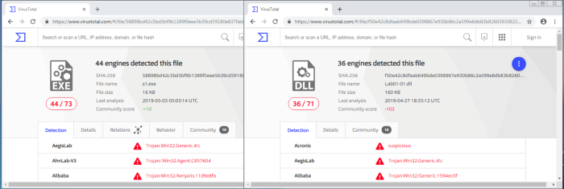

Figure 1.1— VirusTotal.com reports for **Lab01–01.exe** and
**Lab01–01.dll**.

Although the book states that these files are initially unlikely to
appear within [VirusTotal](http://www.virustotal.com), they have become
part of the antivirus signatures so have been recognised. We currently
see that 44/73 antivirus tools pick up on malicious signatures from
**Lab01–01.exe**, whereas 36/71 identify **Lab01–01.dll** as malicious.

ii-We can use [VirusTotal](http://www.virustotal.com) to identify more
information, such as when the files were compiled. We see that the two
files were compiled almost at the same time (*around 2010–12–19
16:16:19*) — this strengthens the theory as the two files are
associated. Other tools can also be utilised to identify Time Date
Stamp, such as [PE Explorer](http://www.pe-explorer.com/) (Figure 2.1).

Figure 2.1 — Date Time Stamps from VirusTotal.com and PE Explorer.

iii-When a file is **packed**, it is more difficult to analyse as it is
typically obfuscated and compressed. Key indicators that a program is
packed, is a lack of visible strings or information, or including
certain functions such as LoadLibrary or GetProcAddress — used for
additional functions. A packed executable has a **wrapper program**
which decompresses and runs the file, and when statically analysing a
packed program, only the wrapper program is examined.

Figure 3.1 — PEiD of **Lab01–01.exe**

[PEiD](https://www.aldeid.com/wiki/PEiD) can be used to identify whether
a file is packed, as it shows which packer or compiler was used to build
the program. In this case *Microsoft Visual C++ 6.0* is used for both
the **Lab01–01.exe** and **Lab01–01.dll** (figure 3.1), whereas a packed
file would be packed with something like
[*<u>UPX</u>*](https://upx.github.io/).

iv- Investigating the **imports** is useful in identifying what the
malware might do. Imports are functions used by a program, but are
actually stored in a different program, such as common libraries.

Any of the previously used tools (VirusTotal,
[PEiD](https://www.aldeid.com/wiki/PEiD), and [PE
Explorer](http://www.pe-explorer.com/)) can be used to identify the
imports. These are stored within the **ImportTable** and can be expanded
to see which functions have been imported.

**Lab01–01.exe** imports functions from KERNEL32.dll and MSVCRT.dll,
with **Lab01–01.dll** also importing functions from KERNEL32.dll,
MSVCRT.dll, and WS2_32.dll (figure 4.1)

Figure 4.1— Import Tables from **Lab01–01.exe** and **Lab01–01.dll**.

- KERNEL32.dll is a common DLL which contains core functionality, such
  as access and manipulation of memory, files, and hardware. The most
  significant functions to note for **Lab01–01.exe** are are
  FindFirstFileA and FindNextFileA , which indicates the malware will
  search through the filesystem, as well as open and modify. On the
  other hand, **Lab01–01.dll** most notably uses Sleep and
  CreateProcessA.

- WS2_32.dll provides network functionality, however in this case is
  imported by ordinal rather than name, it is unclear which functions
  are used.

- MSVCRT.dll imports are functions that are included in most as part of
  the compiler wrapper code.

Assessing the combination of imported functions, so far it could be
assumed that this malware allows for a network-enabled back door.

v-Along with **Lab01–01.exe** and **Lab01–01.dll**, there are other ways
to identify malicious activity on infected systems. Disassembling
**Lab01–01.exe** in [PE Explorer](http://www.pe-explorer.com/) shows us
a set of strings around kerne132.dll which is supposed to be disguised
as the common kernel32.dll — note 1 rather than l (figure 5.1).

Figure 5.1— Disassembly of **Lab01–01.exe** and **Lab01–01.dll** using
PE Explorer

vi- Further investigating the strings, however for **Lab01–01.dll**, it
is apparent that there is an IP address of 127.26.152.13 , which would
act as a network based indicator of malicious activity (figure 5.1).

vii-Bringing all the pieces together, there can be an assumption made
that **Lab01–01.exe**, and by extension **Lab01–01.dll**, is malware
which creates a backdoor. [VirusTotal](http://www.virustotal.com)
provided indication that the files were malicious, and utilising this or
[PE Explorer](http://www.pe-explorer.com/) it was established that the
two were likely related, with the **.dll** is dependant upon the
**.exe**. The files are not packed(as identified by
[PEiD](https://www.aldeid.com/wiki/PEiD)), small programs, with no
exports, however specific imports which indicate that **Lab01–01.exe**
might search through directories and create/manipulate files such as the
disguised kernel32.dll, as well possibly searching for executables on
the target system, as suggested by the string exec within
**Lab01–01.dll**. In addition, there are network based imports, an IP
address, as well as the functions imported from kernel32.dll,
CreateProcess and sleep, which are commonly used in backdoors.

**b- Analyse Lab01–02.exe.**

i-As with the previous lab, uploading **Lab01–02.exe** in
[VirusTotal.com](http://www.virustotal.com) shows us that 47/71
antivirus tools recognise this file’s signature as malicious (figure
1.1).

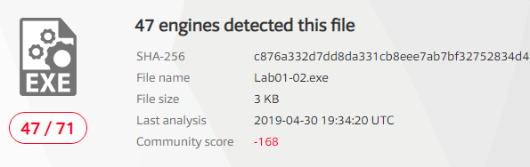

Figure 1.1— VirusTotal.com reports for **Lab01–02.exe.**

ii-We can identify whether the file is packed, either through
[VirusTotal.com](http://www.virustotal.com) or
[PEiD](https://www.aldeid.com/wiki/PEiD). A file which is not packed
will indicate the compiler (eg, *Microsoft Visual C++ 6.0*), or the
method in which it has been packed. Initially,
[PEiD](https://www.aldeid.com/wiki/PEiD) declared there was *Nothing
found \**, however after changing from a *normal* to *deep* scan, it has
been determined that the file has been packed by
[*<u>UPX</u>*](https://upx.github.io/) (figure 2.1).

Figure 2.1 — PEiD Deep scan

- ***Normal** scan is at the Entry Point of the PE File for documented
  signatures.*

- ***Deep** scan is the containing section of the Entry Point*

- ***Hardcore** scan is a complete scan of the entire file for
  signatures.*

Another way of identifying whether the file has been packed or not, is
via the Entry Point Section (*EP Section*) — these are UPX0, UPX1 and
UPX2, section names for UPX packed files. UPX0 has a virtual size of
0x4000 but a raw size of 0 (figure 2.2), likely reserved for
uninitialized data — the unpacked code.

Figure 2.2 — PEiD PE Section Viewer

We are able to unpack the file directly within [PE
Explorer](http://www.pe-explorer.com/), with the **UPX Unpacker
Plug-in**. When enabled, this automatically unpacks the file when loaded
(Figure 2.3).

Figure 2.3 — UPX Unpacker Plug-in running in PE Explorer

iii- When the file is unpacked, we can investigate strings and imports
to see what the malware gets up to. From the Import Viewer within [PE
Explorer](http://www.pe-explorer.com/), we see there are four imports
(figure 3.1).

- KERNEL32.DLL — imported to most programs and doesn’t tell us much
  other than suggesting the potential of creating threads/processes.

- ADVAPI32.dll — specifically CreateServiceA is of note.

- MSVCRT.dll — imported to most programs and doesn’t tell us much.

- WINNET.dll — specifically InternetOpenA and InternetOpenURLA are of
  note.

Figure 3.1 — Import Viewer within PE Explorer

iv-So far, this is suggesting that the malware is creating a service and
connecting to a URL. Checking out the strings of the file in the
Disassembler, we see ‘*Malservice*’,
‘*http://www.malwareanlysisbook.com*’ and ‘*Internet Explorer 8.0*’
(figure 3.2). These potentially act as host or network based indicators
of malicious activity, though the service to run, URL to connect to, and
the preferred browser.

Figure 3.2 — Disassembler Strings

C. **Analyze the file Lab01-03.exe.**

i- Once again, uploading to [VirusTotal.com](http://www.virustotal.com)
indicates that **Lab01–03.exe** is malicious due to 58/69 antivirus
tools currently recognising signatures.

ii Scanning this with [PEiD](https://www.aldeid.com/wiki/PEiD)
demonstrates that **Lab01–03.exe** is packed with [FSG
1.0](https://www.aldeid.com/wiki/Category:Digital-Forensics/Computer-Forensics/Anti-Reverse-Engineering/Packers/FSG)
(figure 2.1 left). This is much more difficult to unpack than
[UPX](https://upx.github.io/) and must be done manually. Currently we
are unable to unpack this. Check out **Lab 18–2** (Chapter 18, Packers
and Unpacking) to unpack in [OllyDbg](http://www.ollydbg.de/).

Figure 2.1 —PEiD showing Lab01–03.exe packed with FSG 1.0 (left) and
Section VIewer (right)

Other indicators that the file is packed, are the missing names in the
EP Section viewer (Figure 2.1 right), as well as the first section
having a virtual size of 0x3000 and a raw size of 0 — again most likely
reserved for the unpacked code.

iii- Although **Lab01–03.exe** is currently unpackable, we can still try
to identify any imports to get an idea of what the file might do.

Figure 3.1 — Dependency Walker for **Lab01–03.exe**

Loading the file into [PE Explorer](http://www.pe-explorer.com/)
unfortunately shows a blank Import Table, and running it in the
Disassembler is also unhelpful. Another useful program is [Dependency
Walker](http://www.dependencywalker.com/), which lists the imported and
exported functions of a portable executable (PE) file (figure 3.1).

Here, we can see that **Lab01–03.exe** is dependant upon (and therefore
imports) KERNEL32.DLL. The particular functions here are LoadLibraryA
and GetProcAddress, however this does not tell us much about the
functionality other than the fact the file is packed.

iv- We are unable to unpack the file the visible imports are
uninformative, and we can’t see any strings in [PE
Explorer](http://www.pe-explorer.com/) (figure 4.1), it is difficult to
suggest what the file might do, or identify any host/network based
malware-infection indicators.

Figure 4.1 — PE Explorer showing no strings information for packed
**Lab01–03.exe**

**D- Analyze the file Lab01-04.exe.**

i- **Lab01–04.exe** is recognised as malicious, with 53/72 engines
detecting malicious signatures (Figure 1.1).

ii- [PEiD](https://www.aldeid.com/wiki/PEiD) shows us that the file is
unpacked (and compiled with *Microsoft Visual C++ 6.0*) (figure 2.1).
Likewise, the EP section shows the valid file names as well as actual
raw sizes for them all, rather than UPX0-3 or blanks, as well as a raw
size of 0, typically seen for packed files (figure 2.1). As this is not
packed, there is no need to unpack it.

Figure 2.1 — PEiD showing Lab01–04.exe is not packed and Section VIewer

iii- Loading **Lab01–04.exe** into [PE
Explorer](http://www.pe-explorer.com/), we initially see that the Date
Time Stamp is clearly faked (figure 3.1). At the time of writing it
looks as though the file was compiled months in the future, and it's not
immediately clear what the real stamp should be.

Figure 3.1 — Date Time Stamp of **Lab01–04.exe**

iv- Switching to the Import Viewer within [PE
Explorer](http://www.pe-explorer.com/), we see that there are three of
the common .dll imported (figure 4.1).

Figure 4.1 — Import Viewer for **Lab01–04.exe**

- KERNEL32.dll — Core functionality, such as access and manipulation of
  memory, files, and hardware.

- ADVAPI32.dll — Access to advanced core Windows components such as the
  Service Manager and Registry. The functions here look like they’re
  doing something with privileges.

- MSVCRT.dll — imports are functions that are included in most as part
  of the compiler wrapper code.

Assessing the combination of imports, there are a few key ones which can
point us in the direction of the program’s functionality.

- SizeOfResource, FindResource, and LoadResource indicate that the file
  is searching for data in a specific resource.

- CreateFile, WriteFile and WinExec suggests that it might write a file
  to disk and execute it.

- LookupPrivilegeValueA and AdjustTokenPrivilages indicates that it
  might access protected files with special permissions.

v- Looking at the strings is often a good way to identify any
host/network based malware-infection indicators. Again, this can be done
through the Disassembler in [PE Explorer](http://www.pe-explorer.com/)
(Figure 5.1)

Figure 5.1 — **Lab01–04.exe** strings within PE Explorer Disassembler

The strings of note here look like ‘*\system32\wupdmgr.exe*’,
‘*psapi.dll*’ and ‘*\winup.exe*’ — potentially these are the files which
the .dll identified, create, or execute.  
‘*\system32\wupdmgr.exe*’ might correlate with KERNEL32.dll
GetWindowsDirectory function to write to system directory and the
malware might modify the Windows Update Manager.

This gives us some host-based indicators, however there is nothing
apparent regarding network functions.

vi- Previously overlooked in [PEiD](https://www.aldeid.com/wiki/PEiD)’s
Section Viewer, there is a resources file .rsrc —The Resource Table.
This is also seen in [PE Explorer](http://www.pe-explorer.com/)’s
Section Headers.

Figure 6.1 — Resource Hacker identifying **Lab01–04.exe**’s **binary
resource**

We are able to open this within [Resource
Hacker](http://angusj.com/resourcehacker/), a tool which can be used to
manipulate resources within Windows binaries. Loading **Lab01–04.exe**
into [Resource Hacker](http://angusj.com/resourcehacker/) identifies
that resource as binary and lets us search through it. (figure 6.1)

**e. Analyze the malware found in the file Lab03-01.exe using basic
dynamic  
analysis tools.**

i-This dynamic analysis starts with initial static analysis to hopefully
gain a baseline understanding of what might be going on. Straight in
with [PEiD](https://www.aldeid.com/wiki/PEiD) and [PE
Explorer](http://www.pe-explorer.com/) we see that **Lab03–01.exe** is
evidently PEncrypt 3.1 packed, and only visible import of kernel32.dll
and function ExitProcess(figure 1.1). Also, there are are no apparent
strings visible.

Figure 1.1 — File
**Lab03–01.exe** is packed, and has minimal imports

It’s difficult to understand this malware’s functionality with this
minimal information. Potentially the file will unpack and expose more
information when it is run. One thing we can do is execute
[strings](https://docs.microsoft.com/en-us/sysinternals/downloads/strings)
to scan the file for UNICODE or ASCII characters not easily located.
Doing this we can identify some useful information.  
There is a bit of noise here which have been removed, and the main ones
are highlighted in red (table 1.1).

Table 1.1 — Processed output of strings *function on* **Lab03–01.exe**

Looking at these, we can make some rough assumptions that
**Lab03–01.exe** is likely to do some network activity and download and
hide some sort of file in some of the registry directories, under one of
those string names.

ii- To identify host-based indicators, we can make assumptions from the
previous strings output, such as potentially attaching itself to
SOFTWARE\Microsoft\Windows\CurrentVersion\Run\VideoDriver — however, it
is more useful to perform **dynamic analysis** and see what it’s doing.
Take a snapshot of the VM so you’re able to revert to a pre-execution
state!

Set VM networking to Host-only, and manually assign the preferred DNS
server as [iNetsim](http://www.inetsim.org), or configure the DNS reply
IP within
[ApateDNS](https://www.fireeye.com/services/freeware/apatedns.html) to
loopback, and set up listeners using
[Netcat](http://netcat.sourceforge.net/) (ports 80 and 443 are
recommended as a starting point as these are common).

Clear all processes within
[Procmon](https://docs.microsoft.com/en-us/sysinternals/downloads/procmon),
and apply suitable filters to clear out any noise and find out what the
malware is doing. Initially filter to include Process **Lab3–1.exe** so
we can see its activity. Likewise, start [Process
Explorer](https://docs.microsoft.com/en-us/sysinternals/downloads/process-explorer)
for collecting information about processes running on the system.

Figure 2.1 —
[Procmon](https://docs.microsoft.com/en-us/sysinternals/downloads/procmon)
of **Lab03–01.exe**

The first thing we notice when executing **Lab03–01.exe** is the series
of Registry Key operations (Figure 2.1). This doesn’t tell us too much
about what the malware is doing specifically however, it’s always useful
to see an overview of the activities. We can filter this further to only
show WriteFile and RegSetValue to see the key operations (figure 2.2)

Figure 2.2 —
[Procmon](https://docs.microsoft.com/en-us/sysinternals/downloads/procmon)
of **Lab03–01.exe**, filtered for WriteFile and RegSetValue

We can investigate these operations further, and we see that they are
related. First, a file is written to
C:\WINDOWS\system32\\**vmx32to64.exe** (*note, this filename is a string
we’ve identified as part of the initial static analysis*) however, this
appears to be set to the registry of
HKLM\SOFTWARE\Microsoft\Windows\CurrentVersion\Run\VideoDriver (*another
identified string!*). This is a strong host-based indicator that the
malware is up to something (Figure 2.3). Most likely the malware is
intended to be run at startup.

Figure 2.3 — **Lab03–01.exe** hiding under **vmx32to64.exe** *and set to
**VideoDriver** registry.*

Upon further investigation, it appears as though files **vmx32to64.exe**
and **Lab03–01.exe** share the same hash (figure 2.4), indicating the
malware has established persistence through creating and hiding a copy
of itself, as well as to execute at startup via the VideoDriver
registry.

Figure 2.4 — **Lab03–01.exe** sharing the same SHA1 Hash as
**vmx32to64.exe***.*

Further host-based indicators can be identified through analysis of
[Process
Explorer](https://docs.microsoft.com/en-us/sysinternals/downloads/process-explorer),
to show which handles and DLLs the malware has opened or loaded.

Figure 2.4 — [Process
Explorer](https://docs.microsoft.com/en-us/sysinternals/downloads/process-explorer)
showing Mutex **WinVMX32**

[Process
Explorer](https://docs.microsoft.com/en-us/sysinternals/downloads/process-explorer)
shows us that **Lab03–01.exe** has created at mutex of WinVMX32 (*again,
another identified string*) (Figure 2.4). A mutex (mutual exclusion
objects) is used to ensure that only once instance of the malware can
run at a time — often assigned a fixed name. We also see
**Lab03–01.exe** utilises ws2_32.dll and wshtcpip.dll for network
capabilities.

iii-We’re able to analyse network activity either locally on the victim,
or utilising [iNetSim](https://www.inetsim.org). I have demonstrated
both, having configured DNS to either the
[iNetSim](https://www.inetsim.org) machine or loopback (for the
[netcat](https://en.wikipedia.org/wiki/Netcat#:~:text=netcat%20(often%20abbreviated%20to%20nc,by%20other%20programs%20and%20scripts.)
listeners). Turning our attention to
[ApateDNS](https://www.fireeye.com/services/freeware/apatedns.html) and
our [iNetSim](https://www.inetsim.org) logs, we see some pretty
significant network-based indicators of this malware activity.
[ApateDNS](https://www.fireeye.com/services/freeware/apatedns.html) show
regular DNS requests to www.practicalmalwareanalysis.com every 30
seconds (figure 3.1).

Figure 3.1 —
**[<u>ApateDNS</u>](https://www.fireeye.com/services/freeware/apatedns.html)**
showing DNS beaconing

The [ApateDNS](https://www.fireeye.com/services/freeware/apatedns.html)
capture suggests the malware is beaconing — possibly to either to fetch
updates/instructions or to send back stolen information.

Figure 3.2 — [iNetSim](https://www.inetsim.org) logs

Also, the associated [iNetSim](https://www.inetsim.org) logs show a
recognised DNS request for the malicious website, providing further
indication of beaconing intent.

Finally, the [Netcat](http://netcat.sourceforge.net/) listener (with DNS
configured for loopback) has picked up a transmission on port 443. This
shows a series of illegible characters emitted from the malware (Figure
3.3). On subsequent executions or periodic ticks, the transmission is
unique.

Figure 3.3 — Illegible characters transmitted by **Lab03–01.exe.**

The combination of host and network-based indicators provide significant
grounding to make assumptions regarding the malware’s activity.

- From **Static Analysis**, not a lot was uncovered other than the
  output of what might use as hard-coded parameters.

- **Dynamic Analysis** to uncover further host-based indicators show
  that the malware has replicated and masked under another file name has
  associated with the registry for execution on startup and has network
  functionality.

- Network-based activity is identified through capturing periodic DNS
  requests, as well as intercepting random character transmissions of
  HTTP & SSL

**f. Analyze the malware found in the file Lab03-02.dll using basic
dynamic analysis  
tools.**

i- At first glance, we have **Lab03–02.dll.** As this is not a .exe
file, we are unable to directly execute it. rundll32.exe is a windows
utility which loads and runs 32-bit dynamic-link libraries (.dll).

First, however, we likely require any exported functions to pass in as
an argument. This can be identified through PE analysis, which shows us
a set of exported and imported functions. The imported functions (Figure
1.1) give us an idea of the .dll’s capabilities. Speculation into these
might suggest there will likely be some networking going on, as well as
some file, directory and registry manipulation. Functions included as
part of ADVAPI32.dll suggests the malware may need to be run as a
service, which is backed up by **Lab03–02.dll**’s exports (Figure 1.1)

Figure 1.1 — **Lab03–02.dll**’s Imports and Exports showing likely
service capabilities

Running
[streams](https://docs.microsoft.com/en-us/sysinternals/downloads/strings)
also gives us a lot of useful insight into potential actions. Most of
which are found as imported functions, however, there are others worth
noting that my be useful host/network-based indicators. These include
some very distinctive strings, potential registry locations and file or
network names, as well as some base64 encoded strings hinting at some
functionality (Figure 1.2).

Figure 1.2 — **Lab03–02.dll**’s strings showing potential functionality.

Now we have a starting point to look out for, we can prepare our
environment for trying to run the malware — clearing
[procmon](https://docs.microsoft.com/en-us/sysinternals/downloads/procmon),
taking a [registry snapshot](https://sourceforge.net/projects/regshot/),
and setting up the network.

ii- To install the malware, pass one of Install or installA (found from
the exports) into rundll32.  
Executing C:\rundll32.exe Lab03-02.dll,install doesn’t give any
immediate feedback on the command line, within [process
explorer](https://docs.microsoft.com/en-us/sysinternals/downloads/process-explorer),
or [Wireshark](https://www.wireshark.org/)/iNetSim, however taking a 2nd
[registry snapshot](https://sourceforge.net/projects/regshot/) and
comparing the two, it’s clear that keys and values have been added —
many of these matching up with what we found from
[strings](https://docs.microsoft.com/en-us/sysinternals/downloads/strings)
(Figure 2.1)

Figure 2.1 — Registry keys and values added as a result of installing
**Lab03–02.dll**

We can see within the
[regshot](https://sourceforge.net/projects/regshot/) comparison that
something called IPRIP has been added as a service, with some of the
more identifiable strings as \DisplayName or \Description. The image
path has also been set to %SystemRoot%\System32\svchost.exe -k netsvcs
which shows the malware is likely to be launched within **svchost.exe**
with network services as an argument.

iii- Since we have installed **lab03–02.dll** as a service, we can now
run this and we see the same \DisplayName + update found from the added
reg values (Figure 3.1).

Figure 3.1 — Starting the IPRIP service

Checking out
[ProcessExplorer](https://docs.microsoft.com/en-us/sysinternals/downloads/process-explorer)
to see what’s happened, we can search for the **Lab03–02.dll** which
will point us to the **svchost.exe** instance that was created.

Figure 3.2 — Process Explorer showing **svchost.exe** launched with
**Lab03–02.dll**

We can identify various indicators which attribute **Lab03–02.dll** to
this instance of **svchost.exe** thorough the inclusion of the .dll, the
service display name *“Intranet Network Awareness (INA+)”*, and the
command line argument matching what has been found in strings. This
helps us to confirm that **Lab03–02.dll** has been loaded — note the
*process ID, 1148*. We’ll need this to see what’s going on in
[ProcMon](https://docs.microsoft.com/en-us/sysinternals/downloads/procmon)!

iv- Checking out
[ProcMon](https://docs.microsoft.com/en-us/sysinternals/downloads/procmon),
filtered on *PID 1148*, we see a whole load of registry RegOpenKey and
ReadFiles, however, seems mostly **svchost.exe** related and nothing
jumps out as malicious.

v- Turing our attention to look for network-based indicators, we have
traffic captured within [Wireshark](https://www.wireshark.org/), as well
as logged within [iNetSim](https://www.inetsim.org/). To give us an idea
of what to look for, we can check out the
[iNetSim](https://www.inetsim.org/) logs first (Figure5.1), which show
us that we have seen 2 notable types of activity; DNS and HTTP
connections. The DNS appears to be periodic requests to
practicalmalwareanalysis.com (which we previously saw similar with
**Lab03–01.exe**), as well as a HTTP GET request to
<http://practicalmalwareanalysis.com/serve.html> which attempts to
download a file. Fortunately, as we had
[iNetSim](https://www.inetsim.org/) set up to respond, it provides a
dummy file to complete the request —
/var/lib/inetsim/http/fakefiles/sample.html. If we didn’t have this, we
might have downloaded something real nasty.

Figure 5.1 — iNetSim logs of **Lab03–02.dll**’s DNS and HTTP request

We’re able to look at these within
[Wireshark](https://www.wireshark.org/) and inspect the packets in more
detail. Filtering on DNS, we’re able to see the DNS request to
practicalmalwareanalysis.com (Figure 5.2). Finding the conversation
between the host and [iNetSim](https://www.inetsim.org/) and following
the TCP stream, we’re able to see the content within the HTTP GET
request to
[http://practicalmalwareanalysis.com/serve.html](http://practicalmalwareanalysis.com/serve.html.)
(Figure 5.2). This also shows [iNetSim](https://www.inetsim.org/)’s
dummy content replacing serve.hmtl .

Figure 5.2 — [Wireshark](https://www.wireshark.org/) traffic for
**Lab03–02.dll** DNS (left) and HTTP (right)

Figure 5.3 — [Netcat](http://netcat.sourceforge.net/) receiving HTTP GET
header

Reverting to snapshot and reinstalling & launching the malicious
.dll/service, we can also capture traffic by using
[ApateDNS](https://www.fireeye.com/services/freeware/apatedns.html) to
redirect to loopback were we have a
[Netcat](http://netcat.sourceforge.net/) listener on port 80 (Figure
5.3). Here, we see the same HTTP GET header as we did within
[Wireshark](https://www.wireshark.org/).

Referring back to the strings output, *“practicalmalwareanalysis.com”*,
*“serve.html”*, and *“Windows XP 6.11”* are also evident within the
network analysis and can be used as signatures for the malware.

To recap on the main host/network-based indicators we see:

- IPRIP installed as a service, including strings such as *“Intranet
  Network Awareness (INA+)”*

- Network activity to *“practicalmalwareanalysis.com/serve.html”* as
  well as the User-Agent *%ComputerName% Windows XP 6.11.*

**g. Execute the malware found in the file Lab03-03.exe while monitoring
it using basic dynamic analysis tools in a safe environment**

i- After prepping for dynamic analysis, launch **Lab03–03.exe** and you
may notice it appear briefly within [Process
Explorer](https://docs.microsoft.com/en-us/sysinternals/downloads/process-explorer)
with a child process of svchost.exe. After a moment however, it
disappears leaving svchost.exe orphaned (Figure 1.1).

Figure 1.1 — Orphaned svchost.exe

An orphaned process is one with no parent listed in the process tree.
svchost.exe typically has a parent process of services.exe, but this one
being orphaned is unusual and suspicious.

Investigating this instance of svchost.exe, we see it has a Parent:
Lab03-03.exe(904), confirming it’s come from executing **Lab03–03.exe**.
Exploring the properties further, we don’t see much anomalous until we
get to the strings.

ii- Utilizing strings within [Process
Explorer](https://docs.microsoft.com/en-us/sysinternals/downloads/process-explorer)
is actually a useful trick to analyse malware which is packed or
encrypted, because the malware is running and unpacks/decodes itself
when it starts. We’re also able to view strings in both the image on
disk and in memory.

Figure 2.1 — Comparing strings in memory from process explorer and from
running strings on **Lab03–03.exe**

Taking advantage of this, we can inspect the strings in Image and in
Memory, as well as compare against what we found from strings during
quick static analysis.

The strings on image appear pretty consistent with other instances of
svchost.exe however, within Memory, these much greater resemble what we
discovered earlier, but with a few distinct differences —
practicalmalware.log and a set of keyboard commands (Figure 2.1). This
is an indicator that the keylogger guess might be accurate.

iii- To test the keylogger hypothesis, we can open something and type
stuff. To target explicitly on the malware, filter on the suspect
svchost.exe (PID, 3936) within Process Monitor, and we see a whole load
of file manipulation for practicalmalwareanalysis.log (Figure 3.1).

Figure 3.1 — Process Monitor file manipulation from malicious
svchost.exe

iv- Opening practicalmalwareanalysis.log, we find that the file captures
inputted strings and distinctive keyboard commands as seen within the
memory strings from [Process
Explorer](https://docs.microsoft.com/en-us/sysinternals/downloads/process-explorer)
(Figure 4.1). This confirms that **Lab03–03.exe** a keylogger using
process replacement on svchost.exe.

Figure 4.1 — Evidence of **Lab03–03.exe** keylogging

**h. Analyze the malware found in the file Lab03-04.exe using basic
dynamic analysis tools.**

**i-What happens when you run this file?**

When we run the file. Process is created which opens up the CMD and then
deleted the original executable after making it execute and hide itself
somewhere else.

**ii-What is causing the roadblock in dynamic analysis?**

The executable is evasive and trying to evade itself by checking whether
the system is VM or not. AV-Detection etc. Obviously this will make it
difficult to observer the file via dynamic analysis.

**iii- Are there other ways to run this program?**

The other ways can be to open this executable using Ollydbg or IDA pro
where we can analyze it in a more efficient way.

**<u>Practical No. 2</u>**

**a. Analyze the malware found in the file Lab05-01.dll using only IDA
Pro. The goal of this lab is to give you hands-on experience with IDA
Pro. If you’ve already worked with IDA Pro, you may choose to ignore
these questions and focus on reverse engineering the malware**

[IDA Pro](https://www.hex-rays.com/products/ida/), an Interactive
Disassembler, is a disassembler for computer programs that generates
assembly language source code from an executable or a program. IDA Pro
enables the disassembly of an entire program and performs tasks such as
function discovery, stack analysis, local variable identification, in
order to understand (or change) its functionality.

This lab utilises IDA to explore a malicious .dll and demonstrates
various techniques for navigation and analysis. Any useful shortcuts
will be identified.

# i. What is the address of DllMain?

The address off DllMain is 0x1000D02E. This can be found within the
graph mode, or within the Functions window (figure 2).

Figure 2: Address of DllMain

# ii. Where is the import gethostbyname located?

gethostbyname is located at 0x100163CC within .idata (figure 3).This is
found through the Imports window and double-clicking the function. Here
we can also see gethostbyname also takes a single parameter — something
like a string.

Figure 3: Location of gethostbyname

# iii. How many functions call gethostbyname?

Searching the xrefs (ctrl+x) on gethostbyname shows it is referenced 18
times, 9 of which are type (p) for the near calll, and the other 9 are
read (r) (figure 4). Of these, there are 5 unique calling functions.

Figure 4: gethostbyname xrefs

# iv. For gethostbyname at 0x10001757, which DNS request is made?

Pressing G and navigating to 0x10001757, we see a call to
thegethostbyname function, which we know takes one parameter; in this
case, whatever is in eax — the contents of off_10019040 (figure 5)

Figure 5: gethostbyname at 0x10001757

The contents of off_10019040 points to a variable aThisIsRdoPicsP which
contains the string \[This is RDO\]pics.practicalmalwareanalysis.com.
This is moved into eax (figure 6).

Figure 6: Contents of off_1001904 (aThisIsRdoPicsP)

Importantly, 0Dh is added to eax, which moves the pointer along the
current contents. 0Dh can be converted in IDA by pressing H, to 13. This
means the eax now points to 13 characters inside of its current
contents, skipping past the prefix \[This is RDO\] and resulting in the
DNS request being made for pics.practicalmalwareanalysis.com.

# v & vi. How many parameters and local variables are recognized for the subroutine at 0x10001656?

There are a total of 24 variables and parameters for sub_10001656
(figure 7).

Figure 7: sub_10001656 parameters and varliables

Local variables correspond to negative offsets, where there are **23**.
Many are generated by IDA and prepended with var\_ however there are
some which have been resolved, such as name or commandline. As we work
through, we generally rename any of the important ones.

Parameters have positive offsets. Here there is **one**, currently
lpThreadParameter. This may also be seen as arg_0 if not automagically
resolved.

# vii. Where is the string \cmd.exe /c located in the disassembly?

Press Alt+T to perform a string search for \cmd.exe /c, which is stored
as aCmdExeC, found within sub_1000FF58 at offset 0x100101D0 (figure 8).

Figure 8: Location of ‘\cmd.exe /c’

# viii. What happens around the referencing of \cmd.exe /c?

The command cmd.exe /c opens a new instance of cmd.exe and the /c
parameter instructs it to execute the command then terminate. This
suggests that there is likely a construct of something to execute
somewhere nearby.

Taking a cursory look around sub_1000FF58, we see several indications of
what might be happening. Look for push offset X for quick wins.

Towards the top of the function, we see an address that is quite telling
of what is happening. The offset aHiMasterDDDDDD called at
0x1001009Dcontains a long message which includes several strings
relating to system time information (actually initialised just before),
but more notably reference to a **Remote Shell** (figure 9).

Figure 9: Contents of offset aHiMasterDDDDDD

Further on throughout the function, there are more interesting offset
addresses with strings that may provide an indication of activity.

Figure 10: Offset strings within sub_1000FF58

Some of which are likely part of any commandline activity, whereas
others may be additional modules. Some of the notable ones might be  
aInject, aIexploreExe, and aCreateProcessG, which could be indicative of
process injection into iexplore.exe.

**ix. At 0x100101C8, dword_1008E5C4 indicates which path to take. How
does the malware set dword_1008E5C4?**

The comparison of dword_1008E5C4 and ebx will determine whether \cmd.exe
/c or \command.exe /c is pushed; likey based upon the Operating System
version to utilise the correct command prompt (figure 11).

Figure 11: cmd.exe or command.exe options

Following the xrefs of dword_1008E5C4 , we see it written (type w) in
sub_10001656, with the value of eax. There is a preceding call to
sub_10003695, where the function takes a look at the system’s Version
Information (using API call GetVersionExA) (figure 12).

Figure 12:

There is a comparison between the VersionInformation.dwPlatformId and 2,
so looking at the [Windows Platform
IDs](https://docs.microsoft.com/en-us/dotnet/api/system.platformid?view=net-6.0)
we see that it is looking to see if ‘The operating system is Windows NT
or later.’ If it is, then \cmd.exe /c is pushed. If not, then it is
\command.exe /c.

# x. What happens if the string comparison to robotwork is successful?

The robotwork string comparison is completed using the function memcmp,
which returns **0** if the two strings are identical. The JNZ branch
jumps if the result **Is Not Zero**. This means, if the robotwork
comparison is successful, returning 0, then the jump does not execute
(the red path). If the memcmp was unsuccessful, then some other non-zero
value would be returned and the jump (green path) would be followed
(figure 13).

Figure 13: memcmp of robotwork

Not jumping, (and following the red path), leads to a new function
sub_100052A2 which includes registry keys
SOFTWARE\Microsoft\Windows\CurrentVersion WorkTime and WorkTimes. The
function is looking for values within the WorkTime and WorkTimes (
RegQueryValueExA) and if so, are displayed as part of the relevant
aRobotWorktime offset addresses (via %d) (figure 14).

Figure 14: Querying SOFTWARE\Microsoft\Windows\CurrentVersion WorkTime
and WorkTimes registry keys

The start of the function takes in a parameter for SOCKET as s , which
is then passed through to a new function (sub_100038EE) along with the
registry values (ebp) (figure 15).

Figure 15: Passing registry values through SOCKET s

Therefore, if the string comparison for robotwork is successful, the
registry keys SOFTWARE\Microsoft\Windows\CurrentVersion WorkTime and
WorkTimes are queried and the values passed through (likely) the remote
shell connection.

# xi. What does the export PSLIST do?

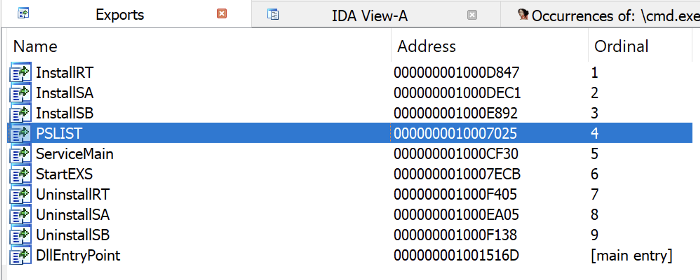

Figure 16: Exports view

Open the exports list and find the exported function PSLIST. (figure
16).

Navigate here and see there are three subroutines. One of which queries
OS version information (similar as seen in Q9, but this time also sees
if dwMajorVersion is 5 for more specific OS footprinting
([dwMajorVersions](https://docs.microsoft.com/en-us/windows/win32/api/winnt/ns-winnt-osversioninfoexa#remarks))),
and depending on the outcome, will call either sub_10006518 or
sub_1000664C (figure 17).

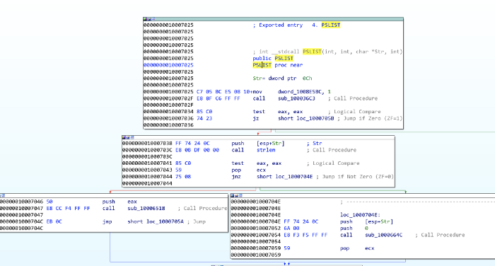

Figure 17: PSLIST exported function paths

Both sub_10006518 and sub_1000664C utilise CreateToolhelp32Snapshot to
take a snapshot of the specified processes and associated information,
and then execute appropriate commands to query the running processes
IDs, names, and the number of threads. sub_1000664C also includes the
SOCKET (s) to send the output out to (figure 18).

Figure 18: Using CreateToolhelp32Snapshot, quering running processes,
and sending to socket

# xii. Which API functions could be called by entering sub_10004E79?

A useful way to quickly see what API functions are called by a certain
subroutine is through the Proximity Brower view, this transforms the
standard Graph or Text views into a much more condensed graph
highlighting which API functions or subroutines are called (figure 19)

Figure 19: Proximity View of sub_10004E79

Figure 20: Functions called by sub_10004E79

The functions called from sub_10004E79 (figure 20) indicate that the
functionality is to identify the language used on the system, and then
pass that information through the SOCKET (as we’ve seen sub_100038EE
before). It might make sense to rename sub_10004E79 to something like
**getSystemLanguage**. While we’re at it, we might aswell rename
sub_100038EE to something like **sendSocket**.

# **xiii. How many Windows API functions does DllMain call directly, and how many at a depth of 2?**

Another way to view the API functions called from somewhere, is through
View -\> Graphs -\> User XRef Chart. Set start and end addresses to
DllMain and the Recursion depth to 1 to see four API functions called
(figure 21). At a depth of 2, there are around 32, with some duplicates.

Figure 21: API functions called by DllMain.

Some of the more notable API calls which may provide indication of
functionality are: sleep winexec gethostbyname inet_nota CreateThread
WSAStartup inet_addr recv send socket connect LoadLibraryA

# xiv. How long will the Sleep API function at 0x10001358 execute for?

At first glance, one might think that the value passed to the sleep is
3E8h (1000), equating to 1 second, however it is a imul call which means
the value at eax is getting multiplied by 1000. Looking up, we see that
aThisIsCti30 at the offset address is moved into eax and then the
pointer is moved 13 along (similar to what's seen in Q2) (figure 22).

Figure 22: Sleep for 30 seconds

This means that the value of eax when it is pushed is 30. atoi converts
the string to an integer, and it is multiplied by 1000. Therefore, the
Sleep API function sleeps for 30 seconds.

# xv & xvi. What are the three parameters for the call to socket at 0x10001701?

The three values pushed to the stack, labeled as protocol, type, and af,
and are 6, 1, 2 respectively, are the three parameters used for the call
to socket (figure 23).

Figure 23: Call to socket at 0x10001701

These depict what type of socket is created. Using [Socket
Documentation](https://docs.microsoft.com/en-us/windows/win32/api/winsock2/nf-winsock2-socket)
we can determine that in this case, it is TCP IPV4. At this point, we
might aswell rename those operands (figure 24).

Figure 24: Definitions and renaming of socket parameters

# xvii. Is there VM detection?

Figure 25: Searching for the in instruction using 0xED in binary.

The in instruction (opcode 0xED) is used with the string *VMXh* to
determine whether the malware is running inside VMware. 0xED can be
searched (alt+B) and look for the in instruction (figure 25).

From here, we can navigate into the function and see what is going on
within sub_10006196.

Figure 26: in instruction within sub_10006196

Directly around the in instruction, we see evidence of the string VMXh
(converted from original hex value) (figure 26), which is potentially
indicative of VM detection. If we look at the other xrefs of
sub_10006196 we see three occurrences, each of which contains
aFoundVirtualMa, indicating the install is canceling if a Virtual
Machine is found (figure 27).

Figure 27: Found Virtual Machine string found after *VMXh string*

# xviii, xix, & xx. What is at 0x1001D988?

The data starting at 0x1001D988 appears illegible, however, we can
convert this to ASCII (by pressing A), albeit still unreadable (Figure
28).

Figure 28: Random data at 0x1001D988

We have been provided a python script with the lab lab05–01.py which is
to be used as an IDA plugin for a simple script. For 0x50 bytes from the
current cursor position, the script performs an XOR of 0x55, and prints
out the resulting bytes, likely to decode the text (figure 29).

Figure 29: XOR 0x55 script

We are unable to do this within the free version of IDA, however we can
loosely do it manually ourselves by taking the bytes from 0x1001D988 and
doing XOR 0x55.

Evidently, the conversion to ASCII and manual decoding has messed up
something with the capitalisation, but we can see some plaintext and
determine the completed message (figure 30)

Figure 30: Manual XOR 0x55

**b. analyze the malware found in the file Lab06-01.exe.**

**i. What is the major code construct found in the only subroutine
called by main?**

Before we start, it is worth noting that sometimes IDA does not
recognise the main subroutine. We can find this quite quickly by
traversing from the start function and finding sub_401040. This is main
as it contains the required parameters (argc and \*\*argv). I renamed
the subroutine to main (figure 1).

Figure 1: Lab06–01 \| main subroutine

Navigating into the first subroutine called in main (sub_401000) (figure
2), we see it executes an external API call InternetGetConnectedState,
which returns a TRUE if the system has an internet connection, and FALSE
otherwise. This is followed by a comparison against 0 (FALSE) and then a
JZ (Jump If Zero). This means the jump will be successful if
InternetGetConnectedState returns FALSE (0) (There is no internet
connection).

Figure 2: Lab06–01 \| sub_401000 internet connection test

Therefore, the jump path (short loc_40102B) is taken and the string
returned will be ‘*Error 1.1: No Internet\n*’.

InternetGetConnectedState returns TRUE, then the jump is not successful,
and the returned string is ‘*Success: Internet Connection\n*’.  
  
Based upon this, it can be determined that the major code construct is a
basic **If Statement**.

**ii. What is the subroutine located at 0x40105F?**

Given the proximity to the strings at the offset addresses in each path,
it can be assumed that sub_40105F is printf, a function used to print
text with formatting (supported by the *\n* for newline in the strings).

IDA didn’t automatically pick this up for me, but with some
cross-referencing and looking into what we would expect as parameters,
we can be safe in the assumption.

**iii. What is the purpose of this program?**

Lab06–01.exe is a simple program to test for internet connection. It
utilises API call InternetGetConnectedState to determine whether there
is internet, and prints an advisory string accordingly.

**c. Analyze the malware found in the file *Lab06–02.exe*.**

**i & ii. What operation does the first subroutine called by main
perform? What is the subroutine located at 0x40117F?**

This is very similar to Lab06–01.exe. We can easily find the main
subroutine again (this time sub_401130), and again we see the first
subroutine called is sub_401000. This is very similar as it calls
InternetGetConnectedState and prints the appropriate message (figure 3).
We also can verify that 0x40117F is still the printf function, which
I’ve renamed.

Figure 3: Lab06–02 \| sub_401000 internet connection test & sub_40117F
(printf)

**iii. What does the second subroutine called by main do?**

This is something new now; the main function in lab06–02.exe is a little
more complex with an added subroutine and another conditional statement
(figure 4). We can see that sub_401040 is reached by the preceding cmp
to 0 being successful (jnz jump if not 0), which therefore means we’re
hoping for the returned value from sub_401000 to be not 0 — indication
there IS internet connection.

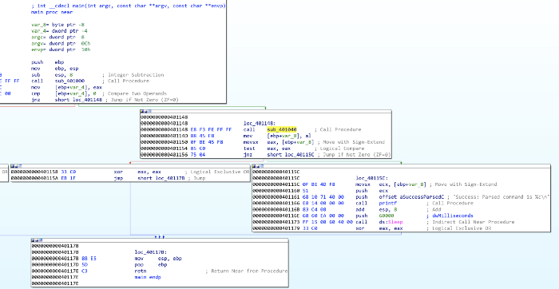

Figure 4: Lab06–02 \| main subroutine

Navigating to sub_401040, we immediately see some key information, which
supports the determination that this occurs if there is an internet
connection.

The most stand-out information is the two API calls, InternetOpenA and
InternetOpenUrlA, which are used to initiate an internet connection and
open a URL. We also see some strings at offset addresses just before
these, indicating these are passed to the API calls (figure 5).

Figure 5: Lab06–02 \| Internet connection API calls and strings

First, szAgent containing string “*Internet Explorer 7.5/pma*”, which is
a User-Agent String, is passed to InternetOpenA.  
szUrl contains the string
“*http://www.practicalmalwareanalysis.com/cc.htm*” which is the URL for
InternetOpenUrlA.

This has another jnz where the jump is not taken if hFile returned from
InternetOpenUrlA is 0 (meaning no file was downloaded), where a message
is printed “*Error 2.2: Fail to ReadFile\n*” and the internet connection
is closed.

**iv. What type of code construct is used in sub_40140?**

If szURl **is** found, the program attempts to read 200h (512) bytes of
the file (*cc.htm*) using the API call InternetReadFile (the jnz
unsuccessful path leads to “*Error 2.2: Fail to ReadFile\n*” printed and
connections closed) (figure 6).

Figure 6: Lab06–02 \| Reading first 4 bytes of cc.htm

There are then four cmp / jnz blocks which each comparing a single byte
from the Buffer and several variables. These may also be seen as
Buffer+1, Buffer+2, etc. This is a notable code construct in which a
character array is filled with data from InternetReadFile and is read
one by one.

These values have been converted (by pressing R) to ASCII. Combined
these read \<!--, indicative of the start of a comment in HTML. If the
value comparisons are successful, then var_20C (likely the whole 512
byes in Buffer, but just mislabeled by IDA) is read. If at any point a
byte read is incorrect, then an alternative path is taken and the string
“*Error 2.3: Fail to get command\n*” is printed.

Looking back at main, if this all passes with no issues, the string
“*Success: Parsed command is %c\n*” is printed and the system does Sleep
for 60000 milliseconds (60 seconds) (figure 7). The command printed
(displayed through formatting of %c is variable var_8) is the returned
value from sub_401040, the contents of *cc.htm.*

Figure 7: Lab06–02 \| Reporting successful read of command and sleeping
for 60 seconds

**v. Are there any network-based indicators for this program?**

The key NBIs (network-based indicators) from the program are the
user-agent string and URL found related to the InternetOpenA and
InternetOpenUrlA calls; *Internet Explorer 7.5/pma* and
*http://www.practicalmalwareanalysis.com/cc.htm*

**vi. What is the purpose of this malware?**

Very similar to Lab06–01.exe, Lab06–02.exe tests for internet connection
and prints an appropriate message. Upon successful connection, however,
the program then attempts to download and read the file from
*[<u>http://www.practicalmalwareanalysis.com/cc.htm</u>](http://www.practicalmalwareanalysis.com/cc.htm).*

Figure 8: Lab06–02.exe \| Tested execution

Upon testing, this file is not available on the server. The program did
not successfully read the required first 4 bytes therefore an error
message was printed (figure 8).

**d. Analyze the malware found in the file *Lab06–03.exe*.**

**i. Compare the calls in main to Lab06–02.exe’s main method. What is
the new function called from main?**

For both executables, I have renamed all of the functions that we have
already analysed. The differentiator between the two is an additional
function once internet connection has been tested, the file has been
downloaded, and the successful parsing of the command message has been
printed — sub_401130 (figure 9).

Figure 9: Lab06–03.exe \| Comparisons of Lab06–03.exe (left) and
Lab06–02.exe (right) main functions

**ii. What parameters does this new function take?**

sub_401130 takes 2 parameters. The first is char, the command character
read from
*[<u>http://www.practicalmalwareanalysis.com/cc.htm</u>](http://www.practicalmalwareanalysis.com/cc.htm)*
and lpExistingFileName (a long pointer to a character string, ‘Existing
File Name’, which is the program’s name ( Lab06–03.exe) (figure 10).
These were both pushed onto the stack as part of the main function.

Figure 10: Lab06–03.exe \| sub_401130 parameters.

**iii. What major code construct does this function contain?**

IDA has helpfully indicated that the major code construct is a five-case
switch statement by adding comments for 'switch 5 cases' and the
'jumptable 00401153 default case'. We have previously seen similar cmp
which are if statements, however, in this case, there is a possibility
of five paths. We can confirm this in the flowchart graph view, where
there are five switch cases and one default case (figure 11).

Figure 11: Lab06–03.exe \| sub_401130 flowchart

**iv. What can this function do?**

The five switch cases are as follows (figure 12):

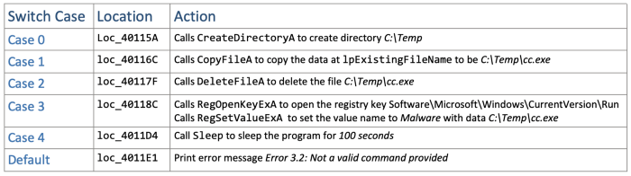

Figure 12: Lab06–03.exe \| sub_401130 switch cases

Depending on the command provided (0–4) the program will execute the
appropriate API calls to perform directory operations or registry
modification. lpExistingFileName is the current file, Lab06–03.exe*.*
Setting the registry key
Software\Microsoft\Windows\CurrentVersion\Run\Malware with file
C:\Temp\cc.exe is a method of persistence to execute the malware on
system startup.

**v. Are there any host-based indicators for this malware?**

The key HBIs (host-based indicators) are the file written to disk
(C:\Temp\cc.exe), and the registry key used for persistence (
Software\Microsoft\Windows\CurrentVersion\Run /v Malware \|
C:\Temp\cc.exe)

**vi. What is the purpose of this malware?**

Following on from the functionality of the simpler Lab06–01.exe and
Lab06–02.exe, Lab06–03.exe also tests for internet connection and prints
an appropriate message. The program attempts to download and read the
file from
*[<u>http://www.practicalmalwareanalysis.com/cc.htm</u>](http://www.practicalmalwareanalysis.com/cc.htm).*
The program then has a set of possible functionalities based upon the
contents of *cc.htm* and the switch code construct to perform one of:

- Create directory C:\Temp

- Copy the current file (Lab06–03.exe) to C:\Temp\cc.exe

- Set the Run registry key as Malware \| C:\temp\cc.exe for persistence

- Delete C:\Temp\cc.exe

- Sleep the program for 100 seconds

**e. analyze the malware found in the file Lab06-04.exe.**

**i. What is the difference between the calls made from the main method
in Lab06–03.exe and Lab06-04.exe?**

Figure 13: Lab06–04.exe \| Modified downloadFile function with arg_0

Of the subroutines called from main we have analysed (renamed to
testInternet, printf, downloadFile, and commandSwitch) only downloadFile
has seen a notable change. The aInternetExplor address contains the
value *Internet Explorer 7.50/pma%d* for the user-agent (szAgent) which
includes an *%d* not seen previously, as well as a new local variable
arg_0 (figure 13).

This instructs the printf function to take the passed variable arg_0 as
an argument and print as an int. The variable is a parameter taken in
the calling of downloadFile , donated by IDA as var_C(figure 14).

Figure 14: Lab06–04.exe \| Variable passed to downloadFile

Some of the called subroutines have different memory addresses to what
we saw in the previous Lab06–0X.exes, due to the main function being
somewhat more complex and expanded.

**ii. What new code construct has been added to main?**

main has been developed upon to include a for loop code construct, as
observed in the flowchart graph view (figure 15).

Figure 15: Lab06–04.exe \| For loop within main

A for loop code construct contains four main components —
initialisation, comparison, execution, and increment. All of which are
observed within main (figure 16):

Figure 16: Lab06–04.exe \| For loop components

**iii. What is the difference between this lab’s parse HTML function and
those of the previous labs?**

As previously identified, the parse HTML function (downloadFile) now
includes a passed variable. Having analysed this and main, we can
determine that it is the for loop’s current conditional variable (var_C)
value which is passed through to downloadFile’s user-agent *Internet
Explorer 7.50/pma%d*, as arg_0 as this will increment by 1 each time, it
may potentially be used to indicate how many times it has been run.

**iv. How long will this program run? (Assume that it is connected to
the Internet.)**

There are several aspects of main’s for loop which can help us roughly
work how long the program will run. Firstly, we know that there is a
Sleep for 60 seconds, after the commandSwitch function. We also know
that the conditional variable (var_C) is incremented by 1 each loop.
(Figure 17).

Figure 167: Lab06–04.exe \| Sleep function and for loop increment

The for loop starts var_C at 0, and will break the loop once it reaches
1440. This means that there are 1440 60second loops, equalling 86400
seconds (24hours). The program may run for longer if the command
instructs the switch within commandSwitch to sleep for 100seconds at any
of the 1440 iterations.

**v. Are there any new network-based indicators for this malware?**

The only new NBI for Lab06–04.exe is the aInternetExplor “*Internet
Explorer 7.50/pma%d”*, with
“*http://www.practicalmalwareanalysis.com/cc.htm*” as the other, already
known, indicator.

**vi. What is the purpose of this malware?**

Lab06–04.exe is the most complex of the four samples, where a basic
program to check for internet connection has been developed into an
application that connects to a C2 domain to retrieve commands and
perform specific actions on the host. The malware runs for a minimum of
24hrs or at least makes 1440 connections to the C2 domain with 60-second
sleep intervals. The functionality of the malware allows it to copy
itself to a new directory, set it as autorun for persistence by
modifying a registry, delete the new file, or sleep for 100 seconds.

**<u>Practical No. 3</u>**

**a. Analyze the malware found in the file Lab07-01.exe.**

**i. How does this program ensure that it continues running (achieves
persistence) when the computer is restarted?**

Creates a service named “Malservice”. Establishes connection to the
service control manager (OpenSCManagerA) — requires administrator
permissions, then gets handle of current process (GetCurrentProcess),
gets File name (GetModuleFileNameA). Creates the service named
“**Malservice**” wich auto starts each time. (CreateServiceA)

**ii. Why does this program use a mutex?**

Program uses mutex to not reinfect the same machine again. Opens mutex
(OpenMutexA) with the name “**HGL345**” with **MUTEX_ALL_ACCESS.** If
instance is already created, terminates program, otherwise creates one.

**iii. What is a good host-based signature to use for detecting this
program?**

Host-based signature are mutex “**HGL345**” and service
“**Malservice**”, which starts the program.

**iv. What is a good network-based signature for detecting this
malware?**

User Agent is “Internet Explorer 8.0” good network-based signature and
connects to server “<http://www.malwareanalysisbook.com>" for infinity
time.

**v. What is the purpose of this program?**

Program is designed to create the service for persistence, waits for
long time till 2100 years, creates thread, which connects to
“<http://www.malwareanalysisbook.com>" forever, this loop never ends.
The rest code is not accessed: 20 times calls thread, which connects to
web page and sleeps for 7.1 week long before program exits. Infinitive
loop is created to **DDOS attack** the page. Attacker is only able to
compromised the web page if has more resources than hosting provider can
handle.

**vi. When will this program finish executing?**

Program will wait 2100 Years to finish. This time represents midnight on
January 1, 2100.

Creates new thread (CreateThread), important argument is lpStartAddress,
which indicates the start of the thread and connects to internet
(described at paragraph 4) for 20 times. Then sleeps for enormous time ~
7.1 week and exits the program.

**b. Analyze the malware found in the file Lab07-02.exe.**

**i. How does this program achieve persistence?**

Program doesn’t achieve persistance. Initializes COM object
(**OleInitialize**) creates single object with specified clsid
(**CoCreateInstance**).

IDA PRO represents **rclsid** and **riid** like this:

There are two ways to get GUID value of rclsid and riid.Conversion
through size representation:dd (dword — 4 bytes) **0002 DF01**  
dw 0 - **0000**  
dw 0 - **0000**  
db **C0** (takes only 1 byte)  
**000000 46**GUID format is **{8–4–4–12}**If we write as GUID we get:  
**{0002DF01–0000–0000-C000–000000000046}**Here is another way:The
interval of value rclsid is from \[402058–402068). If we eliminate
**image base** (40 0000), we get the interval \[2058–2068**)** or
\[2058–2067**\]** (we don’t want to take byte which belongs to other
value).

CFF Explorer showing the Image Base

I use HxD to select hex bytes Edit -\> Select block…

Set the ranges:

“Data inspector” view shows **rclsid** — GUID value (Byte order should
be set to Little Endian):  
**{0002DF01–0000–0000-C000–000000000046}**

If we do the same for **riid** we get
**{D30C1661-CDAF-11D0–8A3E-00C04FC9E26E}**

These registry keys will show clsid and riid
meanings:**HKEY_CLASSES_ROOT\CLSID\\** and
**HKEY_CLASSES_ROOT\Interface\\**P.S. HKEY_CLASSES_ROOT (HKCR) is a
[shortcut](https://docs.microsoft.com/en-us/windows/win32/sysinfo/hkey-classes-root-key)
of HKLM and HKCU, but in our case it doesn’t
matter.HKEY_CLASSES_ROOT\CLSID\\0002DF01-0000-0000-C000-000000000046}
shows that CLSID belongs to **Internet Explorer(Ver 1.0).**

HKEY_CLASSES_ROOT\Interface\\D30C1661-CDAF-11D0-8A3E-00C04FC9E26E}and
the interface is **IWebBrowser2**.

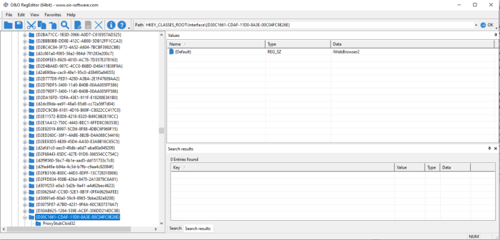

More info about could be found
[here](https://repo.zenk-security.com/Reversing%20.%20cracking/Reversing%20Encrypted%20Callbacks%20and%20COM%20Interfaces.pdf).After
execution of **CoCreateInstance** one of arguments ***\*ppv*** contains
the requested interface pointer.

Pointer \*ppv is moved to eax. which is later de-referenced (pointer to
object).

From de-referenced object 2Ch is added (44 in dec).

Structure of IWebBrowser2, can be found
[here](https://wasm.in/threads/kak-programmno-vvesti-nik-i-parol-cherez-interfejs-iwebbrowser2.32326/).  
44 means **Navigate** method is called.

**ii. What is the purpose of this program?**

Program just opens Internet explorer with an advertisement.
“<http://www.malwareanalysisbook>.com/ad.html.”

**iii. When will this program finish executing?**

After some cleanup functions: **SysFreeString** and **OleUninitialize**
program terminates.

**c. For this lab, we obtained the malicious executable, Lab07-03.exe,
and DLL, Lab07- 03.dll, prior to executing. This is important to note
because the mal- ware might change once it runs. Both files were found
in the same directory on the victim machine. If you run the program, you
should ensure that both files are in the same directory on the analysis
machine. A visible IP string beginning with 127 (a loopback address)
connects to the local machine. (In the real version of this malware,
this address connects to a remote machine, but we’ve set it to connect
to localhost to protect you.)**

**i- How does this program achieve persistence to ensure that it
continues running when the computer is restarted?**

Persistence is achieved by writing file to  
“C:\Windows\System32\Kerne132.dll”  
and modifying every ".exe" file to import that library.

**ii. What are two good host-based signatures for this malware?**

Good host-based signatures are:  
“C:\\Windows\\System32\\Kerne132.dll”  
Mutex name “**SADFHUHF**”

**iii. What is the purpose of this program.**

**Dynamic analysis**Execute program with correct
argument:"**WARNING_THIS_WILL_DESTROY_YOUR_MACHINE**"  
modifies "WinRAR.exe" in my case.

Library "kerne**1**32.dll" is replaced instead of "kernel32.dll" to
executable.

Using API Monitor from [Rohitab](http://www.rohitab.com/apimonitor) we
identify what is it doing: Searching for executables ".exe" in C
drive.  
If found opens it, Creates file mapping object, opens it in memory,
searches if import is "kernel32.dll". Replaces with "kerne**1**.dll"
Unmaps from memory. Closes handles.

If any of executable (not in memory) is opened in “PEStudio”, we see
there only “kerne**1**32.dll” library is imported.

**Static analysis**Executable is launched with this parameter
“**WARNING_THIS_WILL_DESTROY_YOUR_MACHINE**”

Opens file “C:\\Windows\\System32\\Kernel32.dll” (CreateFileA) with read
permissions (File_Share_Read and Generic read). Creates mapping object
(CreateFileMappingA with Page_Readonly permissions) for this file. This
mapping object is used to map (copy) in to the memory. Opens another
file (CreateFileA in FILE_SHARE_READ mode) “Lab07–03.dll”. Exits if
failed to open the library (Lab07–03.dll).

Creates file mapping object of the library "Lab07-03.dll"
(CreateFileMappingA with PAGE_READWRITE protection). Maps this object in
to the memory (MapViewOfFile with FILE_MAP_ALL_ACCESS). Exits if failed
to map.

Closes both handles of libraries. Copies file “Lab07–03.dll” to
“C:\\windows\\system32\\kerne**1**32.dll” (looks like original, except
”l” letter is misspelled as number “1”). Zero and string “C:\\\*” is
passed as args to another function. \* means all files located in C
directory.

Searches for the first file or folder (FindFirstFileA). Checks if file
attribute is directory (FILE_ATTRIBUTE_DIRECTORY).

Calls function \_mv_mapfile.

If not the directory checks if filename is equal to “.” (current
directory).

Also compares if it is root directory (“..”)

**Explanation:**  
If you enter “dir” command in “cmd.exe” see one dot (current directory)
and two dots (root directory).

For example if current directory is “C:\WINDOWS\system32”, then root dir
is “C:\WINDOWS”.Also compares if it is root directory (“..”)

**lea edi, \[esp+154h+FindFileData.cFileName\]** ; edi points to file
name  
**or ecx, 0FFFFFFFFh** ; clever way to set ecx to -1  
**xor eax, eax** ; set eax register to zero  
**repne**
[**<u>scasb</u>**](https://www.aldeid.com/wiki/X86-assembly/Instructions/scasb)
; repeat if eax and edi are not equal to null. Each cycle ecx is
decremented, untill it finds null symbol at the end of string.  
**not ecx** ; inverts negative number to positive. Have string length +
1 (null byte)  
**dec ecx** ; string length  
All these [assembly](http://www.int80h.org/strlen/) instruction do the
same as [strlen](http://www.cplusplus.com/reference/cstring/strlen/) in
c++.Allocates space for file name in memory (malloc).  
Checks if file extension is “.exe”.

When enumerates all files in the directory it pushes another string
“\\\*” and calls the same function again (recursive function). Enters
the sub folder and repeat enumeration process. Find all executable files
in the C drive (FindNextFileA).

Checks if file has “**PE**” header.

Example: **Image_File_Header** -\> **e_lfanew** (Offset to PE Header)

Dll creates or opens the mutex **“SADFHUHF”**. Mutex are usefull to
check if instance of the program has been executed before or not.

Initiates Winsock dll function (WSAStartup) uses **TCP** protocol to
connect to server “**127.26.152.13:80”**.

If connects to server, sends hello message: “**hello**”.  
Disables send on a socket (shutdown).

Ready to receive command from the server.Received message is up to 4096
bytes length. Compares if command is "**sleep"** (sleeps for 1 min and
repeats the same from sending hello message).

If command is “**exec**”, Creates process (CreateProcessA) with argument
“CREATE_NO_WINDOW”. One of the most important parameter is
lpCommandLine. Looking backwads edx register is pushed on to the stack.
edx has the address of **CommandLine** (calculated using lea
instruction).

This address doesn’t appear anywhere except the beginning of function:

It means that it has not defined CommandLine already. The value appears
on a runtime, when command is received from server.Variables has
negative, while arguments - positive value. CommandLine is the variable.
**buf** contains the received command and **CommandLine** contains what
to execute. The difference between buf and CommandLine are 5 bytes.
1000h-FFBh=**5** (h means in hexdecimal).

If we look at the received buff command, we got “**exec**”, which is 4
bytes long. Mostly the space (fifth byte) is the separator between exec
and CommandLine.Strings are the arrays (index will be visualized as the
arrow where it points). Index points before or after the symbol, not on
the letter itself. Every array starts from zero index — \[0\] (before
“**e**” letter). Index of \[1\] -points after “e” and before “x”.

If command is “**q**” exits loop.If none of them — Sleep for 1 minute
and loop.  
When executable is found, calls mv_mapfile function (renamed by myself).
Opens executable (CreateFileA). Creates mapping object
(CreateFileMappingA). Maps file in to the memory (MapViewOfFile).

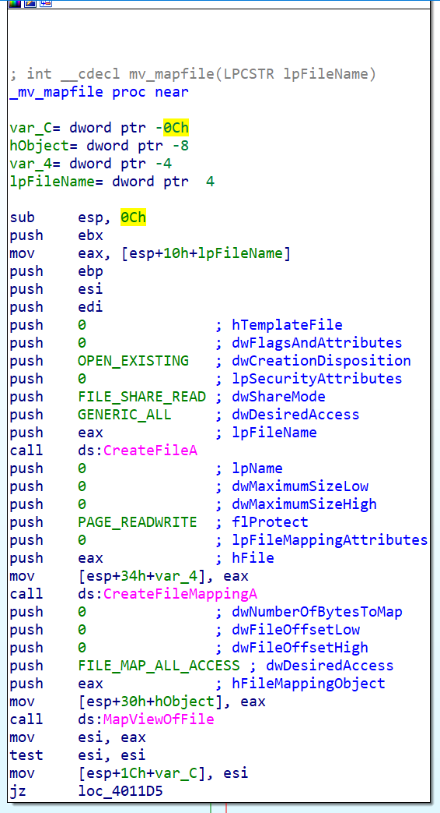

Esi register points to start of the file.  
mov ebp, \[esi + **3Ch**\]; dosheader-\>e_lfanew  
cmp dword ptr \[ebp+0\], 4550h ; Check if valid ‘PE’ header.  
To understand this you should know [PE
structure](http://opensecuritytraining.info/LifeOfBinaries.html).

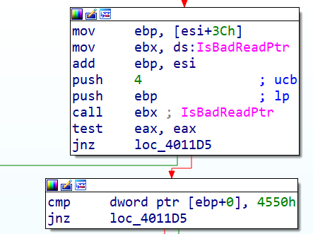

**Explanation**:  
File is opened in PEViewer. 3Ch (RVA-Relative virtual address) points to
**offset to New EXE Header**. In order to get the value (Data), it
should be de referenced \[\] brackets grabs whats at that address: E8h
(in our example).  
DosHeader-\>e_lfanew (equivalent in c++)

However grabbed **offset to New EXE Header** is another address. Should
be de referenced again.  
**Image_NT_Signature** is at the address **E8h** (RVA)**.**

Checks if valid PE file:  
ImageNtHeaders-\>Signature != 'PE' (equivalent in c++)Call
**IsBadReadPtr** to check if the calling process has read access to that
memory region.

String **Str1** is compared to “kernel32.dll”.

Two instructions represents strlen (repne scasb) and memcpy (rep
movsd).Using repne scasb we get length of the string.rep movsd
instruction moves byte from esi to edi register ecx times (ecx = string
length).mov esi, offset dword_403010

If we open dword_403010 we see that is actually ascii letters (looking
in ascii table we see that numbers and letters starts from 30h to 7Ah)

lookuptables.com

By pressing “a” (convert data to string in IDA) two times we get
“kerne**1**32.dll”:

String **Str1** is our source, which is “kerne**l**32.dll” and replaced
by the string kernel**1**32.dll (destination).Access import table:  
mov ecx, \[ebp+80h\] ; Import table RVA: E8h+80h=168h

**iv. How could you remove this malware once it is installed?**

Malware could be removed replacing imports to original "kernel32.dll"
for every executable. Using automated program or script to do this.Or
original "kernel32.dll" replaced of "kerne**1**32.dll**"**Or reinstall
windows operating system.

**d. Analyze the malware found in the file Lab09-01.exe using OllyDbg
and IDA Pro to answer the following questions. This malware was
initially analyzed in the Chapter 3 labs using basic static and dynamic
analysis techniques**

**i. How can you get this malware to install itself?**

To install this malware, we need to reach the function @0x00402600. In
this function, we can see function call to
[OpenSCManagerA](https://msdn.microsoft.com/en-us/library/windows/desktop/ms684323(v=vs.85).aspx),
[ChangeServiceConfigA](https://msdn.microsoft.com/en-us/library/windows/desktop/ms681987(v=vs.85).aspx),
[CreateServiceA](https://msdn.microsoft.com/en-sg/library/windows/desktop/ms682450(v=vs.85).aspx),
CopyFileA and registry creation. All these are functions to make the
malware persistence.

To get to the install function @0x00402600 we would need to run this
malware with either 2 or 3 arguments (excluding program name). We would
need to enter a correct passcode as the last argument and “-in” as the
1st argument.

To install the malware just execute it as “**Lab09-01.exe -in abcd**”

We can also choose to patch the following opcode “**jnz**” to “**jz**”
at address 0x00402B38 to bypass the passcode check.

if you want to install it with a custom service name such as jmpRSP, you
may execute it as  “**Lab09-01.exe -in jmpRSP abcd**“.

**ii. What are the command-line options for this program? What is the
password  
requirement?**

The 4 command line accepted by the program are

1.  -in; install

2.  -re; uninstall

3.  -cc; parse registry and prints it out

4.  -c; set Registry

The password for this malware to execute is “abcd”. Analyzing the
function @0x00402510, we can easily derive this password. The below
image contains comments that explains how I derived that the passcode is
“abcd”.

**iii. How can you use OllyDbg to permanently patch this malware, so
that it doesn’t require the special command-line password?**

As mentioned in Question i, we just need to patch 0x00402B38 to jz. To
patch the malware in ollydbg, run the program in ollydbg and go to the
address 0x00402B38.

Right click on the address and press Ctrl-E (edit binary). Change the
hex from 75 to 74 as shown below.

Figure 4. Edit Binary

The next step is to save the changes. Right click in the disassembly
window and select copy to executable -\> all modifications. Then proceed
to save into a file.

**iv. What are the host-based indicators of this malware?**

To answer this question lets look at the dynamic analysis observations
and IDA Pro codes.

Figure 6. Registry trails in IDA Pro
Figure 7. Proc Mon captured WriteFile and RegSetValue
Figure 8. Regshot captured registry creation and service
creation
Figure 9. The service created in registry
Figure 10. Services.msc

1.  HKLM\\SOFTWARE\\Microsoft \\XPS\\Configuration

2.  Lab09-01_patched Manager Service

3.  %SYSTEMROOT%\\system32\\Lab09-01_patched.exe

**v. What are the different actions this malware can be instructed to
take via the network?**

If no argument is passed into the executable, the malware will call the
function @0x00402360. This function will parse the registry
“HKLM\\SOFTWARE\\Microsoft \\XPS\\Configuration and call function
0x00402020 to execute the malicious functions.

Analyzing the function @0x00402020, we can conclude that the malware is
capable of doing the following tasks

1.  Sleep

2.  Upload (save a file to the victim machine)

3.  Download (extract out a file from the victim machine)

4.  Execute Command

5.  Do Nothing

**vi. Are there any useful network-based signatures for this malware?**

Figure 11. Network Traffic

From wireshark, we can see that the malware is attempting to retrieve
commands from <http://www.practicalmalwareanalysis.com>. A random
page(xxxx/xxx.xxx) is retrieved from the server using HTTP/1.0. Note
that the evil domain can be changed, therefore by fixing the network
based signature to just practicalmalwareanalysis.com is not sufficient.

**e. Analyze the malware found in the file Lab09-02.exe using OllyDbg to
answer the following questions.**

**i. What strings do you see statically in the binary?**

Nothing useful…

**2ii What happens when you run this binary?**

The program just terminates without doing anything.

**iii. How can you get this sample to run its malicious payload?**

Figure 1. ocl.exe

From the above flow graph in main function, we can see that the binary
retrieves its own executable name via **GetModuleFileNameA**. It then
strip the path using **\_strrchr**. The malware then compares the
filename with **“ocl.exe”**. It it doesn’t match, the malware will
terminates. Therefore to run the malware we must name it as
**“ocl.exe”**.

**iv. What is happening at 0x00401133?**

Figure 2. some passphrase?

We can see in the opcode that a string is formed character by character.
The string is “1qaz2wsx3edc”. The way the author created  the string
prevented IDA Pro from displaying it as a normal string.

**v. What arguments are being passed to subroutine 0x00401089?**

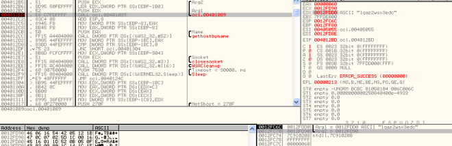Figure 3. GetHostName

From the above ollydbg image, we can see that the string “1qaz2wsx3edc”
is passed in to the subroutine 0x00401089. An unknown pointer
(0x0012FD90) is also passed in.

Figure 4. XOR decoding

Stepping into the subroutine, you will realize that the malware is
trying to decode a string(0x0012FD90) with the xor key (1qaz2wsx3edc).
As shown above, we can start to see the decoded string taking shape.

6\. What domain name does this malware use?

Figure 5. Domain Decoded

<http://www.practicalmalwareanalysis.com>

7\. What encoding routine is being used to obfuscate the domain name?

As mentioned in question 5, XOR is used to obfuscate the domain name.

8\. What is the significance of the CreateProcessA call at 0x0040106E?

Figure 6. connecting to
practicalmalwareanalysis.com:9999

The first block shows that we get the decoded domain name and get the ip
by using
[gethostbyname](https://msdn.microsoft.com/en-us/library/windows/desktop/ms738524(v=vs.85).aspx)
. In the second block, we can see that it is trying to connect to the
derived ip at port 9999.  In the third block, we can see that socket s
is passed into the CommandExecution subroutine as last argument.

Figure 7. passing io to socket

From the above figure, we can see that the StartupInfo’s hStdInput,
hStdOutput, hStdError now points to the socket s. In other words, all
input and output that we see in cmd.exe console will now be transmitted
over the network. The CreateProcessA call for cmd.exe and is hidden via
wShowWindow flag set to SW_HIDE(0). What it all meant was that a reverse
shell is spawned to receive commands from the attacker’s server.

**f. Analyze the malware found in the file Lab09-03.exe using OllyDbg
and IDA Pro.  
This malware loads three included DLLs (DLL1.dll, DLL2.dll, and DLL3.dll
) that  
are all built to request the same memory load location. Therefore, when
viewing  
these DLLs in OllyDbg versus IDA Pro, code may appear at different
memory  
locations. The purpose of this lab is to make you comfortable with
finding the correct location of code within IDA Pro when you are looking
at code in OllyDbg**

**i. What DLLs are imported by Lab09-03.exe?**

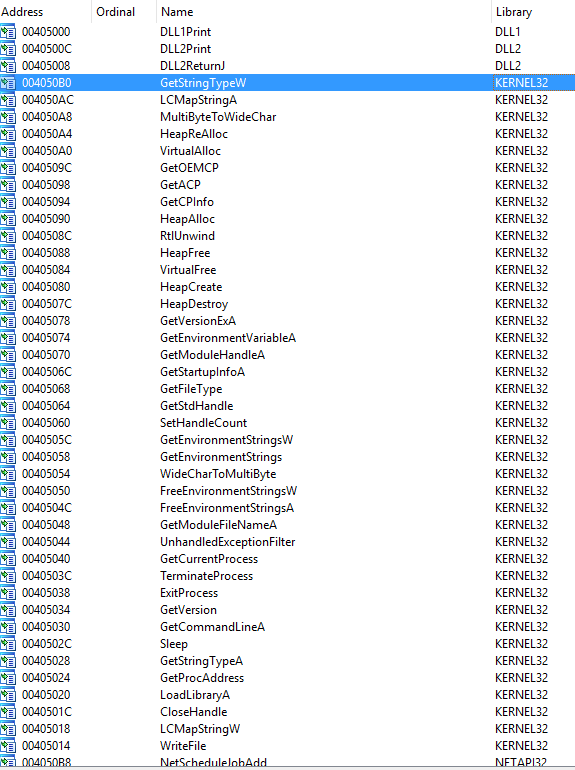

Figure 1. imports

From IDA Pro we can see that DLL1, Dll2, KERNEL32 and NETAPI32 is
imported by the malware. During runtime we can see more dlls being
imported.

Figure 2. DLL3.dll being imported during runtime

**ii. What is the base address requested by DLL1.dll, DLL2.dll, and
DLL3.dll?**

Loading the dll in IDA Pro we can see the base address that each dll
requests for. Turns out that all 3 dlls requests for the same image base
at address 0x10000000.

Figure 3. Imagebase: 0x10000000

**iii. When you use OllyDbg to debug Lab09-03.exe, what is the assigned
based address for: DLL1.dll, DLL2.dll, and DLL3.dll?**

From figure 2, we can observe that the base address for DLL1.dll is
@0x10000000, DLL2.dll is @0x330000 and DLL3.dll is @0x390000.

**iv. When Lab09-03.exe calls an import function from DLL1.dll, what
does this import function do?**

Figure 4. Calling DLL1Print

Figure 5. DLL1Print

From figure 4, we can see that DLL1Print is called. In figure 1, we can
see that DLL1Print is imported from DLL1.dll. Opening DLL1.dll in IDA
Pro, we can conclude that DLL 1 mystery data %d\n is printed out.
However %d is filled with values in dword_1008030 a global variable.
xref check on this global variable suggests that it is being set by
@0x10001009.

Figure 6. Setting global variable with process id

The above figure shows that once the dll is loaded, it will query its
own process id and set the global variable dword_1008030 to the
retrieved process id. To conclude DLL1Print will print out “**DLL 1
mystery data \[CurrentProcess ID\]**“.

**v. When Lab09-03.exe calls WriteFile, what is the filename it writes
to?**

Figure 7. File Handle from DLL2ReurnJ

Analyzing Lab09-03.exe, we can see that the File Handle is retrieved
from DLL2ReurnJ subroutine (imported from DLL2.dll)

Figure 8. DLL2ReturnJ

From the above image, DLL2ReturnJ returns a global variable taken from
dword_1000B078.

Figure 9. DLL2’s DLLMain

From the above image, things become clear. The returned File Handle
points to **temp.txt**.

**vi. When Lab09-03.exe creates a job using NetScheduleJobAdd, where
does it get the data for the second parameter?**

According to msdn,
[NetScheduleJobAdd](https://msdn.microsoft.com/en-us/library/windows/desktop/aa370614(v=vs.85).aspx) submits
a job to run at a specified future time and date. The second parameter
is a pointer to a
[AT_INFO](https://msdn.microsoft.com/en-us/library/windows/desktop/aa370248(v=vs.85).aspx)
Structure

NET_API_STATUS NetScheduleJobAdd(

\_In_opt\_ LPCWSTR Servername,

\_In\_     LPBYTE  Buffer,

\_Out\_    LPDWORD JobId

);

 Figure 10. AT_INFO structure

From Lab09-03.exe we can see that it is loading a dll dynamically during
runtime by first calling
[LoadLibraryA](https://msdn.microsoft.com/en-us/library/windows/desktop/ms684175(v=vs.85).aspx)(“DLL3.dll”)
then
[GetProcAddress](https://msdn.microsoft.com/en-us/library/windows/desktop/ms683212(v=vs.85).aspx)(“DLL3Print”)
to get the pointer to the export function. The pointer is then called to
get the AT_INFO structure.

Figure 11. Get AT_INFO Structure

**vii. While running or debugging the program, you will see that it
prints out three pieces of mystery data. What are the following: DLL 1
mystery data 1, DLL 2 mystery data 2, and DLL 3 mystery data 3?**

- DLL 1 mystery data prints out the current process id

- DLL 2 mystery data prints out the CreateFileA’s handle

- DLL 3 mystery data prints out the decimal value of the address to the
  command string “ping <http://www.malwareanalysisbook.com&#8221>;

**viii. How can you load DLL2.dll into IDA Pro so that it matches the
load address used by OllyDbg?**

Figure 12. Manual Load

Select Manual Load checkbox when opening DLL2.dll in IDA Pro. You will
be prompted to enter new image base address.

**<u>Practical No. 4</u>**

**a. This lab includes both a driver and an executable. You can run the
executable from anywhere, but in order for the program to work properly,
the driver must be placed in the C:\Windows\\ System32 directory where
it was originally found on the victim computer. The executable is
Lab10-01.exe, and the driver is Lab10-01.sys**

**i. Does this program make any direct changes to the registry? (Use
procmon to check.)**

Not really. Looking at the following figure, the only direct changes
made by the malware is RNG\Seed. However if you were to look into the
registries created by services.exe, we will see that it is trying to add
a service.

Figure 1. Registry changes

but this is not the case for regshot! There are some HKLM policies added
to the machine.

Figure 2. More Registry changes in Regshot

**ii. The user-space program calls the ControlService function. Can you
set a breakpoint with WinDbg to see what is executed in the kernel as a
result of the call to ControlService?**

Figure 3. ControlService

The above figure shows the malware opening Lab10-01 service, starting
the service and eventually closing it via
[ControlService](https://msdn.microsoft.com/en-us/library/windows/desktop/ms682108(v=vs.85).aspx); SERVICE_CONTROL_STOP.

breaking the kernel debugger and using the following command !object
\Driver shows the loaded drivers…

Figure 3. !object \Driver

SERVICE_CONTROL_STOP will call DriverUnload function. To figure out what
is the address of DriverUnload function is I would first place a
breakpoint on Lab10-01 Driver entry.

**kd\> bu Lab10_01!DriverEntry**

Note that “-” is converted to “\_”. Next we need to step till
Lab10_01.sys is loaded. Use step out till you see
this **nt!IopLoadUnloadDriver+0x45**.

**kd\> !object \Driver**

to list the loaded drivers, then we use display type (dt) to display out
the LAB10-01 driver.

Figure 4. dt \_DRIVER_OBJECT

In the above image, we can see the address for DriverUnload. Now we just
need to set breakpoint on that address as shown below.

Figure 5. breakpoint unload

Stepping through the functions we will see RtlCreateRegistryKey
and RtlWriteRegistryValue being called.

Figure 6. RtlCreateRegistryKey

The following image is the dissembled code of the driver in IDA Pro.
Stepping the above instructions is the same as going through the
instructions below.

Figure 7. Lab10-01.sys IDA Pro

**iii. What does this program do?**

The malware creates a service Lab10-01 that calls the driver located at
“c:\windows\system32\Lab10-01.sys”. It then starts the service,
executing the driver and then stops the driver causing the driver to
unload itself. In the driver’s unload function the driver attempts to
create and write registry key using kernel function call. The following
are the registry modification made by the driver.

- **RtlCreateRegistryKey**:
  \\Registry\\Machine\\SOFTWARE\\Policies\\Microsoft

- **RtlCreateRegistryKey**: \\Registry\\Machine\\SOFTWARE\\Policies\\Microsoft\\WindowsFirewall

- **RtlCreateRegistryKey**: \\Registry\\Machine\\SOFTWARE\\Policies\\Microsoft\\WindowsFirewall\\DomainProfile

- **RtlCreateRegistryKey**:
  \\Registry\\Machine\\SOFTWARE\\Policies\\Microsoft\\WindowsFirewall\\StandardProfile

- **RtlWriteRegistryValue**: \\Registry\\Machine\\SOFTWARE\\Policies\\Microsoft\\WindowsFirewall\\DomainProfile
  – 0 (data)

- **RtlWriteRegistryValue**: \\Registry\\Machine\\SOFTWARE\\Policies\\Microsoft\\WindowsFirewall\\StandardProfile
  – 0 (data)

According to
[msdn](https://technet.microsoft.com/en-us/library/bb490624.aspx), the
above registry modifications will disable Windows Firewall for both the
domain and standard profiles on the victim’s machine.

**b-The file for this lab is Lab10-02.exe**

**i. Does this program create any files? If so, what are they?**

Cerbero Profiler highlighted that the malware contains a PE Resource.
Instinct tells me that this malware behaves like a packer and will
extract this resource onto the target’s machine.

Figure 1. MZ header in resource
Figure 2. IDA Pro’s string

“C:\\Windows\\System32\\Mlwx486.sys” seems suspicious. xRef this string
might help us to solve this problem.

Figure 3. Extract Resource

In the main method, we can see that the code is trying to extract the
FILE resource into “C:\\Windows\\System32\\Mlwx486.sys”.

After extracting the driver, the malware then goes on to create a
service (486 WS Driver) and start it using StartServiceA.

Using Proc mon we can observe that WriteFile
to “C:\\Windows\\System32\\Mlwx486.sys” was captured by the tool.

**ii. Does this program have a kernel component?**

Attempts to locate the dropped driver in system32 folder was fruitless.
Somehow the file is not in the folder. So instead I decided to extract
the driver out from the resource directly. Firing up IDA Pro we can see
DriverEntry function suggesting that this executable is a driver.

**iii. What does this program do?**

DrierEntry leads us to the following subroutine in IDA Pro (0x10706).
The malware is attempting to change the flow of the kernel Service
Descriptor Table and the target that it is attempting to hook is the
NtQueryDirectoryFile. The malware calls MmGetSystemRoutineAddress to get
the pointer to the NtQueryDirectoryFile and KeServiceDescriptorTable
subroutine. Then it loops through the service descriptor table looking
for the address of NtQueryDirectoryFile. Once found, it will overwrite
the address with the evil hook (custom subroutine).

Figure 6. Evil Hook

Figure 6. NTQueryDirectoryFile

In the driver, **NTQueryDirectoryFile** function is used. According to
[msdn](https://msdn.microsoft.com/en-us/library/windows/hardware/ff556633(v=vs.85).aspx),
this function returns various kinds of information about files in the
directory specified by a given file handle. Further down, we can see
that **RtlCompareMemory** is called. A comparison was made between the
filename and the following string “**Mlwx**“. If it matches, the file
will be hidden.

Figure 7. Mlwx string

To see all this win action, fire up Windbg and attach it to the kernel.

use the following command to list the service descriptor table. This
table has yet been tampered with…

**kd\> dps nt!KiServiceTable l 100**

Figure 8. Default Service Descriptor Table

Set breakpoint by using this command **bu Mlwx486!DriverEntry**. Run
Lab10-02.exe and windbg should break.Set breakpoint at
**nt!IopLoadDriver+0x66a** and let the program run again. Once the
kernel breaks, you will be able to run **!object \Driver **to list the
loaded drivers. DriverInit for the malware has yet been executed at this
stage so you can set your breakpoint from this point on.

Figure 9. Break @ DriverEntry
Figure 10. DriverInit
Figure 11. DriverEntry

From Figure 10 & 11, we can see that DriverInit is actually DriverEntry
in IDA Pro.

runing **kd\> dps nt!KiServiceTable l 100 **now shows that the service
descriptor table has been modified.

Figure 12. Service Descriptor Table modified

To conclude, the malware uses ring 0 rootkit to hide files that starts
with “**Mlwx**” via hooking of the service descriptor table.

**<u>Practical No. 5</u>**

**a-Analyze the malware found in Lab11-01.exe**

**i. What does the malware drop to disk?**

Figure 1.
Binary resource in Lab11-01.exe’s TGAD

There is a binary in the resource section of Lab11-01.exe.

Figure 2. msgina32.dll dropped

From Proc Mon we can observe that msgina32.dll and software.LOG are
dropped on the machine.

**ii. How does the malware achieve persistence?**

In figure 2, the malware adds “HKLM\SOFTWARE\Microsoft\Windows
NT\CurrentVersion\Winlogon\GinaDLL” into the registry.

According to
[MSDN](https://msdn.microsoft.com/en-us/library/windows/desktop/aa380543(v=vs.85).aspx), [*<u>Winlogon</u>*](https://msdn.microsoft.com/en-us/library/windows/desktop/ms721635(v=vs.85).aspx#_security_winlogon_gly),
the
[*<u>GINA</u>*](https://msdn.microsoft.com/en-us/library/windows/desktop/ms721584(v=vs.85).aspx#_security_gina_gly),
and network providers are the parts of the interactive logon model. The
interactive logon procedure is normally controlled by Winlogon,
MSGina.dll, and network providers. To change the interactive logon
procedure, MSGina.dll can be replaced with a customized GINA DLL.
Winlogon will trigger the use of the malicious dll and that is how the
malware achieve persistency.

**iii. How does the malware steal user credentials?**

Looking at the dropped dll’s export, it seems like it is a custom dll to
hook to the winlogon process.

Figure 3. WlxLoggedOutSAS

After checking through the exports function, only 1 function
(**WlxLoggedOutSAS**) behaves suspiciously. The rest simply pass the
inputs to the original function address.

Figure 4. Intercepting WlxLoggedOutSAS

The above figure is pretty straight forward, the inputs are passed to
the original WlxLoggedOutSAS function and a copy of the inputs are
passed to a function to write to a file.

**iv. What does the malware do with stolen credentials?**

Figure 5. Write to file

The above figure shows the malicious dll writing the stolen values into
c:\windows\system32\msutil32.sys file.

**v. How can you use this malware to get user credentials from your test
environment?**

By rebooting the machine or by logging off and re-login
again. **c:\windows\system32\msutil32.sys** will contains the password
used to login to the windows.

Figure 6. Captured Password

**b- Analyze the malware found in *Lab11-02.dll*. Assume that a
suspicious file named *Lab11-02.ini* was also found with this malware.**

**i. What are the exports for this DLL malware?**

Figure 1. Exports

**ii. What happens after you attempt to install this malware using
rundll32.exe?**

Figure 2. Set Registry & WriteFile

The malware add a registry value in **HKLM\\SOFTWARE\\Microsoft\\Windows
NT\\CurrentVersion\\Windows\\AppInit_DLLS**.

It then copy itself; the dll as **C:\Windows\System32\spoolvxx32.dll**.

The malware then tries to open **C:\Windows\System32\Lab11-02.ini.**

**iii. Where must Lab11-02.ini reside in order for the malware to
install properly?**

Figure 3. Loads config file

The malware will attempt to load the config from
**C:\Windows\System32\Lab11-02.ini**. We would need to place the ini
file in system32 folder.

**iv. How is this malware installed for persistence?**

According to
[MSDN](https://msdn.microsoft.com/en-us/library/windows/desktop/dd744762(v=vs.85).aspx), AppInit_DLLs
is a mechanism that allows an arbitrary list of DLLs to be loaded into
each user mode process on the system. By adding AppInit_DLLs
in **HKLM\\SOFTWARE\\Microsoft\\Windows
NT\\CurrentVersion\\Windows\\ **we are loading the malicious DLL into
each user mode process that gets executed on the system.

**v. What user-space rootkit technique does this malware employ?**

If we look at the subroutine @0x100012A3, you will see that it is
attempting to get the address of send from wscock32.dll. It then pass
the address to subroutine @0x10001203.

The subroutine @0x10001203 is employing the inline hook technique. It
first get the offset from the hook position to the function where it
wants to jump to. It then uses VirtualProtect to make 5 bytes of
space from the start of the subroutine address
to **PAGE_EXECUTE_READWRITE. **Once it is done it then rewrite the code
to jmp to the hook function. Finally it reset the 5 bytes of memory
space back to the old protection attributes.

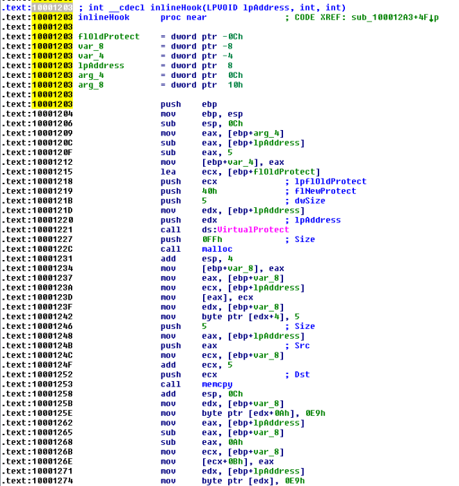Figure 4. inline hook

However, the malware only hook 3 programs; THEBAT.EXE, OUTLOOK.EXE,
MSIMM.EXE.** **

Figure 5. Hook selected programs

To conclude, the malware is attempting to do an inline hook on
wsock32.dll’s send function for selected programs.

** vi. What does the hooking code do?**

We first look at what the malware is retrieving from the config file.

Figure 6. Decoding config

After reading the data from the config file, the malware then decode it
by calling the subroutine @0x100016CA. If we dive into this subroutine,
you will realize that it is a xor decoding function. Let’s place a hook
there in ollydbg to see what comes out.

Figure 7. billy@malwareanalysisbook.com

This decoded string will be use in the following function.

Figure 8. replacing send data

The inline hook jumps to the above function. Its starts off with
checking if the send buffer contains the string “RCPT TO”. If it does,
it will create a new buffer “**RCPT
TO:\<billy@malwareanalysisbook.com\>\r\n**” and send it off via the
original send function. The function will then end of by simply
forwarding the original data to the send function.

**vii. Which process(es) does this malware attack and why?**

As answered in question v… the malware only hook 3 programs; THEBAT.EXE,
OUTLOOK.EXE, MSIMM.EXE.** **They are all email clients.

**viii. What is the significance of the .ini file?**

As answered in question v… the config.ini contains the encoded attacker
email address. It is use to replace recipient address causing email to
be send to the attacker instead.

**c- Analyze the malware found in Lab11-03.exe and Lab11-03.dll. Make
sure that both files are in the same directory during analysis.**

**i. What interesting analysis leads can you discover using basic static
analysis?**

**Lab11-03.exe**

Figure 1. Installation

The main method in Dll11-03.exe is pretty straight forward. It first
copy the Lab11-03.dll to **C:\\Windows\\System32\\inet_epar32.dll**. It
then attempts to modify **C:\\Windows\\System32\\cisvc.exe** and
executes the infected executable by starting a service via the command
“**net start cisvc**”

**Lab11-03.dll**

The dll contains some interesting stuff… In export, we can see a
suspicious looking function; **zzz69806582**.

Figure 2. Export function surface a funny function

The imports contains **GetAsyncKeyState** and **GetForegroundWindow**
which highly suggests that this is a keylogger.

Figure 3. imports

The function @zzz69806582 is pretty simple. It just creates a thread.

Figure 3. function zzz69806582

The thread that the above function creates first check for mutex;
**MZ**.

It then create a file @ **C:\\Windows\\System32\\kernel64x.dll**.

Figure 4.Mutex MZ

Next, the thread calls a subroutine to record keystrokes.

Figure 5. Keylogs

**ii. What happens when you run this malware?**

As answered in question 1, It first copy the Lab11-03.dll to
**C:\\Windows\\System32\\inet_epar32.dll**. It then attempts to modify
**C:\\Windows\\System32\\cisvc.exe** and executes the infected
executable by starting a service via the command “**net start cisvc**”

The infected service then begin to log keystroke and save it
in **C:\\Windows\\System32\\kernel64x.dll**.

Figure 6. Procmon showing file creation in infected
system

**iii. How does Lab11-03.exe persistently install Lab11-03.dll?**

It infects **C:\\Windows\\System32\\cisvc.exe;** an indexing service by
inserting shellcodes into the program. The infected cisvc.exe will load
**C:\\Windows\\System32\\inet_epar.dll** as shown in the figure below.

Figure 7. LoadLibrary

Comparing the infected executable with the original one, we could see
some additional functions added to it. On top of that we can observe
that the entry point has been changed.

Figure 8. Additional Functions
Figure 9. Changes in Entry Point

**iv. Which Windows system file does the malware infect?**

It infects **C:\\Windows\\System32\\cisvc.exe**.

Figure 10. inet_epar32.dll loaded in cisvc.exe

**v. What does Lab11-03.dll do?**

Using **GetAsyncKeyState** and **GetForegroundWindow**, the dll logs
keystrokes into  **C:\\Windows\\System32\\kernel64x.dll**. The dll also
uses a mutex “MZ” to prevent multiple instances of the keylogger is
running at once.

Figure 11. Mutex MZ

**vi. Where does the malware store the data it collects?**

In **C:\\Windows\\System32\\kernel64x.dll**

Figure 12. Key Logs Captured

**<u>Practical No. 6</u>**

**a. Analyze the malware found in the file *Lab12-01.exe* and
*Lab12-01.dll*. Make sure that these files are in the same directory
when performing the analysis.**

**i. What happens when you run the malware executable?**

A Message box with a incremental number in its title pops up every now
and then…

**ii. What process is being injected?**

In the imports table, CreateRemoteThread is used by the exe which highly
suggests that the malware might be injecting DLL into processes.

Figure 2. CreateRemoteThread in imports

“explorer.exe” is found in the list of string. X-ref the string and we
will come to the following subroutine. Seems like explorer.exe is being
targeted to be injected with the malicious dll.

Figure 3. explorer.exe

We can confirm our suspicion using process explorer as shown below.

Figure 4. Explorer.exe injected with dll

**iii. How can you make the malware stop the pop-ups?**

Kill explorer.exe and re-run it again

**iv. How does this malware operate?**

**Lab12-01.exe**

The malware begins by using psapi.dll’s
[EnumProcesses](https://msdn.microsoft.com/en-us/library/windows/desktop/ms682629(v=vs.85).aspx)
to loop through all running processes. Also note that it attempts to
form the absolute path for the malicious dll. This will be used later to
inject the dll in remote processes.

Figure 5. EnumPorcesses

While looping through the processes only “explorer.exe” will be
injected. The following figure shows the filtering taking place.

Figure 6. Check for explorer.exe

Once the malware located the “explorer.exe” process, it will ask the
remote process (explorer.exe) to allocate a heap space. The space will
contains the malicious dll’s absolute path as mentioned earlier. It will
then get the LoadLibraryA address of explorer.exe and triggers the
function via CreateRemoteThread. Explorer.exe will then invoke
LoadLibraryA with the input as the malicious dll’s absolute path which
is already in its heap memory and that is how explorer.exe got injected.
=)

Figure 7. Injecting

**Lab12-01.dll**

The DllMain first creates a thread @ subroutine 0x1001030.

Figure 8. Create Thread

Inside this subroutine, we will find a infinite loop popping a message
box every 1 minute. The title of the message box is “Practical Malware
Analysis %d” where %d is the value of the loop counter.

Figure 9. Popping MsgBox every minute

**b. Analyze the malware found in the file *Lab12-02.exe*.**

**b. What is the purpose of this program?**

Based on dynamic analysis results using procmon and process explorer, we
can conclude that this is a keylogger that performs process hollowing on
svchost.exe.

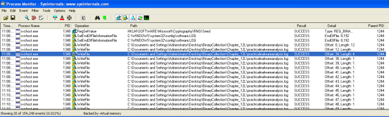Figure 1. Write file to practicalmalwareanalysis.log
Figure 2. Keystrokes in log file

**ii. How does the launcher program hide execution?**

The subroutine @0x004010EA is highly suspicious. It is trying to create
a process in suspended state, calls UnmapViewOfSection to unmap the
original code and tries to write process memory in it. Finally it
resumes the process. This is a recipe for process hollowing technique in
which the running process will look like svchost.exe (in this case) but
it is actually running something else instead.

Figure 3. Create Suspended process, unmap memory

Figure 4. WriteProcessMemory, ResumeThread

**iii. Where is the malicious payload stored?**

In the resource, we can see a suspicious looking payload. IDA Pro
further confirmed that this is the payload that will be extracted out.

Figure 5. Resource with lots of As in it

**iv. How is the malicious payload protected?**

By analyzing the find resource function @0x0040132C we will come across
the following codes that suggests to us that the payload is XOR by “A”.

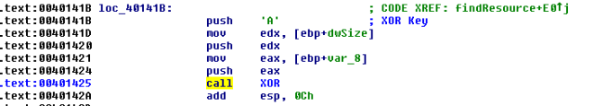Figure 7. XOR by A

**v. How are strings protected?**

The strings are in plain… correct me if i am wrong

Figure 8. Strings in plain

**c. Analyze the malware extracted during the analysis of Lab 12-2, or
use the file *Lab12-03.exe ***

**i. What is the purpose of this malicious payload?**

The use of SetWindowsHookExA with WH_KEYBOARD_LL as the id which
suggests that this is a keylogger.

Figure 1. SetWindowsHookExA

**ii. How does the malicious payload inject itself?**

It uses Hook injection. Keystrokes can be captured by registering high-
or low-level hooks using the WH_KEYBOARD or WH_KEYBOARD_LL hook
procedure types, respectively. For WH_KEYBOARD_LL procedures, the events
are sent directly to the process that installed the hook, so the hook
will be running in the context of the process that created it. The
malware can intercept keystrokes and log them to a file as seen in the
figure below.

Figure 2. Log to practicalmalwareanalsysis.log

**iii. What filesystem residue does this program create?**

The malware will leave behind a log file containing the
keylogs; practicalmalwareanalsysis.log.

**d. Analyze the malware found in the file *Lab12-04.exe*.**

**i. What does the code at 0x401000 accomplish?**

The subroutine check if the process with the given process id is
Winlogon.exe. If it is, it returns 1 else it returns 0.

**ii. Which process has code injected?**

Winlogon.exe is being targeted for injection. Subroutine @0x00401174 is
responsible for process injection via CreateRemoteThread. If we trace
back, we can see that only winlogon’s pid is being passed to the
subroutine.

Figure 2. Winlogon Pid being pushed as argument to
inject subroutine

**iii. What DLL is loaded using LoadLibraryA?**

**sfc_os.dll**

Figure 3. sfc_os.dll

**iv. What is the fourth argument passed to the CreateRemoteThread
call?**

Based on figure 3, the fourth argument is lpStartAddress in which if we
were to trace up we will uncover that lpStartAddress is the address
return by GetProcAddress(LoadLibraryA(“sfc_os.dll”),2).

Loading sfc_os.dll in ida pro we can see the exports that points to
ordinal 2 which resovles to SfcTerminateWatcherThread() as shown in
figure 5..

Figure 4. sfc_os.dll’s ordinal 2

Figure 5. SfcTerminateWatcherThread()

**v. What malware is dropped by the main executable?**

Analyzing the main method, we can see file movement from
“**C:\WINDOWS\system32\wupdmgr.exe**” to a temp folder
“**C:\DOCUME~1\ADMINI~1\LOCALS~1\Temp\\winup.exe**”

Figure 6. Backing up wupdmgr.exe

The following subroutine is then called to extract the resource out from
the executable and using it
to replace “**C:\WINDOWS\system32\wupdmgr.exe**”

Figure 7. dropping form resource to system32\\wupdmgr.exe

Figure 8. Bin 101 in the resource section

**vi. What is the purpose of this and the dropped malware?**

Apparently in order for **SfcTerminateWatcherThread()** to work, the
caller must be from winlogon.exe. That explains why the malware goes
through the trouble in looping through all running threads to locate
winlogon.exe and it even attempts to get higher privileges by using
**AdjustTokenPrivileges** to change token privilege to
**seDebugPrivilige**. With the higher privilege, the malware then calls
**CreateRemoteThread** to ask Winlogon to
invoke **SfcTerminateWatcherThread()**. With that, file protection
mechanism will be disabled and the malware can freely change the system
protected files until the next reboot.

The dropped malware in “**C:\\windows\\system32\\wupdmgr.exe**” executes
the original wupdmgr.exe (which is now in the temp folder) and it
attempts to download new malware
from “[**http://www.practicalmalwareanalysis.com/updater.exe” **](http://www.practicalmalwareanalysis.com/updater.exe)and
save it as “**C:\\windows\\system32\\wupdmgr.exe**”

Figure 9. URLDownloadToFileA

**<u>Practical No. 7</u>**

**a. Analyze the malware found in the file *Lab13-01.exe*.**

**i. Compare the strings in the malware (from the output of the strings
command) with the information available via dynamic analysis. Based on
this comparison, which elements might be encoded?**

In IDA Pro, we can see the following strings which are of not much
meaning. However on execution, if we were to strings the memory using
process explorer and sniff the network traffic, we can observe some new
strings such as
[**http://www.practicalmalwareanalysis.com**](http://www.practicalmalwareanalysis.com).

Figure 1. Meaningless string

Figure 2. URL found

**ii. Use IDA Pro to look for potential encoding by searching for the
string xor. What type of encoding do you find?**

The subroutine @0x00401300 loads a resource in the binary and xor the
value with “**;**“.

Figure 3. FIndResourceA 101

Figure 4. Resource String

Figure 5. XOR with ;

**iii. What is the key used for encoding and what content does it
encode?**

The key used is “**;**“. The decoded content is 
[**http://www.practicalmalwareanalysis.com**](http://www.practicalmalwareanalysis.com).

**iv. Use the static tools FindCrypt2, Krypto ANALyzer (KANAL), and the
IDA Entropy Plugin to identify any other encoding mechanisms. What do
you find?**

KANAL plugin located 4 addresses that uses
“**ABCDEFGHIJKLMNOPQRSTUVWXYZabcdefghijklmnopqrstuvwxyz0123456789+/**”

**v. What type of encoding is used for a portion of the network traffic
sent by the malware?**

base64 encoding is used to encode the computer name.

Figure 7. Encoding string

Figure 8. String encoded

Figure 9. Checking base64 encoded string

**vi. Where is the Base64 function in the disassembly?**

At address 0x004010B1.

**vii. What is the maximum length of the Base64-encoded data that is
sent? What is encoded?**

The maximum length is 12 characters. The maximum base64 length is 16
bytes.

Figure 10. Only 12 Characters

**viii. In this malware, would you ever see the padding characters (= or
==) in the Base64-encoded data?**

According to [wiki](https://en.wikipedia.org/wiki/Base64#Padding). If
the plain text is not divisible by 3, padding will present in the
encoded string.

**ix. What does this malware do?**

It keeps sending the computer name (max 12 bytes)
to [**http://www.practicalmalwareanalysis.com **](http://www.practicalmalwareanalysis.com )every
30 seconds until 0x6F is received as the first character in the
response.

**b. Analyze the malware found in the file *Lab13-02.exe***

**i. Using dynamic analysis, determine what this malware creates.**

A file with size 6,214 KB is written on the same folder as the
executable every few seconds. The naming convention of the file is
**temp\[8xhexadecimal\]**. The file created seems random.

Figure 1. Proc Mon

**ii. Use static techniques such as an xor search, FindCrypt2, KANAL,
and the IDA Entropy Plugin to look for potential encoding. What do you
find?**

Only managed to find XOR instructions. Based on the search result, we
would need to look at the following subroutine

1.  0x0040128D

2.  0x00401570

3.  0x00401739

Figure 2. XOR

** iii. Based on your answer to question 1, which imported function
would be a good prospect for finding the encoding functions?**

WriteFile. Trace up from WriteFile and we might locate the function
responsible for encoding the contents.

**iv. Where is the encoding function in the disassembly?**

The encoding function is @0x0040181F.  Tracing up from WriteFile, you
will come across a function @0x0040181F. The function calls another
subroutine(0x00401739) that performs the XOR operations and some
shifting operations.

Figure 3. encode

**v. Trace from the encoding function to the source of the encoded
content. What is the content?**

Based on the subroutine @0x00401070. The malware is taking a screenshot
of the desktop.

[GetDesktopWindow](https://msdn.microsoft.com/en-us/library/windows/desktop/ms633504(v=vs.85).aspx): Retrieves
a handle to the desktop window. The desktop window covers the entire
screen. The desktop window is the area on top of which other windows are
painted.

[GetDC](https://msdn.microsoft.com/en-us/library/windows/desktop/dd144871(v=vs.85).aspx): The
**GetDC** function retrieves a handle to a device context (DC) for the
client area of a specified window or for the entire screen. You can use
the returned handle in subsequent GDI functions to draw in the DC. The
device context is an opaque data structure, whose values are used
internally by GDI.

[CreateCompatibleDC](https://msdn.microsoft.com/en-us/library/windows/desktop/dd183489(v=vs.85).aspx): The
**CreateCompatibleDC** function creates a memory device context (DC)
compatible with the specified device.

[CreateCompatibleBitmap](https://msdn.microsoft.com/en-us/library/windows/desktop/dd183488(v=vs.85).aspx): The
**CreateCompatibleBitmap** function creates a bitmap compatible with the
device that is associated with the specified device context.

[BitBlt](https://msdn.microsoft.com/en-us/library/windows/desktop/dd183370(v=vs.85).aspx): The
**BitBlt** function performs a bit-block transfer of the color data
corresponding to a rectangle of pixels from the specified source device
context into a destination device context.

Figure 4. Screenshot

**vi. Can you find the algorithm used for encoding? If not, how can you
decode the content?**

The encoder used is pretty lengthy to go through, However if we look at
the codes in 0x401739, we can see lots of xor operations. If it is xor
encoding we might be able to get back the original data if we call this
subroutine again with the encrypted data.

Figure 5. xor operations

**vii. Using instrumentation, can you recover the original source of one
of the encoded files?**

My way of decoding the encoded files is to use DLL injection. To do
that, i write my own DLL and create a thread to run the following
function on **DLL_PROCESS_ATTACHED**. To attach the DLL to the malware
process, we first run the malware and use a tool called **Remote DLL
injector** by securityxploded to inject the DLL into the malicious
process.

Figure 6. Decode Function

The above codes simply scan the path in which the executable resides in
for encoded files that start with “**temp**“. It then reads the file and
pass the data to the encoding function **@0x40181F**. Once the data is
decoded, we make use of the function **@0x401000** to write out the file
to “**DECODED\_\[encoded file name\].bmp**“. Last but not least i shall
delete the encoded file so as not to clutter the folder.

**c. Analyze the malware found in the file *Lab13-03.exe*.**

**i. Compare the output of strings with the information available via
dynamic analysis. Based on this comparison, which elements might be
encoded?**

Based on Wireshark and program response we could see the following
strings.

Figure 1. <http://www.practicalmalwareanalysis.com>
Figure 2. Error Message

In IDA Pro we can see the domain host name and some possible debug
messages.

Figure 3. IDA Pro strings

** ii. Use static analysis to look for potential encoding by searching
for the string xor. What type of encoding do you find?**

There are quite a lot of xor operations to go through. But based on the
figure below, it is highly possible that AES is being used; The
**Advanced Encryption Standard** (**AES**) is also known as **Rijndae**.

Figure 4. XOR operations

**iii. Use static tools like FindCrypt2, KANAL, and the IDA Entropy
Plugin to identify any other encoding mechanisms. How do these findings
compare with the XOR findings?**

Most likely AES is being used in the malware.

Figure 5. PEID found AES

Figure 6. Find Crypt 2 Plugin Found AES

**iv. Which two encoding techniques are used in this malware?**

@0x4120A4 we can see a 65 characters string. Which seems like a custom
base64 key. The standard base64 key should be
“ABCDEFGHIJKLMNOPQRSTUVWXYZabcdefghijklmnopqrstuvwxyz0123456789+/=”
which consists of A-Z, a-z, 0-9, +, / and =.

Figure 7. Custom Base64

A custom Base64 and AES are used in this malware.

**v. For each encoding technique, what is the key?**

The custom base64 string uses
“**CDEFGHIJKLMNOPQRSTUVWXYZABcdefghijklmnopqrstuvwxyzab0123456789+/**”
To test if this key is valid i used a online custom base64 tool to
verify.

Online Tool: <https://www.malwaretracker.com/decoder_base64.php>

Using the above tool with the custom key, I encoded HELLOWORLD and pass
it to the program via netcat to decode. True enough, the encoded text
was decoded back to the original text.

Figure 8. Base64 decode

Based on some debug message, this function (0x00401AC2) seems to be
initializing the AES key.

Figure 9. Init Key

x-ref the function and locate the 2nd argument… the key is most likely
to be “**ijklmnopqrstuvwx**“.

Figure 10. Key pass in as 2nd argument

**vi. For the cryptographic encryption algorithm, is the key sufficient?
What else must be known?**

For custom base64, we would just need the custom base64 string.

For AES, we would need the Cipher’s encryption mode, key and IV.

**vii. What does this malware do?**

The malware connects to an <http://www.practicalmalwareanalysis.com’s>
8190 port and establishes a remote shell. It then reads input from the
attacker. The inputs are custom base64 encoded. Once decoded, the
command is pass to cmd.exe for execution. The return results is
encrypted using AES and send back to the attacker’s server.

**viii. Create code to decrypt some of the content produced during
dynamic analysis. What is this content?**

Using the key, we use CBC mode with no IV to decrypt the AES encrypted
packet. The content is the response from the command sent earlier via
the remote shell from the attacker.

Figure 11. Decrypted Data

**<u>Practical No. 8</u>**

**a. Analyze the malware found in file *Lab14-01.exe*. This program is
not harmful to your system.**

**i. Which networking libraries does the malware use, and what are their
advantages?**

The networking library used is urlmon’s
[URLDownlaodToCacheFileA](https://msdn.microsoft.com/en-us/library/ms775123(v=vs.85).aspx).

Figure 1. urlmon’s URLDownlaodToCacheFileA

The advantage of using this api call is that the http packets being sent
looks like a typical packet from the victim’s browser.

Figure 2. User-Agent

**ii. What source elements are used to construct the networking beacon,
and what conditions would cause the beacon to change?**

From the figure below, we can observe that the networking beacon is
constructed from a partial GUID(19h to 24h) via
[GetCurrentHWProfileA](https://msdn.microsoft.com/en-us/library/windows/desktop/ms724311(v=vs.85).aspx)
and username via
[GetUserNameA](https://msdn.microsoft.com/en-us/library/windows/desktop/ms724432(v=vs.85).aspx).

Based on MSDN, **szHwProfileGuid **is a globally unique identifier
(GUID) string for the current hardware profile. The string returned by
[**<u>GetCurrentHwProfile</u>**](https://msdn.microsoft.com/en-us/library/windows/desktop/ms724311(v=vs.85).aspx)
encloses the GUID in curly braces, {}; for
example: {12340001-4980-1920-6788-123456789012}.

Therefore on different machine, the GUID should be different which
infers that the beacon will change. On top of that, another variable
used is the username therefore different users logging in to the same
infected machine will generate a different beacon as well.

Figure 3. GUID & Username

**iii. Why might the information embedded in the networking beacon be of
interest to the attacker?**

So that the attacker can have a unique id to keep track of the infected
machines and users.

**iv. Does the malware use standard Base64 encoding? If not, how is the
encoding unusual?**

Yes except that the padding used is different.

Figure 4.padding ‘a’ is used instead of ‘=’

To prove that let’s try it using ollydbg. Set breakpoint @0x004013A2 and
we can step through the base64 algo in action. In my test experiment i
used AA:AA:AA:AA:AA:AA-AAAAAAAAAAAAA to let it encode. By right the
standard base64 should give me the following results.

Figure 5. Encoding AA:AA:AA:AA:AA:AA-AAAAAAAAAA

However we got back QUE6QUE6QUE6QUE6QUE6QUEtQUFBQUFBQUFBQUFBQQaa
instead. Which further reinforced what we have seen earlier in IDA Pro
where ‘a’ is used instead of ‘=’ for padding.

Figure 6. Encoding in ollydbg

**v. What is the overall purpose of this malware?**

The malware attempts to download file from the c2 server and executes it
every 60 seconds.

Figure 7. Download and execute

**vi. What elements of the malware’s communication may be effectively
detected using a network signature?**

We can use to following elements to detect for this malware

1.  domain: <http://www.practicalmalwareanalysis.com>

2.  Get request ends with **/\[%c\].png**

3.  Get request pattern is as follows
    “/\[A-Z\|a-z\|0-9\]{3}6\[A-Z\|a-z\|0-9\]{3}6\[A-Z\|a-z\|0-9\]{3}6\[A-Z\|a-z\|0-9\]{3}6\[A-Z\|a-z\|0-9\]{3}6\[A-Z\|a-z\|0-9\]{3}t\[A-Z\|a-z\|0-9\]\*\\\[A-Z\|a-z\|0-9\].png/”

Figure 8. online reg exp tool

**vii. What mistakes might analysts make in trying to develop a
signature for this malware?**

1.  thinking that the GET request is a static base64 string

2.  thinking that the file requested is “a.png”

**viii. What set of signatures would detect this malware (and future
variants)?**

refer to question vi.

**b. Analyze the malware found in file *Lab14-02.exe*. This malware has
been configured to beacon to a hard-coded loopback address in order to
prevent it from harming your system, but imagine that it is a hard-coded
external address.**

**i. What are the advantages or disadvantages of coding malware to use
direct IP addresses?**

**<u>Pro</u>**

If the attacker’s IP were to be blocked, other same variant of malware
that uses different IP would not be affected.

**<u>Con</u>**

If the IP is blacklisted as malicious and blocked by the feds, the
attacker would have lost access to the malware. If the attacker were to
use a domain name, he can easily just redirect to another IP.

**ii. Which networking libraries does this malware use? What are the
advantages or disadvantages of using these libraries?**

Figure 2. WININET

WININET library is used by this malware.

**<u>Pro</u>**

Caching and cookies are automatically set by the OS. If cache are not
cleared before re-downloading of files, the malware could be getting a
cached file instead of a new code that needs to be downloaded.

**<u>Con</u>**

User agent need to be set by the malware author, usually the user agent
is hard coded.

**iii. What is the source of the URL that the malware uses for
beaconing? What advantages does this source offer?**

The url is hidden in the string resource. Once a malware is compiled,
the attacker would just need to reset the resource to another ip without
recompiling the malware. Also using a resource make do without an
additional config file.

**iv. Which aspect of the HTTP protocol does the malware leverage to
achieve its objectives?**

Threads are created by the malware. One to send data out in the user
agent field after encoding it using custom base64. The other to receive
data.

Figure 3. Read Data
Figure 4. Send Data

Read Data Thread uses a static user agent “Internet Surf” as shown
below.

Figure 5. Internet Surf User-agent

**v. What kind of information is communicated in the malware’s initial
beacon?**

Setting a breakpoint @0x00401750, we will break before the malware
attempts to send packets out. Here you will see a custom base64 encoded
data being package ready to send out.

Figure 6. Base64 encoded data

The decoded text is the cmd.exe prompt.

Figrue 7. Decoded Base64

**vi. What are some disadvantages in the design of this malware’s
communication channels?**

1.  Only outgoing traffic is encoded thus incoming commands are in plain
    for defender to see

2.  The user agent used is hard coded for one of the thread which makes
    it easy to form a signature to detect it.

3.  The other user agent looks out of place and defender can spot it if
    he/she go through the packet header.

**vii. Is the malware’s encoding scheme standard?**

No. We can see the custom base64 key in the following figure.

Figure 8. Custom base64 key

**viii. How is communication terminated?**

In the subroutine @0x00401800, once the malware reads the word **exit**
from the C2 server, the thread will exit.

Figure 9. exit keyword

**ix. What is the purpose of this malware, and what role might it play
in the attacker’s arsenal?**

Reverse Shell via http. On termination of the malware a subroutine
(0x00401880) will be called to delete itself from the system.

Figure 10. self delete

**c. This lab builds on Practical 8 a. Imagine that this malware is an
attempt by the  
attacker to improve his techniques. Analyze the malware found in file
*Lab14-03.exe*.**

**i. What hard-coded elements are used in the initial beacon? What
elements, if any, would make a good signature?**

From the figure below, we can see hard-coded user-agent and
headers (Acccept, Accept-Language, Accept-Encoding, and a unique UA-CPU
field). All of these can be used as a signature especially the
**UA-CPU** field. It is also noted that the author pass the string
“**User-Agent: xxx**” into InternetOpenA API call. This results in
User-Agent field being set to **User-Agent:User-Agent:xxx**… A duplicate
error in which we can used it to generate a good signature too.

Figure 1. HTTP Headers

**ii. What elements of the initial beacon may not be conducive to a
longlasting signature?**

In the subroutine @0x401457, we can see that the url
“[**http://www.practicalmalwareanalsysis.com/start.htm**](http://www.practicalmalwareanalsysis.com/start.htm)”
is being set as the beacon destination. However that is provided that
“**c:\\autobat.exe**” does not exists, if it exists, the contents will
be read and parsed as the beacon destination instead.
Using “[**http://www.practicalmalwareanalsysis.com/start.htm**](http://www.practicalmalwareanalsysis.com/start.htm)”
as a signature might not be a good idea since an attacker might be able
to change the beacon destination.

Figure 2. autobat.exe

**iii. How does the malware obtain commands? What example from the
chapter used a similar methodology? What are the advantages of this
technique?**

The malware scan the response for a **\<noscript\>** tag. The text after
the tag is the command to execute. The advantage of using this technique
is that it is hiding the commands in plain sight that blends in the
returned html page. Therefore making detection hard for defender.

Figure 3. \<noscript\>

**iv. When the malware receives input, what checks are performed on the
input to determine whether it is a valid command? How does the attacker
hide the list of commands the malware is searching for?**

Analyzing subroutine @00401000 & 0x00401684. The checks are as follows

1.  starts with \<noscript\>

2.  url exists after \<noscript\>

3.  url ends with “69′”

4.  commands must be in the form of /command/parameter

The attacker hides the commands by using only the first character to
switch between predefined commands. Therefore he can use different words
to represent same command so long as the first character matches in the
switch.

v\. What type of encoding is used for command arguments? How is it
different from Base64, and what advantages or disadvantages does it
offer?

The malware divides the parameters by 2 characters. Each 2 characters
are passed to atoi function to convert it to integer. It then references
the following string to get the exact character it represents.

Figure 4. Decode string

**<u>Pro</u>**

It is a custom encoding technique thus not easily detected by existing
tools

**<u>Con</u>**

It is pretty simple to reverse.

**vi. What commands are available to this malware?**

| **Command** | **Description**     |
|-------------|---------------------|
| d           |  Download & Execute |
| n           |  Exit               |
| s           |  Sleep              |
| r           |  Write autobat.exe  |

**vii. What is the purpose of this malware?**

The malware serves as a backdoor by downloading and execute new codes on
the victim’s machine via http request. It can also rewrite the config
file “autobat.exe” to let it connect to a different C2 Server.

viii\. This chapter introduced the idea of targeting different areas of
code with independent signatures (where possible) in order to add
resiliency to network indicators. What are some distinct areas of code
or configuration data that can be targeted by network signatures?

1.   “<http://www.practicalmalwareanalsysis.com/start.htm&#8221>;

2.  Any new url found in “c:\\autobat.exe”

3.  Headers such as UA-CPU and User Agent (duplicated User-Agent)

4.  http response contains \<noscript\>\[url\]\[69′\]

**ix. What set of signatures should be used for this malware?**

refer to question 8.

**d. Analyze the sample found in the file Lab15-01.exe. This is a
command-line program that takes an argument and prints “Good Job!” if
the argument matches a secret code.**

**i. What anti-disassembly technique is used in this binary?**

Xor was used followed by jz to trick the disassembler into making a
jump. An opcode “E8” is used to make IDA Pro disassemble the code
wrongly.

Figure 1. A confuse looking IDA Pro

We can undefine the code and reanalyze the code as shown below.

Figure 2. Reanalyzing opcodes

**ii. What rogue opcode is the disassembly tricked into disassembling?**

E8 was used to trick the dis assembler.

Figure 3. E8 opcode

**iii. How many times is this technique used?**

5 times. Just count the number of 0xE8(refer to figure 2) you can find.

**iv. What command-line argument will cause the program to print “Good
Job!”?**

Based on the analysis of the following codes, we need to pass in a pass
phrase “**pdq**“.

Figure 4. decoding the pass phrase
Figure 5. Good Job!

**e- Analyze the malware found in the file Lab15-02.exe. Correct all
anti-disassembly countermeasures before analyzing the binary in order to
answer the questions.**

**i. What URL is initially requested by the program?**

Figure 1. URL
<http://www.practicalmalwareanalysis.com/bamboo.html>

**ii. How is the User-Agent generated?**

via modifying GetHostName returned string.

Figure 2. shift right

The above code will shift the string by 1 character. To prevent invalid
ascii, Z is changed to A, z is changed to a and 9 is changed to 0.

**iii. What does the program look for in the page it initially
requests?**

Bamboo::

Figure 3. strstr

**iv. What does the program do with the information it extracts from the
page?**

It extracts out another url and download its content via
**InternetOpenUrlA** and **InternetReadFile** saving it under **Account
Sumamry.xls.exe**. It then executes it via **ShellExecuteA**.

Figure 4. InternetOpenUrlA followed by InternetReadFile
followed by fopen,fwrite then ShellExecuteA

**f. Analyze the malware found in the file *Lab15-03.exe*. At first
glance, this binary appears to be a legitimate tool, but it actually
contains more functionality than advertised.**

**i. How is the malicious code initially called?**

The return address was overwritten by the malicious code address  at the
start of the program. the stack which contains the ret address was
written with 0x40148c.

Figure 1. Overwriting return address

**ii. What does the malicious code do?**

Figure 2. SEH

@0x40148c we can see that the malware is adding a SEH handler (0x4014C0)
via fs:0. It then performs a divide by 0 error to trigger the SEH.

The handler download a file from a url and executes it via WinExec.

Figure 3. SEH Handler

** iii. What URL does the malware use?**

I decided to write a script to decode the url. the decoding function is
simple… just negate the inputs.

Figure 4. Decoded URL

The url is:
[**http://www.practicalmalwareanalaysis.com/tt.html**](http://www.practicalmalwareanalaysis.com/tt.html)

**iv. What filename does the malware use?**

**spoolsrv.exe**

Figure 5. Decoded filename

**<u>Practical No. 9</u>**

**a-Analyze the malware found in *Lab16-01.exe* using a debugger. This
is the same malware as *Lab09-01.exe*, with added anti-debugging
techniques.**

**i. Which anti-debugging techniques does this malware employ?**

Based on the figures below, the anti debugging techniques used are

1.  checking being debugged flag

2.  checking process heap\[10h\]

3.  checking NtGlobalFlag

Figure 1. Anti debugger

Figure 2. the offset used

Figure 3. Checking process heap

**ii. What happens when each anti-debugging technique succeeds?**

It will self delete and then terminates by calling the subroutine
@00401000.

Figure 4. Self Delete & terminates

**iii. How can you get around these anti-debugging techniques?**

1.  Set breakpoint at the checks and manually change the flow in ollydbg

2.  Patch the program to make jz to jnz etc

3.  use plugins such as phantom.

**iv. How do you manually change the structures checked during
runtime?**

use command line and enter dump fs:\[30\]+2 (refer to figure 2). Set
the byte to 0.

Figure 5. Changing structure

**v. Which OllyDbg plug-in will protect you from the anti-debugging
techniques used by this malware?**

PhantOm plugin will do the job

**b. Analyze the malware found in *Lab16-02.exe* using a debugger. The
goal of this lab is to figure out the correct password. The malware does
not drop a malicious payload.**

**i. What happens when you run Lab16-02.exe from the command line?**

Picture worth a thousand words.

Figure 1. password required

**ii. What happens when you run Lab16-02.exe and guess the command-line
parameter?**

Figure 2. Incorrect password

**iii. What is the command-line password?**

To get the command-line password, we can set breakpoint @0040123A to see
what the malware is comparing the password against. However, on running
the malware, the program simply terminates.

Figure 3. Callbacks

Seems like 0x00408033 subroutine was called before we reach main method.
Analyzing it in IDA Pro, this subroutine is checking for OLLYDBG window
via FindWindowA and it is also using OutputDebugString to detect for
debugger. Just nop the function at let it return to bypass these checks.

Figure 4. byqrp@ss

and so we got the password… however this password is invalid when tried
on the command line with debugger attached.

Lets look at the subroutine @00401090 which is called by the
CreateThread function. This function is responsible for generating the
password to check against.

Figure 5. BeingDebugged Flag

In the subroutine we can see that there is a check against BeingDebugged
Flag… maybe this is the cause of it. Let’s fix the structure and see how
it goes.

Figure 6. byrrp@ss

The decoded password is “byrrp@ss”. However the strncmp will only
compare the first 4 characters.

Figure 7. Correct Password

**iv. Load Lab16-02.exe into IDA Pro. Where in the main function is
strncmp found?**

@0x40123A

Figure 8. strncmp

**v. What happens when you load this malware into OllyDbg using the
default settings?**

The program just terminates. In fact even if I am running it in command
line but ollydbg is running in the background, the application will also
terminates.

**vi. What is unique about the PE structure of Lab16-02.exe?**

There is a .tls section.

Figure 9. .tls section

**vii. Where is the callback located? (Hint: Use CTRL-E in IDA Pro.)**

At address 0x00401060.

Figure 10. Ctrl-E

**viii. Which anti-debugging technique is the program using to terminate
immediately in the debugger and how can you avoid this check?**

1.  OLLYDBG window via FindWindowA

2.  OutputDebugString to detect for debugger

3.  BeingDebugged Flag via fs:\[30h\]+2

**ix. What is the command-line password you see in the debugger after
you disable the anti-debugging technique?**

refer to solution for question iii.

**x. Does the password found in the debugger work on the command line?**

refer to solution for question iii.

**xi. Which anti-debugging techniques account for the different
passwords in the debugger and on the command line, and how can you
protect against them?**

1.  OutputDebugString (nop out the callback function)

2.  BeingDebuggedFlag (change the structure to set debug flag back to 0)

**c. Analyze the malware in *Lab16-03.exe* using a debugger. This
malware is similar to *Lab09-02.exe*, with certain modifications,
including the introduction of anti-debugging techniques.**

**i. Which strings do you see when using static analysis on the
binary?**

these are the only strings of interest to us that we can observe
statically.

Figure 1. strings

**ii. What happens when you run this binary?**

Nothing happen. It just terminates.

**iii. How must you rename the sample in order for it to run properly?**

In ollydbg, we set breakpoint @0x401518 (strncmp) to see what the
malware is comparing against. The executable name needs to be
“**qgr.exe**“. However nothing happen when we attempt to run the malware
via command line…

Figure 2. qgr.exe

Firing up IDA Pro we trace back the variable that was used to match
against the current running executable filename.

Figure 3. var_29C

Seems like the variable is initially set to ocl.exe. It is then passed
to a function where
[QueryPerformanceCounter](https://msdn.microsoft.com/en-us/library/windows/desktop/ms644904(v=vs.85).aspx)
was called twice… In between the 2 QueryPerformanceCounter is a Division
by zero opcodes that is purposely set there to slow down the
debugged process.

The time difference between the 2 QueryPerformanceCounter will determine
if var_118 is 2 or 1 which will affect the return result of this
subroutine. If we are using debugger the QueryPerformanceCounter
difference might be above 1200 due to the triggering of the division by
0 error… if the time difference is above 1200, var_118 will be set to 2
and the filename should be qgr.exe else var_118 will be set to 1 and the
filename should be peo.exe.

Figure 4. QueryPerformanceCounter

By manually making sure that var_118 is set to 1 and not 2, we get the
following filename; **peo.exe**.

Renaming the executable as **peo.exe** will do the trick in running the
app properly.

Figure 5. peo.exe

**iv. Which anti-debugging techniques does this malware employ?**

The techniques used are all time based approach

1.  QueryPerformanceCounter

2.  GetTickCount

3.  rdtsc (subroutine: @0x401300)

v\. For each technique, what does the malware do if it determines it
is  
running in a debugger?

1.  [QueryPerformanceCounter](https://msdn.microsoft.com/en-us/library/windows/desktop/ms644904(v=vs.85).aspx)
    – determines what name should the executable be, in order to execute
    properly

2.  [GetTickCount](https://msdn.microsoft.com/en-us/library/windows/desktop/ms724408(v=vs.85).aspx)
    – crashes the program by referencing a null pointer

3.  [rdtsc](https://msdn.microsoft.com/en-us/library/twchhe95.aspx) –
    call subroutine @0x004010E0; self delete

**vi. Why are the anti-debugging techniques successful in this
malware?**

The malware purposely triggers division by 0 error that will cause any
attached debugger to break and for the analyst to rectify. This action
itself is time consuming as compared to a program without debugger
attached throwing exception and letting SEH handler to do the job.
Therefore the malware codes are able to determine whether a debugger is
being attached just via the time difference.

**vii. What domain name does this malware use?**

adg.malwareanalysisbook.com

Figure 6. adg.malwareanalysisbook.com

**d. Analyze the malware found in *Lab17-01.exe* inside VMware. This is
the same malware as *Lab07-01.exe*, with added anti-VMware techniques.**

**i. What anti-VM techniques does this malware use?**

The malware uses vulnerable instruction: **sidt,sldt and str**

Figure 1. sidt instruction

The malware issues the sidt instruction as shown above, which stores the
contents of IDTR into the memory location pointed to by var_428. The
IDTR is 6 bytes, and the fifth byte offset contains the start of the
base memory address. That fifth byte is compared to 0xFF, the VMware
signature. We can see that var_428+2 is set to var_420. Later on in the
opcodes we can observe that var_420 is shifted right by 3 bytes thus
pointing it to the 5th byte.

**ii. If you have the commercial version of IDA Pro, run the IDA Python
script from Listing 17-4 in Chapter 17 (provided here as findAntiVM.py).
What does it find?**

Figure 2. 3 Anti-VM instructions found

1.  00401121 – sldt

2.  004011b5 – sidt

3.  00401204 – str

**iii. What happens when each anti-VM technique succeeds?**

1.  00401121 – sldt; service created but thread to openurl is not
    created the program terminates.

2.  004011b5 – sidt; sub routine 0x401000 will be invoked, the program
    will be deleted

3.  00401204 – str; sub routine 0x401000 will be invoked, the program
    will be deleted

**iv. Which of these anti-VM techniques work against your virtual
machine?**

None…

**v. Why does each anti-VM technique work or fail?**

It depends on the hardware and the vmware used.

**vi. How could you disable these anti-VM techniques and get the malware
to run?**

1.  nop the instruction

2.  patch the jmp instruction

**e. Analyze the malware found in the file *Lab17-02.dll* inside VMware.
After answering the first question in this lab, try to run the
installation exports using *rundll32.exe* and monitor them with a tool
like procmon. The following is an example command line for executing the
DLL:  
rundll32.exe Lab17-02.dll,InstallRT (or InstallSA/InstallSB)**

**i. What are the exports for this DLL?**

Figure 1. Exports

**ii. What happens after the attempted installation using
rundll32.exe?**

The dll gets deleted. A File xinstall.log was dropped. vmselfdelete.bat
file was dropped,executed and subsequently deleted as well. From the log
file created, it seems that the malware has detected that it is running
in a VM thus deleting itself.

Figure 2. xinstall.log

**iii. Which files are created and what do they contain?**

2 files are created; xinstall.log & vmselfdel.bat.

vmselfdel.bat can be traced to the subroutine @10005567 using IDA Pro.
Needless to say, the purpose of the batch file is to delete the dll and
itself from the system.

Figure 3. self delete

**iv. What method of anti-VM is in use?**

querying I/O communication port.

VMware uses virtual I/O ports for communication between the virtual
machine and the host operating system to support functionality like copy
and paste between the two systems. The port can be queried and compared
with a magic number to identify the use of VMware.

The success of this technique depends on the x86 **in** instruction,
which copies data from the I/O port specified by the source operand to a
memory location specified by the destination operand. VMware monitors
the use of the in instruction and captures the I/O destined for the
ommunication channel port 0x5668 (VX). Therefore, the **second operand
needs to be loaded**  
**with VX** in order to check for VMware, which happens only when the
**EAX register is loaded with the magic number 0x564D5868 (VMXh)**.
**ECX must be loaded with a value corresponding to the action you wish
to perform on the port**. The value **0xA** means “**get VMware version
type**” and **0x14** means “**get the memory size**.” Both can be used
to detect VMware, but 0xA is more popular because it may determine the
VMware version.

Figure 4. Querying I/O comm port

**v. How could you force the malware to install during runtime?**

1.  Patch the jump condition (3 places need to patch since checkVM sub
    routine is xref 3 times)

2.  patch the in instruction in Figure 4 to nop

Figure 5. patching

**vi. How could you permanently disable the anti-VM technique?**

Just patch the above and make the changes to the disk. Based on Figure
5, we could also patch the string @ offset 10019034 -\> 10019248
from \[This is DVM\]5 to \[This is DVM\]0 to disable the check.

**vii. How does each installation export function work?**

**1.InstallRT**

Inject dll into either iexplore.exe or a custom process name that is
passed in as argument.

In brief the subroutine @1000D847  will do the following

1.  Get the dll filename via
    [GetModuleFileNameA](https://msdn.microsoft.com/en-us/library/windows/desktop/ms683197(v=vs.85).aspx)

2.  Get System Directory path via
    [GetSystemDirectoryA](https://msdn.microsoft.com/en-us/library/windows/desktop/ms724373(v=vs.85).aspx)

3.  Copy the current dll into system directory with the same file name

4.  Get the pid of a process; either iexplore.exe by default or a custom
    process name passed in as an argument

5.  Get higher privilege by changing token to SeDebugPrivilege

6.  Inject dll via CreateRemoteThread on the pid retrieved in 4.

Figure
6. Install RT

**2.InstallSA**

Install as a Service

In brief the subroutine @1000D847  will do the following

1.  [RegOpenKeyExA](https://msdn.microsoft.com/en-us/library/windows/desktop/ms724897(v=vs.85).aspx)
    – HKLM\SOFTWARE\Microsoft\Windows NT\CurrentVersion\Svchost

2.  [RegQueryValueExA](https://msdn.microsoft.com/en-us/library/windows/desktop/ms724911(v=vs.85).aspx)
    – netsvcs

3.  loop through the data to find either Irmon or a custom string passed
    in as an argument

4.  [CreateServiceA](https://msdn.microsoft.com/en-us/library/windows/desktop/ms682450(v=vs.85).aspx) –
    with service name as Irmon or a custom string passed in as an
     argument

5.  Add data to HKLM\SYSTEM\ControlSet001\Services\\Irmon \|
    custom\]\description

6.  Creates a parameter key in
    HKLM\SYSTEM\CurrentControlSet\Services\\Irmon \| custom\]

7.  Creates a Servicedll key in
    HKLM\SYSTEM\CurrentControlSet\Services\\Irmon \| custom\] with the
    path of the dll as the value

8.  Start the service

9.  Creates a win.ini file in windows directory

10. Writes a Completed key to SoftWare\MicroSoft\Internet Connection
    Wizard\\ if SoftWare\MicroSoft\Internet Connection Wizard\\ does not
    exists

Figure 7. InstallSA

**3. InstallSB**

It first calls sub rountine 0x10005A0A to

1.  Attain higher privileges via adjusting token to SeDebugPrivilige

2.  It then gets the WinLogon Pid

3.  It then get the windows version to determine which sfc dll name to
    use

4.  It then uses CreateRemoteThread to get Winlogon process to disable
    file protection via sfc

It then  calls the subroutine @0x1000DF22 to

1.  It first query service config of **NtmsSvc** service

2.  If service **dwStartType **is \> 2, it will then change the service
    to **SERVICE_AUTO_START**

3.  If then checks if the service is **running or** **paused**. If it is
    running or in paused state, it will **stop** the service.

4.  It then queries HKLM\\SOFTWARE\Microsoft\Windows
    NT\CurrentVersion\Svchost\\Netsvc values

5.  It then gets the PID of svchost and check if the malicious module is
    loaded

6.  backup c:\\windows\\system32\\ntmssvc.dll
    to c:\\windows\\system32\\ntmssvc.dll.obak

7.  copy current dll to c:\\windows\\system32\\ntmssvc.dll

8.  If ntmssvc.dll isn’t loaded, the malware will then inject it into
    svchost

9.  Starts the created service

10. Creates a win.ini file in windows directory

11. Writes a Completed key to “SoftWare\MicroSoft\Internet Connection
    Wizard\\ if “SoftWare\MicroSoft\Internet Connection Wizard\\ does
    not exists

**f. Analyze the malware *Lab17-03.exe* inside VMware.**

**i. What happens when you run this malware in a virtual machine?**

The malware terminates.

**ii. How could you get this malware to run and drop its keylogger?**

we can patch the jump instructions at the following address

1.  0x004019A1

2.  0x004019C0

3.  0x00401A2F

4.  0x00401467

**iii. Which anti-VM techniques does this malware use?**

**@00401A80: I/O communication port**

**@004011C0: checking registry key
SYSTEM\CurrentControlSet\Control\DeviceClasses\vmware**

**@00401670: checking mac address**

**@00401130: checking for vmware process name (hash of first 6 chars)**

** iv. What system changes could you make to permanently avoid the
anti-VM techniques used by this malware?**

1.  Patch the binaries

2.  Change Mac Address

3.  Remove VMware tools

**v. How could you patch the binary in OllyDbg to force the anti-VM
techniques to permanently fail?**

Change the following instruction to xor instead

Figure 5. in instruction patch

Change the following instruction to xor instead

Figure 6. Registry checking patch

Nop out the calling of this subroutine

Figure vii. Mac Address patching

Change the hash to AAAAAAAAh to invalidate the search

Figure 8. Process Name Hash patching

**<u>Practical No. 10</u>**

**a. Analyze the file *Lab19-01.bin* using *shellcode_launcher.exe***

**i. How is the shellcode encoded?**

The shellcode is alphabetically encoded. In figure 2, we can see the
function responsible for decoding.

Figure 2. Decoding Function

**ii. Which functions does the shellcode manually import?**

We can use a tool called sctest to help us to emulate the shellcode.

Figure 3. sctest
Figure 4. sctest output

We can see that the shellcode uses LoadLibraryA, GetSystemDirectory,
URLDownloadtoFile and WinExec. We can also use ollydbg to see it live.

**iii. What network host does the shellcode communicate with?**

As seen in Figure 4, the shellcode communcates
with http://www.practicalmalwareanalysis.com/shellcode/annoy_user.exe.

**iv. What filesystem residue does the shellcode leave?**

c:\windows\system32\1.exe

**v. What does the shellcode do?**

1.  Download http://www.practicalmalwareanalysis.com/shellcode/annoy_user.exe.

2.  Save the payload as c:\windows\system32\1.exe

3.  Execute the payload

**b- The file *Lab19-02.exe* contains a piece of shellcode that will be
injected into another process and run. Analyze this file.**

**i. What process is injected with the shellcode?**

Firing up IDA Pro we can immediately see that a function is called to
create a new process and thereafter injecting shellcode into it.

Figure 1.
Launching new process

To see the arguments passed into the GetProcessID function (refer to
0x4013DE) we can set a breakpoint in ollydbg.

Figure 2. iexplore.exe is the targeted process

From figure 2, we can see that iexplore.exe path is passed into a
function. The function then use this path to CreateProcess.

**ii. Where is the shellcode located?**

To find the shellcode, i would first try to find the function call
responsible for writing the shellcode into the remote process.
**WriteProcessMemory** is a good place to start.

Figure 3. WriteProcessMemory

At address 0x00401230, we can see a function with a lpbuffer argument
passed in along with the buffer size and a process id. It is not hard to
guess that this function is responsible for opening a handle to the
remote process and eventually writing payload into it. We would just
need to trace who called this function to find out where is the
shellcode located.

Figure 4. Shellcode located at 0x407030

Seems like we have found the shellcode @0x407030. Lets take a peek at
the shellcode =) as shown below… Press “C” to convert the bytes to code.

Figure 5. A peek into the shellcode

**iii. How is the shellcode encoded?**

Looking at the shellcodes in Figure 6, we can see that the author is
using the “**call**” trick (as seen in step 2) to get the address of the
shellcode. Analyzing the codes, we can that the shellcodes from 0x407048
onwards are decoded using XOR with 0xE7.

Figure 6. Shellcode using call instruction and XOR

**iv. Which functions does the shellcode manually import?**

To analyze the shellcode, we can either extract the shellcode and run it
using sctest or you can choose to use a simple trick that I be showing
to break in the newly created process.

1.  First break at WriteProcessMemory function

2.  Before the memory is written into the remote process we change the
    first byte of the shellcode (0x407030) to 0xCC (breakpoint)

3.  Attach debugger to the newly created IEXPLORE.exe

4.  Resume Lab19-02.exe in ollydbg

5.  The IEXPLORE.exe will break on executing the injected shellcode

On analyzing the shellcode, you will come across a function that is
responsible for manually importing the following functions. You may also
wish to break at CALL instructions in the shellcodes to trace where in
the memory are the address coming from.

Figure 7. imports

**v. What network hosts does the shellcode communicate with?**

We set a breakpoint @ connect and analzye the SockAddr struct passed to
it.

Figure 8. SockAddr Struct

**sin_port** = 0x3412 = 13330

**sin_addr** = 0xC0A8C802 = 192.168.200.2

Figure 9. Convert Hex to IP Address (online tool)

**vi. What does the shellcode do?**

Reverse shell(cmd.exe) to 192.168.200.2:13330. We can see that the
shellcode executes CreateProcessA after connecting to the remote IP.

Figure 10. CreateProcessA

The following figure is a internal setup to see how the malware would
behave on successful connection to the IP & port. As we have expected, a
reverse shell connection is established.

Figure 11. Reverse shell connection established

**c. Analyze the file *Lab19-03.pdf*. If you get stuck and can’t find
the shellcode, just skip that part of the lab and analyze file
*Lab19-03_sc.bin* using *shellcode_launcher.exe*.**

**i. What exploit is used in this PDF?**

Lets recce the pdf file first to get more insight. We can see that it
contains /JS and /JavaScript elements. Which indicates that this pdf
**might** be using javascript to exploit the pdf…

Figure 1. pdfid to recce the pdf file

using pdfextract we can easily extract the javascript contents.

Figure 2. Extract javascript via pdfextract tool

The extracted javascript contains the payload and some pdf version check
to filter which pdf reader version can be exploited followed by some
standard heapspray and finally the trigger “**util.printf**“. A google
search on this printf exploit surfaced the following article from CORE
security. CVE-2008-2992 a Printf buffer overflow exploit.

Figure 3. CVE-2008-2992; Printf buffer overlow

**ii. How is the shellcode encoded?**

Referring to Figure 3, we can easily see that the payload is unicode
encoded by the %u symbol. We could convert it using a unicode2raw tool
provided in remnux… or you can write your own simple tool to do it.

Figure4. unicode2raw

**iii. Which functions does the shellcode manually import?**

Before jumping straight into analyze the shellcode, we could use sctest
to generate a nice little graph of the piece of shellcode we are
analyzing.

Figure 5. sctest and dot

Figure 6. Flow Graph

Notice the GetFileSize at the bottom left, this indicates that the
shellcode is attempting to open a file and is using GetFileSize to find
the correct file handler. Perhaps more payload is in the file.

using shellcode_launcher.exe provided by the book, we could launch the
shellcode in ollydbg with a open file handle to the pdf file.

Figure 7. shellcode_launcher

On running the malware, the program will break automatically. Manually
set the new origin to the next instruction to resume program flow as
shown below.

Figure 8. Set new origin to jmp instruction

If we look at the handles, we would see that the pdf file is in it as
well.

Figure 9. File Handle open

Tracing the shellcode we will soon come into the following codes. The
code here is trying to find the function address from kernel32.dll by
using a computed checksum.

Figure 10. imports

The shellcodes then attempts to Load shell32 library followed by a
search for ShellExecuteA as shown in Figure 11 to 13.

Figure 11. LoadLibraryA on shell32

Figure 12. finding ShellExecuteA address

Figure 13. ShellExecuteA added to list of imports

**iv. What filesystem residue does the shellcode leave?**

Set breakpoint @ WriteFile and let the shellcode run. As shown in figure
11 and 12, 2 files are dropped on the victim’s machine. They are foo.exe
and bar.pdf. Both are located in the temp folder as defined in the env
variables of the victim’s machine.

Figure 14. MZ dropped in Temp\foo.exe
Figure 15. PDF dropped in Temp\bar.pdf

**v. What does the shellcode do?**

The shellcode attempt to import various functions from kernel32.dll and
then using its LoadLibraryA function to load shell32 library to import
ShellExecuteA function.

The shellcode then attempts to read the pdf file to extract both the
executable payload and a pdf file which are both dropped in the temp
folder as foo.exe and bar.pdf respectively.

foo.exe is then executed via CreateProcessA as shwon in Figure 16 and
17.

Figure 16. CreateProcessA for foo.exe

Figure 17. foo.exe

Bar.pdf is then opened via ShellExecuteA. ShellExecuteA uses the
victim’s default application to open the pdf file.

Figure 18. ShellExecuteA for bar.pdf

Figure 19. bar.pdf pops up

**d. The purpose of this first lab is to demonstrate the usage of the
thispointer. Analyze the malware in *Lab20-01.exe*.**

**i- Does the function at 0x401040 take any parameters?**

If we examine the main function of ‘Lab20-01.exe’ (C++ executable) in
IDA, we see that this doesm’t take any parameters; however, it does take
a ‘this’ pointer. By doing this it knows that the function it will be
running is for the created object.

One way to identify this is the lack of clear structure being passed,
strange duplication of references being stored prior to it, and the
result being stored in our ‘ecx’ register. This is in addition to a URL
being moved into our newly created object reference.

**ii-Which URL is used in the call to URLDownloadToFile?**

At a glance we can see the below URL being moved into ‘dword ptr
\[ecx\]’.

- http://www.practicalmalwareanalysis.com/cpp.html

Based on this we know that the URL
http://www.practicalmalwareanalysis.com/cpp.html is being stored at the
start of our newly created object. By examining ‘sub_401040’, we can see
that the object passed in our ‘this’ pointer is being stored in
\[ebp+var_4\].

This is then being referenced, and the start of our object is being
accessed as the LPCSTR entry passed to
[URLDownloadToFile](https://docs.microsoft.com/en-us/previous-versions/windows/internet-explorer/ie-developer/platform-apis/ms775123(v=vs.85)).
In this case it is the URL and FileName respectively which is pushed to
the calling object stack shortly before execution.

**iii-What does this program do?**

The program is contained solely within what we’ve discussed in the
previous 2 questions. From what we’ve seen, this program will download a
file from http://www.practicalmalwareanalysis.com/cpp.html and save it
on the local machine to a file called c:\tempdownload.exe

**e. Analyze the malware In Lab20-02.exe.**

**i-What can you learn from the interesting strings in this program?**

If we run strings over this executable, we can see a number of
interesting entries, including what looks to be evidence this is made
using C++, possible imports associated with network connections and FTP
operations, and strings that indicate the program likely functions as an
FTP client which is looking for .doc and .pdf files to send back to
ftp.practicalmalwareanalysis.com.

strings Lab20-02.exe

**ii-What do the imports tell you about this program?**

Opening this in PE-bear, we can see that this is importing functions
from WININET.dll which look to be associated with FTP operations. This
leads us to believe the program will function as a FTP client, further
backing up our hypothesis from question 1.

Examining the imports from KERNEL32.dll we also see what looks to be API
calls associated with finding files which match a certain parameter on a
system.

Based on these imports it looks like this program will search for files
on a system, and at some stage send them to a remote FTP server.

**iii-What is the purpose of the object created at 0x4011D9? Does it
have any virtual functions?**

If we examine 0x4011D9, we can see that this occurs directly after a
comparison which looks to be searching for a .doc file. We can also see
checks on one branch which may be looking for a .pdf file.

Of interest in the above is that after an object is created, for what
looks to be a .doc file being found, there are 2 sets of ‘mov’
operations occurring directly after one another.

This looks to first create an object and store a reference to it into
\[ebp+var_15C\]. This is then stored in a pointer to \[edx\] and
\[eax\]. Immediately after this we see what looks to be a virtual
function table ‘offset off_4060DC’ being written to the object’s first
offset. If we examine cross-references to ‘off_4060DC’, we can see that
this looks to be a virtual function given it is only referenced by an
offset rather than a ‘call’ instruction.

Based on this it appears that the purpose of this object is to act as a
reference to a ‘.doc’ file which has been found. Looking back at
assembly operations performed prior to these operations shows calls to
functions which help to back up this hypothesis. These back up our
hypothesis given the malware would need to find a file before creating
an object as a reference to the file.

**iv-Which functions could possibly be called by the call \[edx\]
instruction at 0x401349?**

Taking a look at the call \[edx\] instruction at ‘0x401349’, we can see
that 3 possible objects are being created. The 3 objects being created
are for a PDF file, DOC file, and a file that is neither of these being
found on disk. From here we see evidence of Virtual Function Tables
being setup, until all the references to a created object merge into a
single reference to ‘\[ebp+var_148\]’.

Taking a step back, what we’re really interested in is the possible
virtual functions that different objects would call, which in this case
is at ‘off_4060DC’, ‘off_4060D8’, and ‘off_4060E0’ (remember that these
all point to the first function in the virtual function table for our
created objects).

If we take a look at what these offsets point to, we can see that they
point to

- sub_401380

- sub_401440

- ’??1_Init_locks@std@@QAE@XZ’ (Name mangling has occurred. This tells
  us the original class was ‘std’ with a function name of
  ‘\_Init_locks’. A quick search reveals this is likely an inbuilt C++
  function used for creating a lock on an object when it is created)

If we examine sub_401380, we can see that this looks to be establishing
a new connection to a remote FTP server and attempting to place a found
PDF file into a ‘pdfs’ directory.

If we examine sub_401440, we can see that this looks to be establishing
a new connection to a remote FTP server and attempting to place a found
DOC file into a ‘docs’ directory.

Based on this we know what functions could be called by the call \[edx\]
instruction at 0x401349.

**v-How could you easily set up the server that this malware expects in
order to fully analyze the malware without connecting it to the
Internet?**

Given we know that this is expecting an FTP server to be present at
ftp.practicalmalwareanalysis.com for exfiltration, we can setup a local
ftp server using software such as
[XAMPP](https://www.apachefriends.org/download.html) or
[FileZilla](https://filezilla-project.org/download.php?show_all=1&type=server)
and then redirect any calls for that domain to our local host like we’ve
done in previous labs.

We know based on what was found in question 4 that this doesn’t look to
be authenticating to the ftp server in question. Due to this we will
first need to enable an ‘anonymous’ user account on our FTP server and
ensure it doesn’t require a password. In addition we will need to
configure the home directory where captured files will be sent.

After doing this we can fire up ApateDNS, our FTP Server, and logon to
the admin interface of our FTP server to track what is being sent to it.
By running the program we can see DNS requests being made which are
redirected to our own host. From here the program begins to establish a
FTP connection, store the file found, and then disconnects from the FTP
server causing a number of connections to occur.

This also highlights that the malware is attempting to store each type
of file found in a folder called ‘docs’ or ‘pdfs’ depending on the
extension being exfiltrated. This backs up what we found in our previous
analysis.

By performing these actions, we are able to fully analyse the malware
without connecting it to the internet.

**vi-What is the purpose of this program?**

The purpose of this program is to find .pdf and .doc files on your
system and exfiltrate these to a remote FTP server at
ftp.practicalmalwareanalysis.com.

**vii-What is the purpose of implementing a virtual function call in
this program?**

By implementing virtual functions the program is able to perform
different actions depending on the object file extension found on the
host. In this case the different functions were to specify what
directory exfiltrated files would be stored in.

**f. Analyze the malware in Lab20-03.exe.**

**i-What can you learn from the interesting strings in this program?**

By running strings against this binary we can begin to infer what it may
be used for and what functionality it may have.

strings Lab20-03.exe

First off we see it is likely written in C++ and can present a message
popup to the user.

Next up we see what looks to be a number of imported APIs giving this
the ability to read files, create files, get access to the user context
it is running under, make network connections, terminate itself,
understand what process it is running under, and load further libraries.

Finally we can see that this looks to perform some Base64-encoding or
decoding functions, potentially using a custom index_string, we see
reference to remote URIs, a reference to original C++ clases being
labelled as a ‘BackdoorClient’ in addition to ‘Polling’ and ‘Beacon’
strings. Further to this we can see this program looks to gather
Host/User information, has the ability to upload and download files, the
ability to create arbitrary processes, and can make GET/POST requests.

Immediately we begin to believe this is some sort of information
gathering remote access tool/trojan which provides the ability to
exfiltrate files and run commands on a system.

**ii-What do the imports tell you about this program?**

Opening this in the latest available version of pestudio (in this case
9.09), we can see that a number of imports are already down as
‘blacklisted’, in addition to some deprecated APIs being used by the
program.

Of interest is that we can see this has the ability to make network
connections, execute processes, and sleep, all of which would be pretty
common functions for a remote access tool/trojan which leveraged the
sleep API call to allow checking into the C2 periodically.

**iii- The function 0x4036F0 is called multiple times and each time it
takes the string Config error, followed a few instructions later by a
call to CxxThrowException. Does the function take any parameters other
than the string? Does the function return anything? What can you tell
about this function from the context in which it’s used?**

If we first examing cross-references to 0x4036F0, we can see that it is
called 5 times throughout this program.

Looking at where these are called we can see they all take place inside
of ‘sub_403180’. An example of this is shown below.

To get a bit more of an idea what is being passed to the function, we
can examine cross-references to sub_403180 to see if anything is passed
to this subroutine. Immediately we see an ‘sub_401EE0’ object being
created and the object’s ‘this’ pointer being stored into ecx.

Based on this we know that the function 0x4036F0 doesn’t take any
parameters other than the Config error string. Taking a look we can see
that this same object (which we’re beginning to believe is part of an
exception object) is used as a parameter to the CxxThrowException
function.

If we examine what’s contained within ‘sub_4036F0’, we find evidence
that this is likely setting up an exception to be raised.

Based on all of this context, and by examining the patterns which occur
right before 0x4036F0 is called, we can infer that these are all
exception objects which raise an exception if the specified config.dat
file doesn’t exist or is invalid.

**iv- What do the six entries in the switch table at 0x4025C8 do?**

If we jump to 0x4025C8 we find the six entries in the switch table which
are referenced at 0x40252A.

If we follow this reference, we can see that this is triggered by a
reference at 0x402500.

If we continue tracking back what kicks this off, we can find at
‘loc_402410’ there’s a cross-reference to an offset within ‘sub_403BE0’.
This is ultimately what kicks off any one of these switches to occur.

If we were to look at what calls this, we’d find it is the only call
within our \_main method which is kicked off shortly after the program
‘start’ method runs. Of interest in the above is that we can see a
looping function and a call to ‘sleep’. Right before this happens
there’s a call to ‘sub_401F80’ which we’ll examine further.

In the above we find 5 calls to subroutines to examine further.

- sub_403D50

Based on the above User-Agent string and API calls, we can assume this
plays the role of establishing a connection to the C2.

- sub_402FF0

Based on the above strings and API calls, we can assume this plays the
role of gathering initial system information to send back to the C2.

- sub_404ED0

This subroutine has a number of subroutines which are called; however,
at a glance we can see that this is likely playing the role of posting
the gathered data back to the C2, or making a GET request to it.

- sub_404B10

Based on the above strings and errors being called, we can assume this
is receving the response to our request and checking to see if it
matches an expected valid HTTP response.

- sub_4015C0

Based on the above strings and what looks to be Base64 index_strings, we
can assume this is Base64-encoding or decoding the response received
from the C2 server.

At this point we have a good idea of what actions the Beacon will take
prior to ‘loc_402410’ inevitably calling the switch table at 0x4025C8.
We also know that the six entries in this switch table are likely six
different actions to take based on the response received from the C2.

To find out what each of the switch entries does we can investigate them
further.

- loc_402561

This is case 0x61, and from the above we can see that this looks to
delete the object which called it, but nothing else.

- loc_402531

This is case 0x62, and from the above we can see that this calls
‘sub_4025E0’ before executing case 0x61. Examining sub_4025E0 we can see
that this looks to call atoi used in parsing a string into a number
before this is passed to a ‘sleep’ API call.

This tells us that case 0x62 is likely designed to notify the beacon to
sleep for a certain amount of time before checking back in for new
commands.

- loc_402559

This is case 0x63, and from the above we can see that this calls
‘sub_402F80’ before flowing into and executing case 0x61. Examining
‘sub_402F80’ we don’t find much besides another call to ‘sub_402EF0’. By
looking at sub_402EF0, we can see that this looks to call CreateProcessA
in order to run a command sent to it.

This tells us that case 0x63 is likely designed to start a process sent
down from the C2 thus executing a command tasked to the beacon.

- loc_40253B

This is case 0x64, and from the above we can see that this calls
‘sub_402BA0’ before executing case 0x61. Examining ‘sub_402BA0’ we can
see that it calls ‘sub_402A20’ with some parameters including
‘lpFileName’. If we look into what ‘sub_402A20’ is doing we see some
familiar calls associated with connecting to the C2 and checking the
response is valid.

In addition the above shows us evidence of a file being written to disk
from the response received, and an error message associated with
downloading a file.

This tells us that case 0x64 is likely designed to download a file from
the C2.

- loc_402545

This is case 0x65, and from the above we can see that this calls
‘sub_402C70’ before executing case 0x61. Examining ‘sub_402C70’ we can
see that it calls ‘sub_4027E0’. If we look into what ‘sub_4027E0’ is
doing we can see a call to CreateFileA which in this instance looks to
be getting a handle on a file before its bytes are read in a looping
function and it is uploaded to the C2.

This tells us that case 0x65 is likely designed to upload a file to the
C2.

- loc_40254F

This is case 0x66, and from the above we can see that this calls
‘sub_402D30’ before executing case 0x61. Examining ‘sub_402D30’ we find
that this looks to be gathering information about the machine it is
being run on which will be sent back to the C2.

This tells us that case 0x66 is likely designed to profile a system and
send the information back to the C2.

**v-What is the purpose of this program?**

If we view ‘sub_401EE0’ which is run after taking the config.dat file as
a parameter.

We can see this is once again creating an exception object, in addition
to specifying the resources which are present for commands to be
retrieved from the C2.

We also know that this sends a beacon to the C2 and has a number of
operations which could occur based on the C2 server response including:

- Notifying the beacon to sleep for a specified number of seconds.

- Notifying the beacon to start an arbitrary process.

- Notifying the beacon to download a file from the C2.

- Notifying the beacon to upload a file to the C2.

- Notifying the beacon to profile a system and send the information back
  to the C2.

**g- Analyze the code in *Lab21-01.exe***

**i-What happens when you run this program without any parameters?**

If we attempt to run this in a x86 (32-bit) OS, we’re presented with an
error message that it is not compatible with this version of windows as
it has been compiled for a 64-bit OS.

Attempting to run this in a 64-bit OS with a tool such as procmon
running reveals that it simply exits and doesn’t do anything of
interest.

**ii-Depending on your version of IDA Pro, main may not be recognized
automatically. How can you identify the call to the main function?**

If we open this in IDA Free 7.0 as a standard AMD64 PE file…

We find that we’re dumped into the main function located at 0x1400010C0.

If we instead open this in another disassembler which doesn’t identify
the main function, in this case we’ll open it in
[Cutter](https://github.com/rizinorg/cutter), if we enable offset
visibility in Cutter preferences, we can see we start at
0x140001750.

To identify the call to our main function we will need to look for a
call, likely after any ‘GetCommandLineA’ checks which may be present. If
we examine the underlying structure of this PE file using Detect-It-Easy
(DIE), we can see it was created in C++.

**iii-What is being stored on the stack in the instructions from
0x0000000140001150 to 0x0000000140001161?**

If we jump to ‘0x140001150’, we can see that some large hexadecimal
values are being stored on the stack.

If we press ‘R’ on these to convert them to an ASCII string, we find the
following.

At first glance it looks like the string ‘.lcoexe’ is being stored on
the stack; however, this is because x86 and x64 assembly is
little-endian (reversed). As IDA has interpreted this as a hex value
rather than a string, converting it results in backwards values. If we
reverse this we find the following string stored on the stack.

ocl.exe

This is the same value we saw in Lab09-02. Given this, it’s possible the
program needs to be called ocl.exe in order for it to run correctly.

**iv- How can you get this program to run its payload without changing
the filename of the executable?**

If we examine 0x14000120C we can see that a string comparison looks to
take place which is likely looking for very specific conditions to be
met to allow the malware to run (possibly checking if it is named
ocl.exe).

When this comparison fails, the program makes a jump to 0x14000120E,
which then makes a jump past the primary functions of this malware at
0x140001213, to loc_1400013D7.

One way we can make this program run its payload without changing the
filename is to ensure that even after it fails this check, instead of
jumping to loc_1400013D7, it flows right into the primary function which
triggers the payload.

If we run this in a debugger such as [x64dbg](https://x64dbg.com/) (at
this point we’re introducing a newer, more robust debugger which
supports 64-bit debugging), we can find the jump located at 0x140001213.

From here it can be modified to instead perform no operation,
effectively allowing the program to flow into its payload.

If we set a breakpoint at our new NOP values, we can use F9 to run the
program and see it hits them without issue. If we then hold F8 to step
over functions, we will begin to see a decoding routine runs which gives
us a known C2.

At this point we can be confident that the check used to determine if
the filename of the executable is correct has been bypassed.

**v- Which two strings are being compared by the call to strncmp at
0x0000000140001205?**

Using x64dbg we can easily create a breakpoint at 0x140001205 and see
the two strings being compared stored in RCX and RDX. After setting a
breakpoint and pressing F9, to run the program until we hit it, we can
see the values being compared are the binary name (Lab21-01.exe) and the
string jzm.exe.

Based on this we know that some transformations must be occurring on the
string ocl.exe before being used in this comparison.

**vi-Does the function at 0x00000001400013C8 take any parameters?**

Jumping to the function at 0x1400013C8, it isn’t immediately obvious in
IDA or x64dbg how many parameters it takes, but what we do see is RBX
being moved into RCX.

Because we know RCX, RDX, R8, and R9 are the first 4 parameters of any
given function call in a 64-bit OS, we know that whatever is within RBX
at the time of this call will be passed to the function at 0x1400013C8
(sub_140001000). By looking at what is being passed to this in IDA prior
to the call, we can see that it is RAX, or more specifically a pointer
to the socket returned by WSASocketA.

By viewing the start of sub_140001000 in IDA we can also see that rcx is
being stored back into rbx which is then being used for the standard
input, output, and error destination meaning that all output will be
redirected to this socket.

Based on this we know that the function at 0x1400013C8 takes 1
parameter, the socket to our C2.

**vii-How many arguments are passed to the call to CreateProcess at
0x0000000140001093? How do you know?**

It’s not immediately clear how many arguments are passed to the call to
CreateProcessA at 0x140001093.

Given IDA has identified this as CreateProcessA though, we can double
click on it and see how many arguments are expected to be passed to this
call.

In this case we can see there are 10 arguments which are expected to be
passed to it.

- lpApplicationName

- lpCommandLine

- lpProcessAttributes

- lpThreadAttributes

- bInheritHandles

- dwCreationFlags

- lpEnvironment

- lpCurrentDirectory

- lpStartupInfo

- lpProcessInformation

Because this is documented, we know that these 10 arguments need to be
passed to
[CreateProcessA](https://docs.microsoft.com/en-us/windows/win32/api/processthreadsapi/nf-processthreadsapi-createprocessa)

**h- Analyze the malware found in *Lab21-02.exe* on both x86 and x64
virtual machines.**

**i-What is interesting about the malware’s resource sections?**

Because we know this malware is similar to Lab12-01.exe, we can compare
the malware’s resource sections to that of Lab12-01.exe and see if
there’s any noticable differences. By opening both of these in pestudio,
we can see that Lab21-02.exe has an added section called .rsrc and a
number of extra imports and strings.

The added section is a resource section, and if we examine what is
contained within it, we can see three interesting binaries named x64,
x64DLL, and x86.

Although this malware is similar to Lab12-01.exe, we’re not entirely
sure how similar it is. To do this we should look at similarities
between our sample ‘Lab12-01.exe’ and ‘Lab21-02.exe’. We can utilise a
disassembler plugin such as
[BinDiff](https://www.zynamics.com/software.html) to get this
information at a glance. This requires a disassembled binary be present
from either a paid pro version of IDA, or the free alternative Ghidra.

If we want to install this plugin into Ghidra, we first must install it
on our OS from the provided msi file. From here we can run Ghidra and
click File \> Install Extensions.

The extension we need to install is ghidra_BinExport.zip as shown below.

After installing this, we need to restart Ghidra and disassemble both
Lab12-01.exe, and Lab21-02.exe. We should also set these to
automatically analyze the selected binary.

Once analysis is complete we can use File \> Export, and select ‘Binary
BinExport for BinDiff’.

Once this is complete for both our binaries, we can compare the 2
BinExport files using BinDiff. We will need to first setup a workspace.

From here we can compare our 2 BinDiff exports.

The end result is a number of graphs and functions we can drill down
into and see what has changed, and in fact a lot has changed between
these 2 binaries.

**ii-Is this malware compiled for x64 or x86?**

Using our BinDiff above we have a graph which tells us what this malware
is compiled for.

- x86-32 (32-bit)

We can also use a number of other tools such as peview, PE-bear,
pestudio or DIE to get the same information as this is stored in the
File Header.

iii-How does the malware determine the type of environment in which it
is running?

Comparing this to Lab12-01.exe, our previous analysis revealed that the
main method contains a number of checks and operations before the main
functionality begins. If we go to the start of the program we may see
evidence of analysis failure.

In this instance it’s not a big issue and we can safely ignore that.
Scrolling down in IDA, we know that any checks to determine what type of
environment it is running in is likely to occur after a call to
‘GetCommandLineA’. We soon find this call, and 5 subsequent calls to
examine of interest.

One thing to note is that 3 of these look to directly lead to sub_4017D0
which seems to prematurely throw an error and terminate the malware. One
of these calls looks more interesting than the others though which is
‘sub_401260’. If we examine this we can see a reference to
‘IsWow64Process’.

In the above we see the malware is attempting to resolve the location of
the ‘IsWow64Process’ export within Kernel32.dll. Where this is found it
will then get its own process ID and execute IsWow64Process which has
dynamically been resolved (dword_40A7A8).

From this we can tell the malware attempts to resolve and call
‘IsWow64Process’ to determine if it is running on a 64-bit or 32-bit OS.

**iv-What does this malware do differently in an x64 environment versus
an x86 environment?**

If we examine code flow after the check for ‘IsWow64Process’, depending
on whether or not this returned true or false in \[ebp+var_10\], a
different number of actions will be taken.

If it returns true, then the malware assumes it is running in an x64
(64-bit) environment. This is due to it being compiled for an x86
(32-bit) environment and needing to be run under
[WOW64](https://docs.microsoft.com/en-us/windows/win32/winprog64/running-32-bit-applications)
when executing on a 64-bit OS.

64-bit (x64 Actions):

If we examine the 64-bit case at a glance, we can see the following
actions taken:

First we see 2 calls to ‘sub_401000’ which is associated with getting 2
different files from the binary resource section and saving them to
disk, these binaries are then saved as ‘Lab21-02x.exe’ and
‘Lab21-02x.dll’ before Lab21-02x.exe is launched and the program
terminates.

32-bit (x86 Actions):

If we examine the 32-bit case at a glance, we can see the following
actions taken:

First we see a call to ‘sub_401000’ which is once again associated with
getting a file from the binary resource section and saving it to disk
(Lab21-02.dll). From here we then see the malware allocating the
extracted DLL into a buffer for later use, and attempting to grant
itself Debug Privileges. From here it then opens a handle to a process
with the name ‘explorer.exe’.

Looking further at the malware, we can see that after getting a handle
to a process with the name explorer.exe, it will attempt to open the
process, allocate memory, write the dropped DLL into that process
memory, and then create a remote thread to run and execute the injected
DLL.

Based on this we know that the malware will attempt to run one of the
dropped binaries in a x64 environment, whereas a x86 environment it will
attempt to inject the dropped binary into a process called explorer.exe.

**v-Which files does the malware drop when running on an x86 machine?
Where would you find the file or files?**

From the above analysis we know that the file dropped when run on on x86
machine will be ‘Lab21-02.dll’. Using Procmon and running the binary on
an x86 system we can see this attempting to be written. In this case we
haven’t run the malware as an administrator so it is unable to write the
file.

This shows us that the file Lab21-02.dll is dropped to
C:\Windows\System32\Lab21-02.dll when run on an x86 machine.

**vi-Which files does the malware drop when running on an x64 machine?
Where would you find the file or files?**

From the analysis in question 4 we know that the file dropped when run
on on x64 machine will be ‘Lab21-02x.exe’ and ‘Lab21-02x.dll’. Using
Procmon and running the binary on an x64 system we can see this
attempting to be written. In this case we haven’t run the malware as an
administrator so it is unable to write the file.

This shows us that the files Lab21-02x.exe and Lab21-02x.dll are dropped
to C:\Windows\SysWOW64\Lab21-02x.exe and
C:\Windows\SysWOW64\Lab21-02x.dll when run on an x64 machine.

If we take a closer look at ‘sub_401000’ which performs the file
dropping on both an x64 and x86 OS, we can see how this happens.

In both cases a call is made to ‘GetSystemDirectoryA’ which should
return C:\Windows\System32\\ however, because this is a 32-bit binary
being run on a 64-bit OS, the OS instinctively sets up a redirect to
C:\Windows\SysWOW64. This is done because the SysWOW64 directory
contains necessary 32-bit compiled DLLs required to allow the operating
system to run 32-bit binaries seemlessly.

**vii-What type of process does the malware launch when run on an x64
system?**

Based on our analysis in question 4 we know this is dropping and
launching ‘Lab21-02x.exe’ on an x64 system. If we use the 32-bit
debugger version of x64dbg (x32dbg), we can set a breakpoint before the
process is started (for example 0x401381) and collect the dropped
binaries from C:\Windows\SysWOW64.

From here we can close our debugger, terminate the process before it
executes Lab21-02x.exe, and move these to the same directory as the
other binaries we’re analysing. Opening both the DLL and EXE in pestudio
reveals they don’t have the 32-bit flag set, and as such have been
compiled specifically for a 64-bit OS.

From this we know that the malware launches a 64-bit process when run on
a x64 system, after the initial 32-bit process is run to drop our 64-bit
payloads.

**viii-What does the malware do?**

To fully answer this question we still need to understand what happens
after Lab21-02x.exe is executed, and what the payload of Lab21-02.dll is
which is injected into explorer.exe. Starting with Lab21-02.dll, we can
first extract this by repeating the process we took in the above
question except we need to perform this on a 32-bit OS, and set a
breakpoint at a different location (for example 0x401454) which occurs
on the x86 path.

We know that this is similar to Lab12-01.exe which injected Lab12-01.dll
into explorer.exe. If we compare the file hash of Lab12-01.dll and
Lab21-02.dll, we can confirm that these are the exact same DLL.

In this instance the malware when run on an x86 system drops the
required DLL which is identical to Lab12-01.dll and injects this into
explorer.exe.

At this point we just need to confirm what the malware does once
Lab21-02x.exe is executed. If we open this in IDA 7.0, we can see that
it is attempting to get a handle on the dropped DLL file Lab21-02x.dll
so it’s likely this is going to be used somewhere by a reference to
\[rsp+1168h+String1\].

Shortly after this we see a call to ‘sub_140001090’ before ‘OpenProcess’
is called. Analysis of sub_140001090 reveals this is also looking for
‘explorer.exe’ as a process name to get a handle to.

Shortly after we see a familiar group of calls which indicate that
Lab21-02x.dll (stored in \[rsp+1168h+String1\]) will be the buffer
injected into explorer.exe.

At this point it’s beginning to look like this malware injects the same
payload into explorer.exe on both 32-bit and 64-bit operating systems,
except it sources that payload from different resources in the
executable. To confirm this we need to examine Lab21-02x.dll which is
being injected and see if it is similar to Lab21-02.dll (or
Lab12-01.dll).

To do this we can open both of these in IDA and look at the StartAddress
to see that Lab21-02.dll is identical only Lab21-02x.dll is compiled for
a 64-bit OS.

From the above analysis we know that the malware first drops secondary
payloads from its resource section, and that the resource section
payload differs depending on if it is running in a 64-bit or 32-bit OS.
On a 64-bit OS it will drop 2 binaries Lab21-02x.dll and Lab21-02x.exe,
and then execute Lab21-02x.exe to inject Lab21-02x.dll into
explorer.exe. On a 32-bit it will drop a Lab21-02.dll and inject this
into explorer.exe. In both cases the injected DLL performs the same
action as Lab12-01.dll which prompts the user to reboot with a message
counting how many minutes have passed since it executed.
